# Step1 逻辑回归的函数集
上一篇讲到分类问题的解决方法，推导出函数集的形式为：

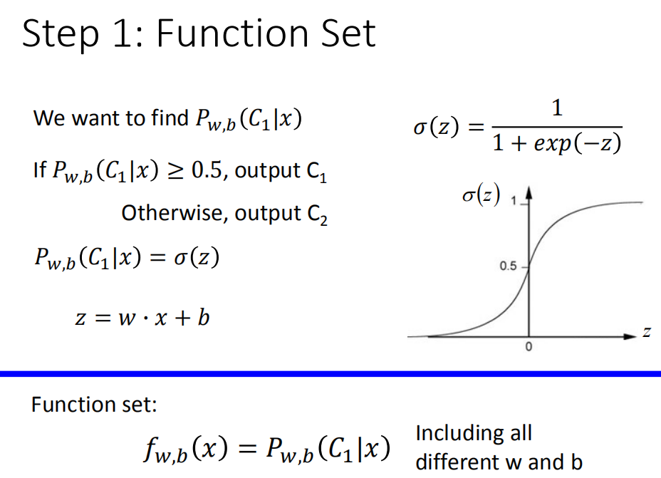

将函数集可视化：

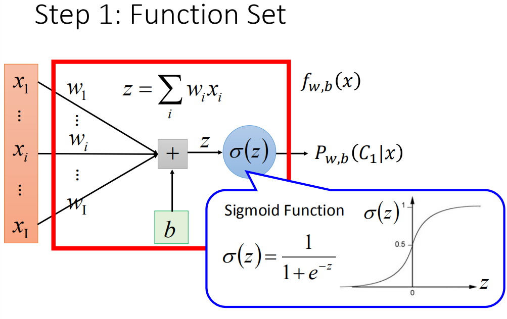

这种函数集的分类问题叫做 Logistic Regression（逻辑回归），将它和第二篇讲到的线性回归简单对比一下函数集：

# Step2 定义损失函数

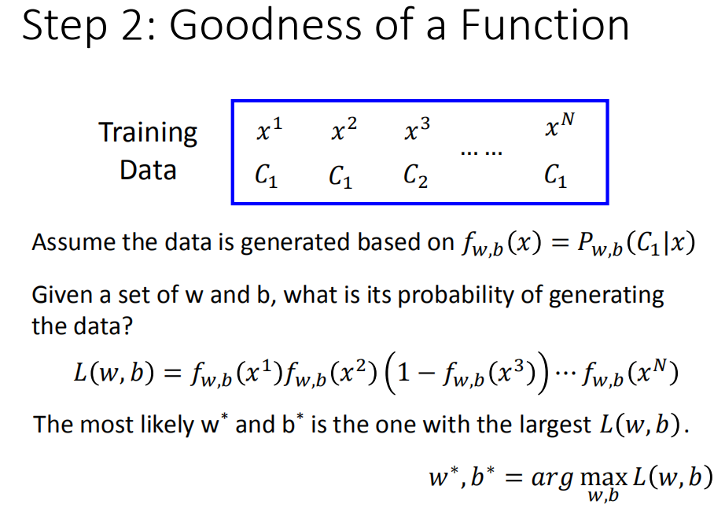

上图有一个训练集，每个对象分别对应属于哪个类型（例如 $x^3$ 属于 $C_2$ ）。假设这些数据都是由后验概率 $fw,b(x)=Pw,b(C1|x)$产生的。

给定一组 w和b，就可以计算这组w，b下产生上图N个训练数据的概率，

$L(w, b) = f_{w,b}(x^{1})f_{w,b}(x^{2}) \left( 1-f_{w,b}(x^{3}) \right) \cdots f_{w,b}(x^{N}) \qquad (1-1)$

对于使得 L(w,b)L(w,b)最大的ww和 bb，记做$w∗w∗$ 和$b∗b∗$ ，即：

$w∗,b∗=argmaxw,bL(w,b)$

将训练集数字化，并且将式1-2中求max通过取负自然对数转化为求min ：

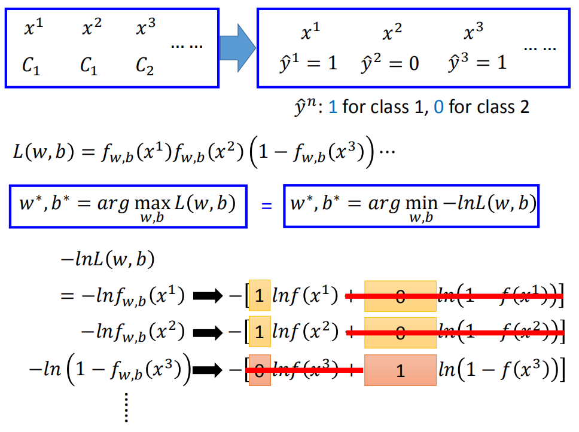

然后将 $−lnL(w,b)$ 改写为下图中带蓝色下划线式子的样子：

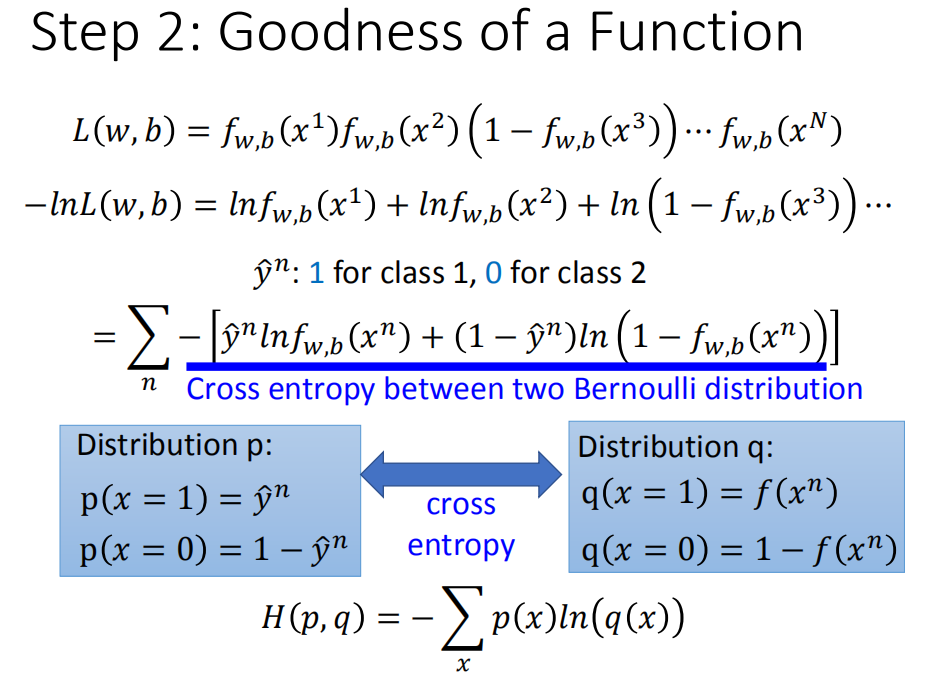

图中蓝色下划线实际上代表的是两个伯努利分布（0-1分布，两点分布）的 cross entropy（交叉熵）

假设有两个分布 
p 和 q，如图中蓝色方框所示，这两个分布之间交叉熵的计算方式就是 H(p,q)H(p,q)；交叉熵代表的含义是这两个分布有多接近，如果两个分布是一模一样的话，那计算出的交叉熵就是0

交叉熵的详细理论可以参考《Information Theory（信息论）》，具体哪本书我就不推荐了，由于学这门科目的时候用的是我们学校出版的教材。。。没有其他横向对比，不过这里用到的不复杂，一般教材都会讲到。

下面再拿逻辑回归和线性回归作比较，这次比较损失函数：

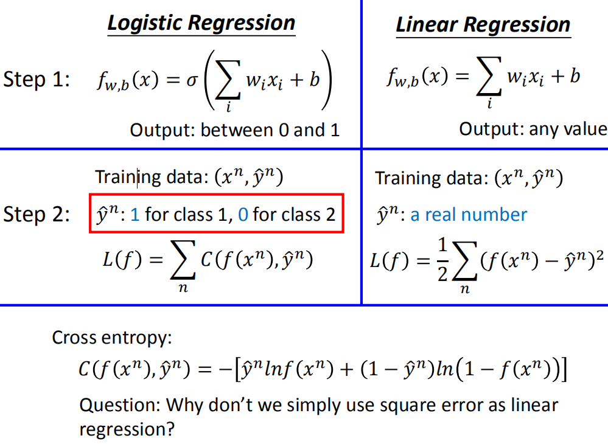

此时直观上的理解：如果把function的输出和target（真正的function y^ny^n）都看作是两个伯努利分布，所做的事情就是希望这两个分布越接近越好。

# Step3 寻找最好的function
下面用梯度下降法求：

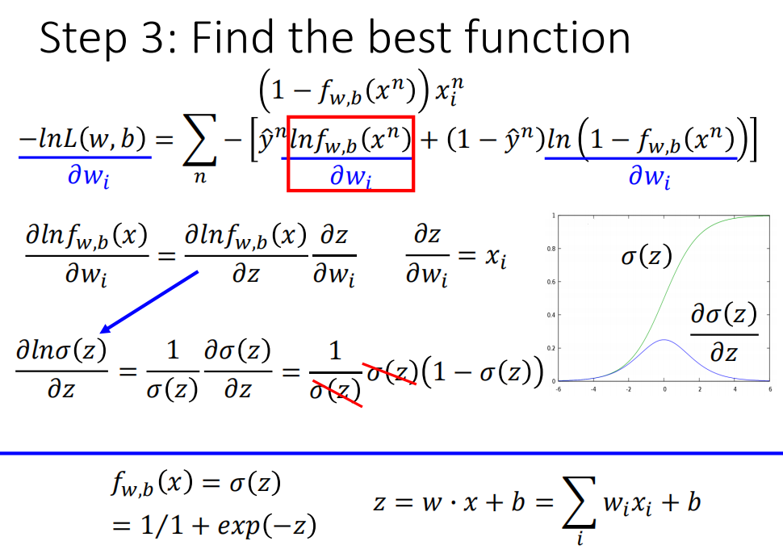

要求−lnL(w,b)−ln⁡L(w,b) 对 wiwi的偏微分，只需要先算出$lnfw,b(x_n)ln⁡fw,b(_xn$) 对 wiwi的偏微分以及 $ln(1−fw,b(x_n))ln⁡(1−fw,b(_xn)$) 对 wiwi的偏微分。计算$lnfw,b(x_n) ln⁡fw,b(x_n)$ 对 wiwi偏微分，fw,b(x)fw,b(x)可以用σ(z)σ(z)表示，而zz可以用$w_iw_i$和 bb表示，所以利用链式法则展开。

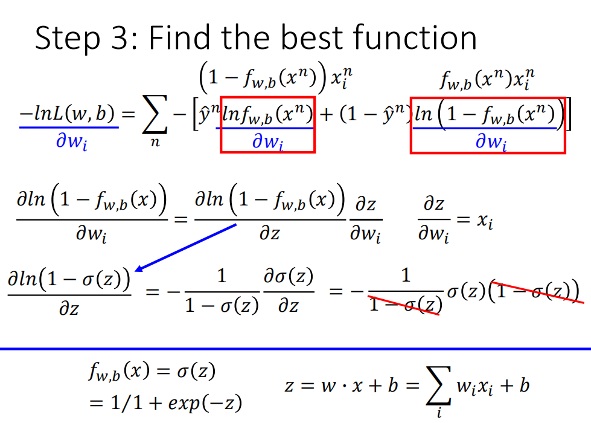

计算 $ln(1−fw,b(x_n))ln⁡(1−fw,b(x_n))$ 对 $w_iw_i$   的偏微分，同理求得结果。

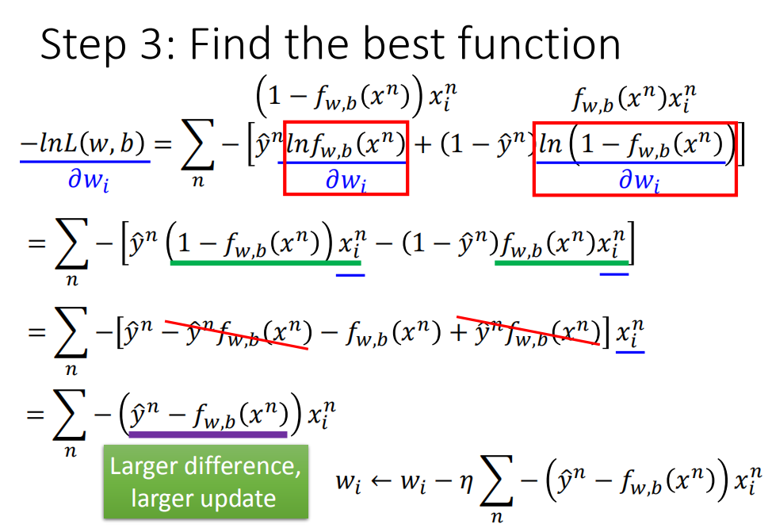

将求得两个子项的偏微分带入，化简得到结果。

现在 $w_iw_i$ 的更新取决于学习率 ηη ，$x^n_i x_i^n$ 以及上图的紫色划线部分；紫色下划线部分直观上看就是真正的目标 $y^n y^n $与我们的function差距有多大。

下面再拿逻辑回归和线性回归作比较，这次比较如果挑选最好的function：

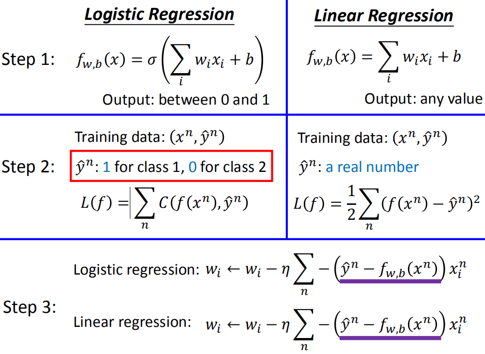

对于逻辑回归，target $y^ny^n$ 是0或者1，输出是介于0和1之间。而线性回归的target可以是任何实数，输出也可以是任何值。

# 损失函数：为什么不学线性回归用平方误差？

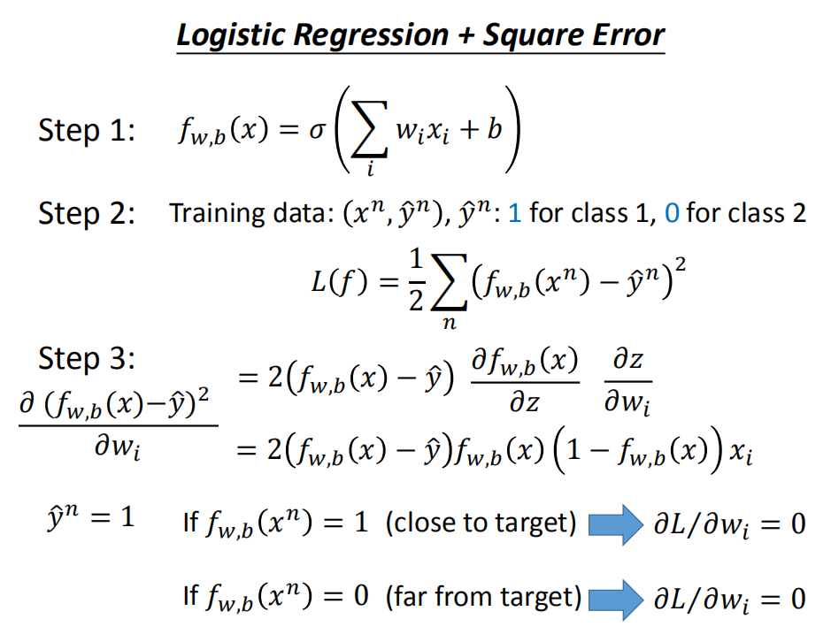

考虑上图中的平方误差形式。在step3计算出了对 $w_i$ 的偏微分。假设 $y^n=1y^n=1$ ，如果 $fw,b(x_n)=1fw,b(x_n)=1$，就是非常接近target，会导致偏微分中第一部分为0，从而偏微分为0；而 $fw,b(x_n)=0fw,b(x_n)=0，会导致第二部分为0，从而偏微分也是0。

对于两个参数的变化，对总的损失函数作图：

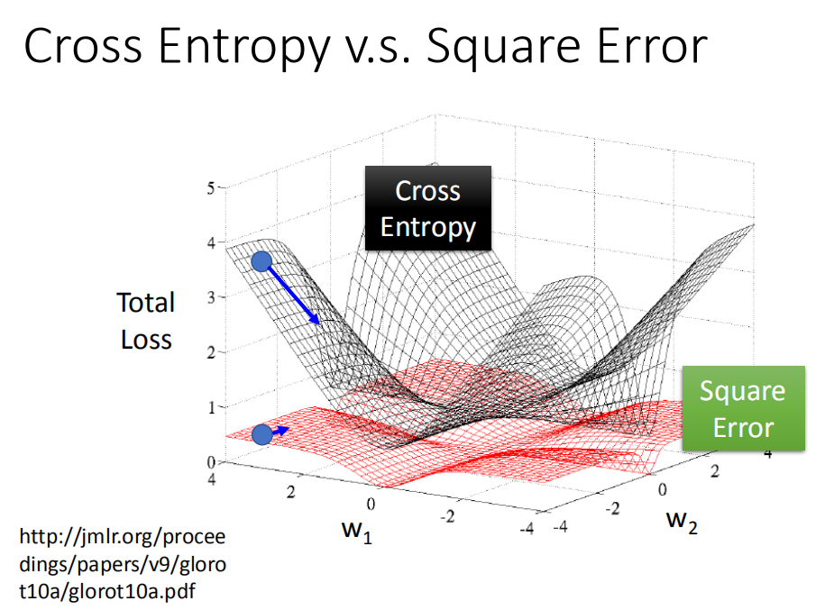
如果是交叉熵，距离target越远，微分值就越大，就可以做到距离target越远，更新参数越快。而平方误差在距离target很远的时候，微分值非常小，会造成移动的速度非常慢，这就是很差的效果了。

# Discriminative（判别）v.s. Generative（生成）
逻辑回归的方法称为Discriminative（判别） 方法；上一篇中用高斯来描述后验概率，称为 Generative（生成） 方法。它们的函数集都是一样的：

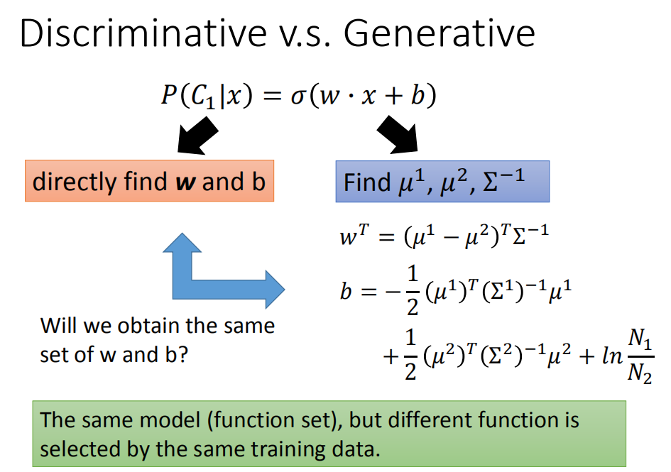

如果是逻辑回归，就可以直接用梯度下降法找出w和b；如果是概率生成模型，像上篇那样求出 $μ^1,μ^2$ ，协方差矩阵的逆，然后就能算出w和b。

用逻辑回归和概率生成模型找出来的w和b是不一样的。

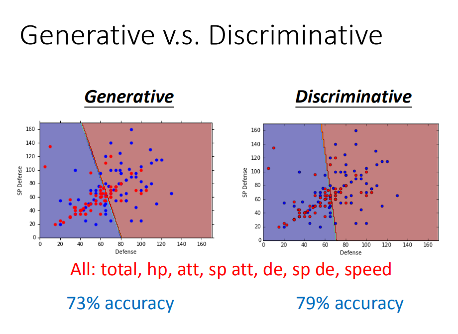

上图是前一篇的例子，图中画的是只考虑两个因素，如果考虑所有因素，结果是逻辑回归的效果好一些。

## 一个好玩的例子

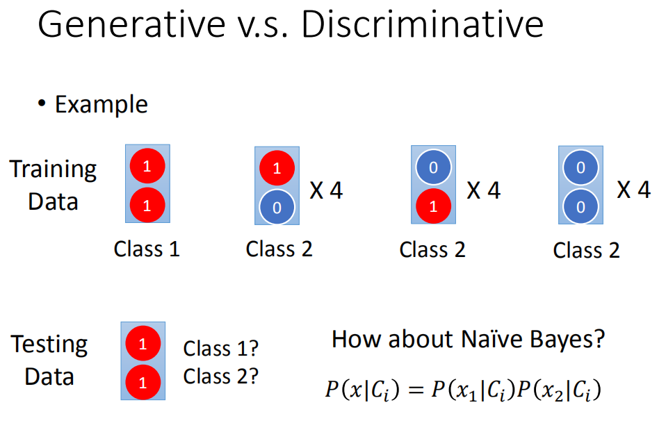

上图的训练集有13组数据，类别1里面两个特征都是1，剩下的(1, 0), (0, 1), (0, 0) 都认为是类别2；然后给一个测试数据(1, 1)，它是哪个类别呢？人类来判断的话，不出意外基本都认为是类别1。下面看一下朴素贝叶斯分类器（Naive Bayes）会有什么样的结果。

朴素贝叶斯分类器如图中公式：xx属于CiCi 的概率等于每个特征属于CiCi 概率的乘积。

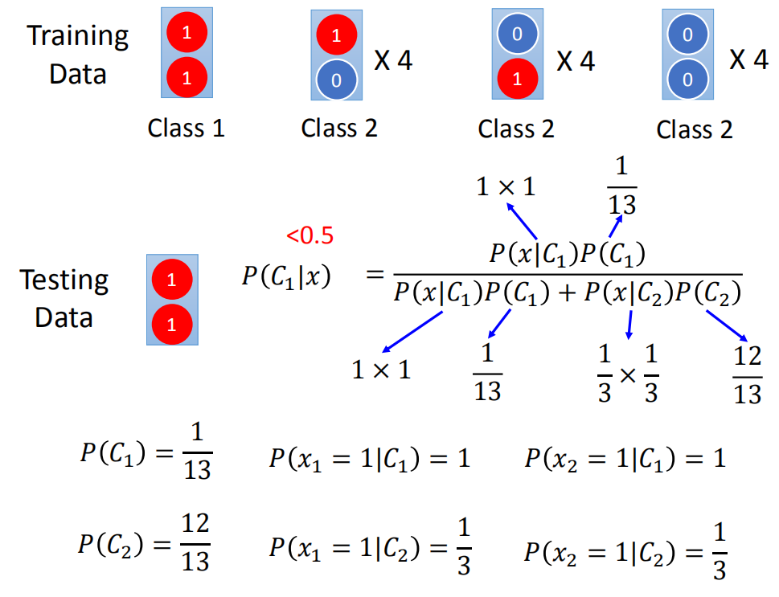

计算出P(C1|x)P(C1|x)的结果是小于0.5的，即对于朴素贝叶斯分类器来说，测试数据 (1, 1)是属于类别2的，这和直观上的判断是相反的。其实这是合理，实际上训练集的数据量太小，但是对于 (1, 1)可能属于类别2这件事情，朴素贝叶斯分类器是有假设这种情况存在的（机器脑补这种可能性==）。所以结果和人类直观判断的结果不太一样。

## 判别（Discriminative）方法不一定比生成（Generative）方法好
生成方法的优势：

训练集数据量很小的情况；因为判别方法没有做任何假设，就是看着训练集来计算，训练集数量越来越大的时候，error会越小。而生成方法会自己脑补，受到数据量的影响比较小。
对于噪声数据有更好的鲁棒性（robust）。
先验和类相关的概率可以从不同的来源估计。比如语音识别，可能直观会认为现在的语音识别大都使用神经网络来进行处理，是判别方法，但事实上整个语音识别是 Generative 的方法，DNN只是其中的一块而已；因为还是需要算一个先验概率，就是某句话被说出来的概率，而估计某句话被说出来的概率不需要声音数据，只需要爬很多的句子，就能计算某句话出现的几率。

# Multi-class Classification（多类别分类）
## Softmax
下面看一下多类别分类问题的做法，具体原理可以参考《Pattern Recognition and Machine Learning》Christopher M. Bishop 著 ，P209-210

假设有3个类别，每个都有自己的weight和bias

把$z_1,z_2,z_3$
放到一个叫做Softmax的方程中，Softmax做的事情就是它们进行exponential（指数化），将exponential 的结果相加，再分别用 exponential 的结果除以相加的结果。原本$z_1,z_2,z_3$可以是任何值，但做完Softmax之后输出会被限制住，都介于0到1之间，并且和是1。Softmax做事情就是对最大值进行强化。

输入x，属于类别1的几率是0.88，属于类别2的几率是0.12，属于类别3的几率是0。

Softmax的输出就是用来估计后验概率（Posterior Probability）。为什么会这样？下面进行简单的说明：

## 为什么Softmax的输出可以用来估计后验概率？
假设有3个类别，这3个类别都是高斯分布，它们也共用同一个协方差矩阵，进行类似上一篇讲述的推导，就可以得到Softmax。

信息论学科中有一个 Maximum Entropy（最大熵）的概念，也可以推导出Softmax。简单说信息论中定义了一个最大熵。指数簇分布的最大熵等价于其指数形式的最大似然界。二项式的最大熵解等价于二项式指数形式(sigmoid)的最大似然，多项式分布的最大熵等价于多项式分布指数形式(softmax)的最大似然，因此为什么用sigmoid函数，那是因为指数簇分布最大熵的特性的必然性。假设分布求解最大熵，引入拉格朗日函数，求偏导数等于0，直接求出就是sigmoid函数形式。还有很多指数簇分布都有对应的最大似然界。而且，单个指数簇分布往往表达能力有限，就引入了多个指数簇分布的混合模型，比如高斯混合，引出了EM算法。想LDA就是多项式分布的混合模型。

## 定义target

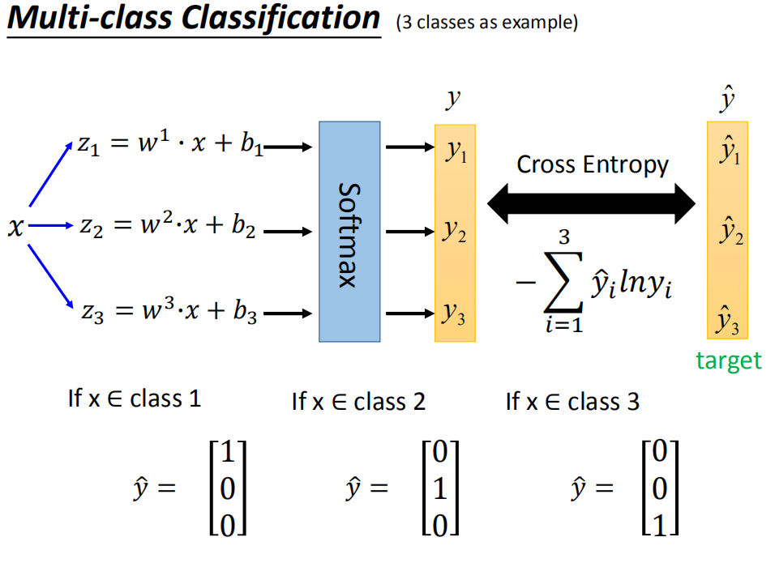

上一篇讲到如果定义类别1 $y^1,\hat_{y}$，  类别2 $y^1, \hat_{y}$，类别3 $y^1, \hat_{y}$，这样会人为造成类别1 和类型2有一定的关系这种问题。但可以将 y^y^定义为矩阵，这样就避免了。而且为了计算交叉熵，y^y^也需要是个概率分布才可以。

# 逻辑回归的限制

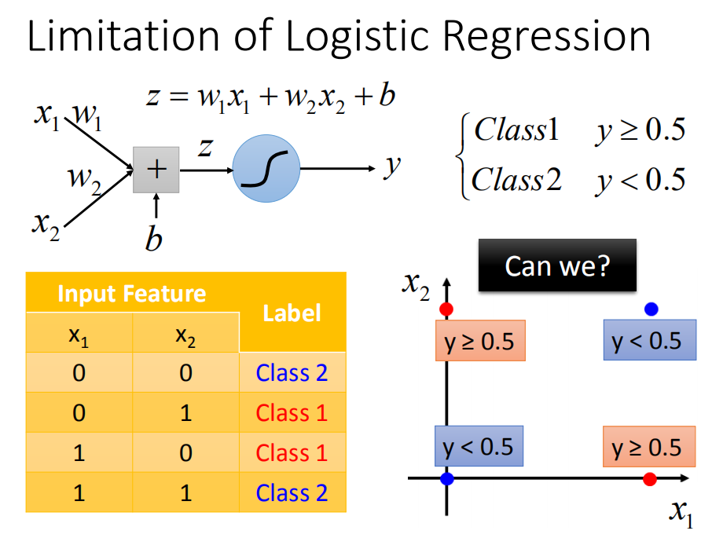

考虑上图的例子，两个类别分布在两个对角线两端，用逻辑回归可以处理吗？

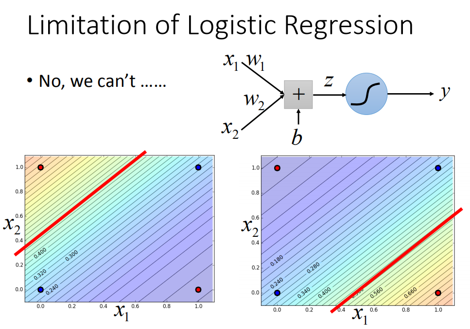

这里的逻辑回归所能做的分界线就是一条直线，没有办法将红蓝色用一条直线分开。

## Feature Transformation（特征转换）

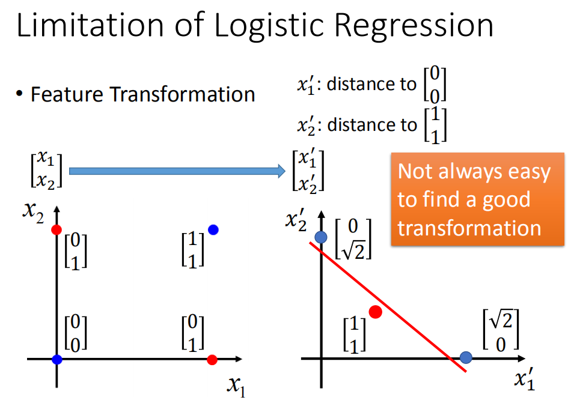

特征转换的方式很多，举例类别1转化为某个点到 (0,0)(0,0) 点的距离，类别2转化为某个点到 (1,1)(1,1) 点的距离。然后问题就转化右图，此时就可以处理了。但是实际中并不是总能轻易的找到好的特征转换的方法。

## Cascading logistic regression models（级联逻辑回归模型）

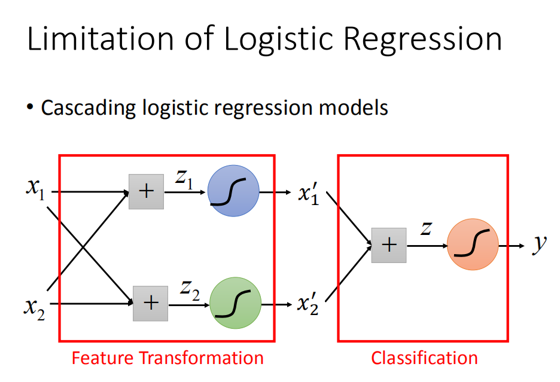

可以将很多的逻辑回归接到一起，就可以进行特征转换。比如上图就用两个逻辑回归 对$z_1,z_2$来进行特征转换，然后对于 $x_1^{'},x_2^{'}$，再用一个逻辑回归zz来进行分类。

对上述例子用这种方式处理：

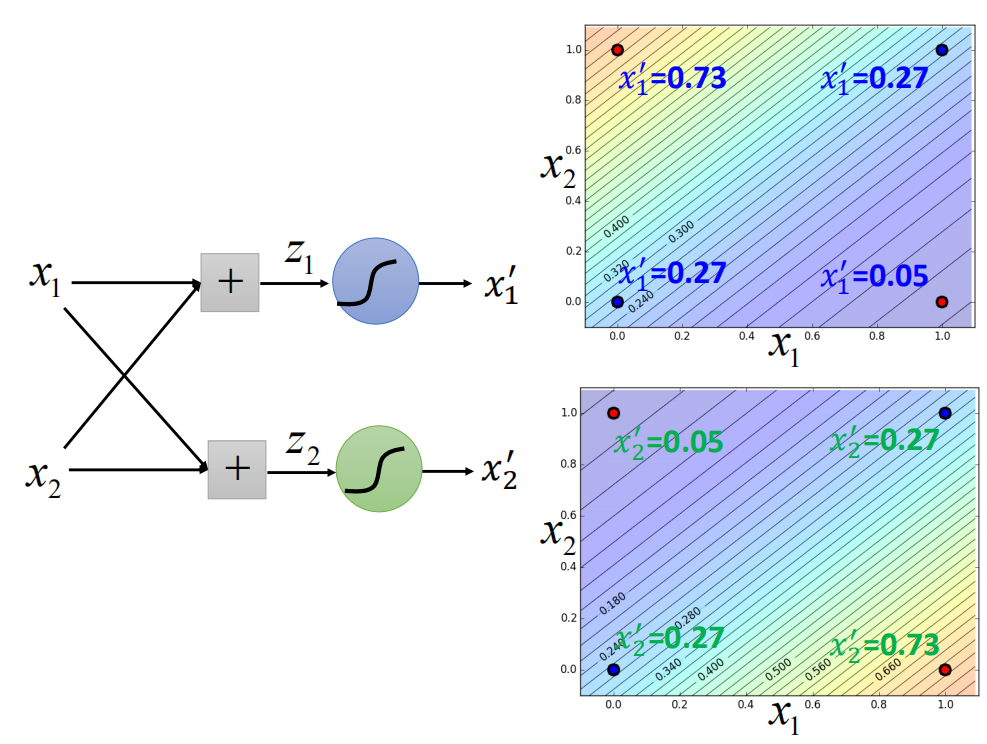

右上角的图，可以调整参数使得得出这四种情况。同理右下角也是

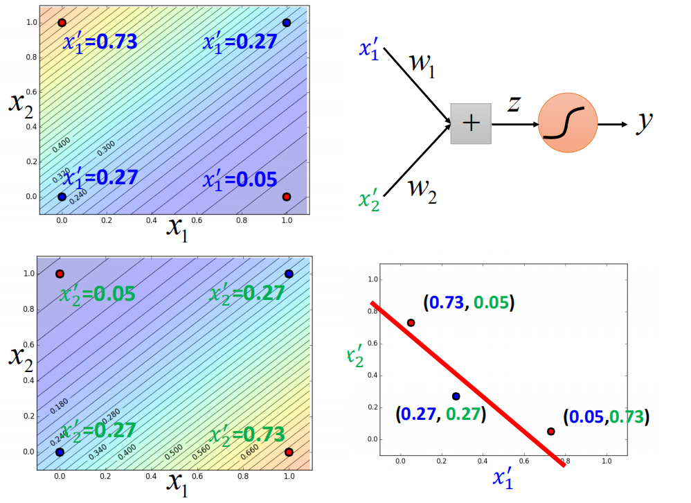

经过这样的转换之后，点就被处理为可以进行分类的结果。

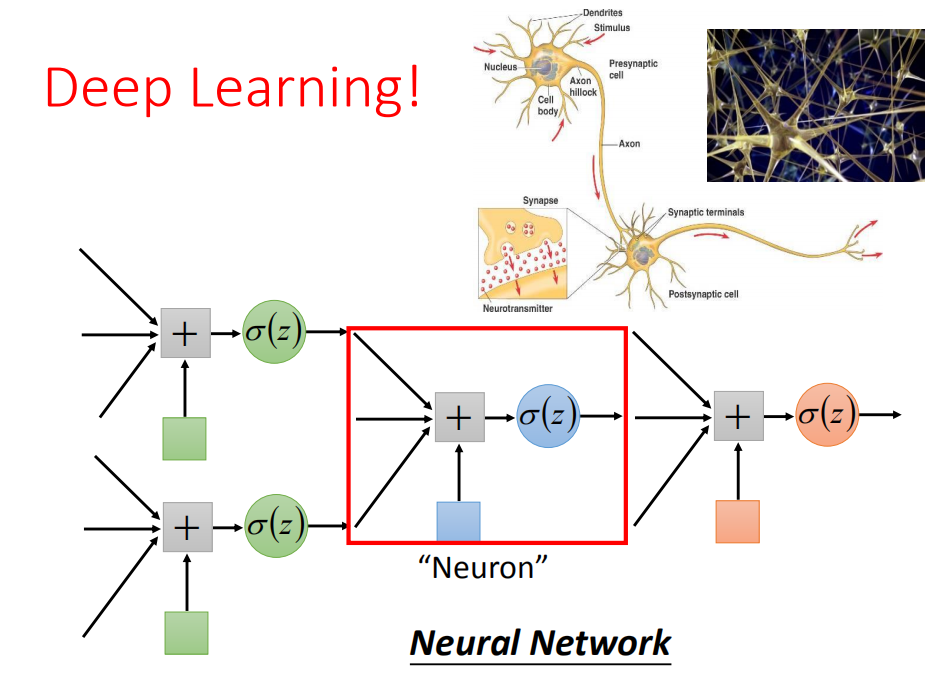

一个逻辑回归的输入可以来源于其他逻辑回归的输出，这个逻辑回归的输出也可以是其他逻辑回归的输入。把每个逻辑回归称为一个 Neuron（神经元），把这些神经元连接起来的网络，就叫做 Neural Network（神经网络）。

