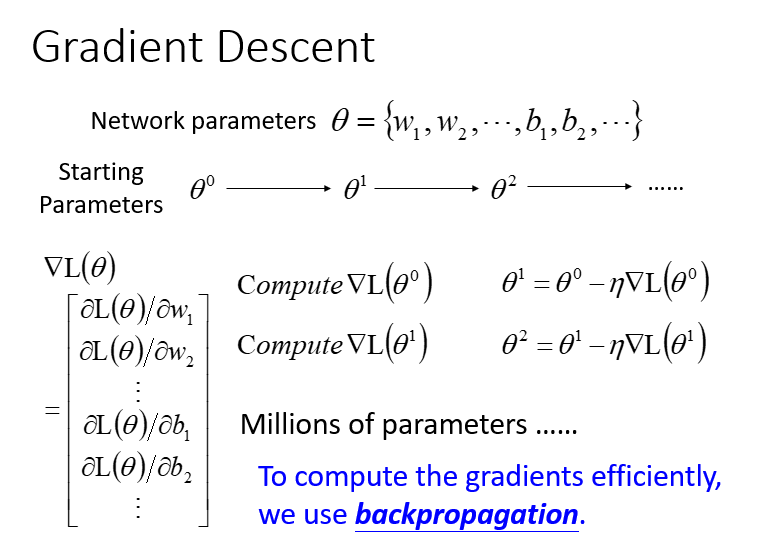
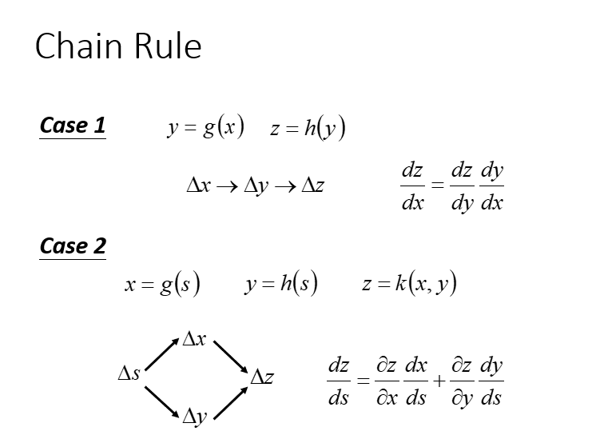
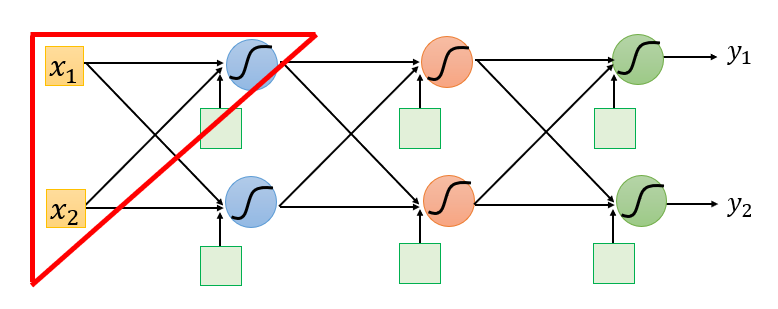
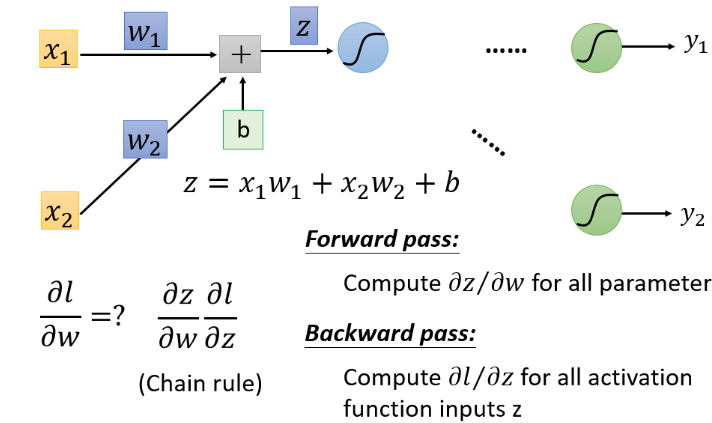
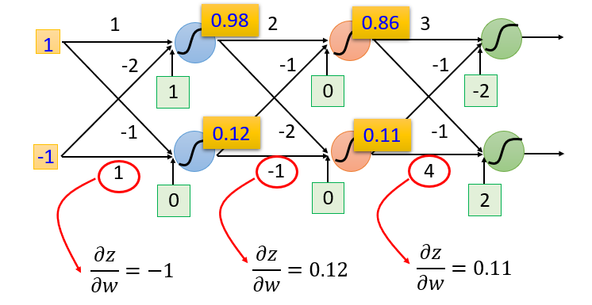
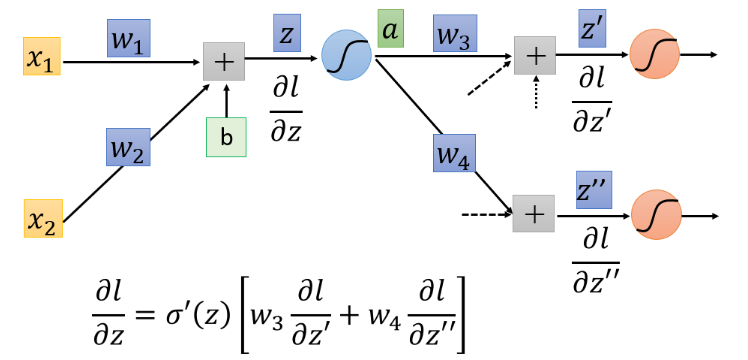
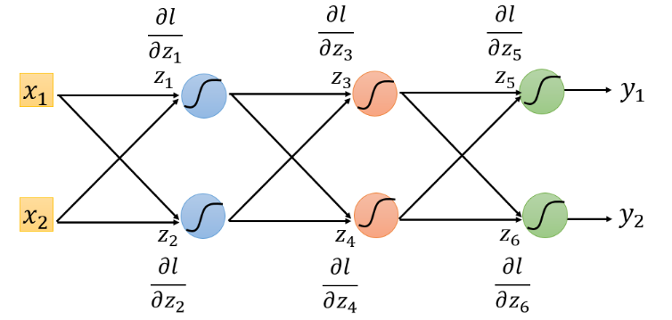
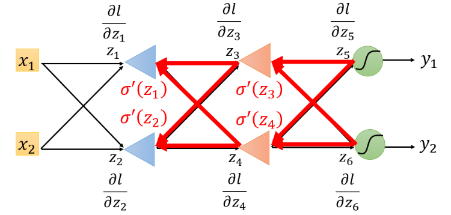

# BackPropagation
# 背景
## 梯度下降

- 给到 $\theta$ (weight and bias)
- 先选择一个初始的 $\theta^0$，计算 $\theta^0$ 的损失函数（Loss Function）设一个参数的偏微分
- 计算完这个向量（vector）偏微分，然后就可以去更新的你 $\theta$ 
- 百万级别的参数（millions of parameters）
- 反向传播（Backpropagation）是一个比较有效率的算法，让你计算梯度（Gradient） 的向量（Vector）时，可以有效率的计算出来

## 链式法则

- 连锁影响(可以看出x会影响y，y会影响z)
- BP主要用到了chain rule

# 反向传播

1. **损失函数(Loss function)是定义在单个训练样本上的**，也就是就算一个样本的误差，比如我们想要分类，就是预测的类别和实际类别的区别，是一个样本的，用L表示。
2. **代价函数(Cost function)是定义在整个训练集上面的**，也就是所有样本的误差的总和的平均，也就是损失函数的总和的平均，有没有这个平均其实不会影响最后的参数的求解结果。
3. **总体损失函数(Total loss function)是定义在整个训练集上面的**，也就是所有样本的误差的总和。也就是平时我们反向传播需要最小化的值。

对于$L(\theta)$就是所有$l^n$的损失之和，所以如果要算每个$L(\theta)$的偏微分，我们只要算每个$l^n$的偏微分，再把所有$l^n$偏微分的结果加起来就是$L(\theta)$的偏微分，所以等下我们只计算每个$l^n​$的偏微分。
我们先在整个神经网络（Neural network）中抽取出一小部分的神经（Neuron）去看（也就是红色标注的地方）：

### 取出一个Neuron进行分析

从这一小部分中去看，把计算梯度分成两个部分

- 计算$\frac{\partial z}{\partial w}$（Forward pass的部分）
- 计算$\frac{\partial l}{\partial z}​$ ( Backward pass的部分 )
## Forward Pass

那么，首先计算$\frac{\partial z}{\partial w}​$（Forward pass的部分）：

根据求微分原理，forward pass的运算规律就是：

$\frac{\partial z}{\partial w_1} = x_1 \\ \frac{\partial z}{\partial w_2} = x_2$
这里计算得到的$x_1$和$x_2$恰好就是输入的$x_1$和$x_2$
直接使用数字，更直观地看到运算规律：

## Backward Pass
 (Backward pass的部分)这就很困难复杂因为我们的l是最后一层：
那怎么计算 $\frac{\partial l}{\partial z}$ （Backward pass的部分）这就很困难复杂因为我们的$l$是最后一层：

计算所有激活函数的偏微分，激活函数有很多，这里使用Sigmoid函数为例

这里使用链式法则（Chain Rule）的case1，计算过程如下：

$\frac{\partial l}{\partial z} = \frac{\partial a}{\partial z}\frac{\partial l}{\partial a} \Rightarrow   {\sigma}'(z)​$
$\frac{\partial l}{\partial a} = \frac{\partial z'}{\partial a}\frac{\partial l}{\partial z'} +\frac{\partial z''}{\partial a}\frac{\partial l}{\partial z''}​$

最终的式子结果：

但是你可以想象从另外一个角度看这个事情，现在有另外一个神经元，把forward的过程逆向过来,其中${\sigma}'(z)$是常数，因为它在向前传播的时候就已经确定了

### case 1 : Output layer
假设$\frac{\partial l}{\partial z'}$和$\frac{\partial l}{\partial z''}​$是最后一层的隐藏层
也就是就是y1与y2是输出值，那么直接计算就能得出结果

但是如果不是最后一层，计算$\frac{\partial l}{\partial z'}$和$\frac{\partial l}{\partial z''}​$的话就需要继续往后一直通过链式法则算下去
### case 2 : Not Output Layer

对于这个问题，我们要继续计算后面绿色的$\frac{\partial l}{\partial z_a}$和$\frac{\partial l}{\partial z_b}$,然后通过继续乘$w_5$和$w_6$得到$\frac{\partial l}{\partial z'}$，但是要是$\frac{\partial l}{\partial z_a}$和$\frac{\partial l}{\partial z_b}$都不知道，那么我们就继续往后面层计算，一直到碰到输出值，得到输出值之后再反向往输入那个方向走。

对上图，我们可以从最后一个$\frac{\partial l}{\partial z_5}$和$\frac{\partial l}{\partial z_6}$看，因为$\frac{\partial l}{\partial z_a}$和$\frac{\partial l}{\partial z_b}$比较容易通过output求出来，然后继续往前求$\frac{\partial l}{\partial z_3}$和$\frac{\partial l}{\partial z_4}$，再继续求$\frac{\partial l}{\partial z_1}$和$\frac{\partial l}{\partial z_2}$
最后我们就得到下图的结果

实际上进行backward pass时候和向前传播的计算量差不多。

# 总结
我们的目标是要求计算$\frac{\partial z}{\partial w}$（Forward pass的部分）和计算$\frac{\partial l}{\partial z}$ ( Backward pass的部分 )，然后把$\frac{\partial z}{\partial w}$和$\frac{\partial l}{\partial z}$相乘，我们就可以得到$\frac{\partial l}{\partial w}$,所有我们就可以得到神经网络中所有的参数，然后用梯度下降就可以不断更新，得到损失最小的函数

