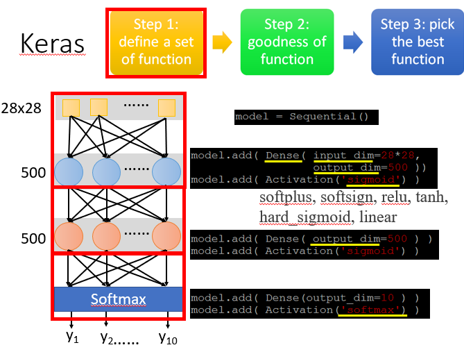
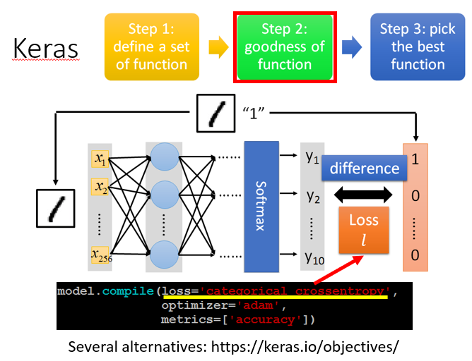
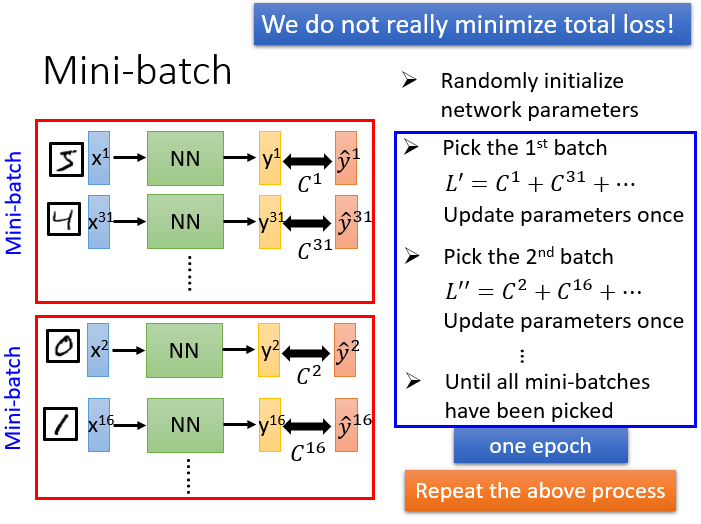
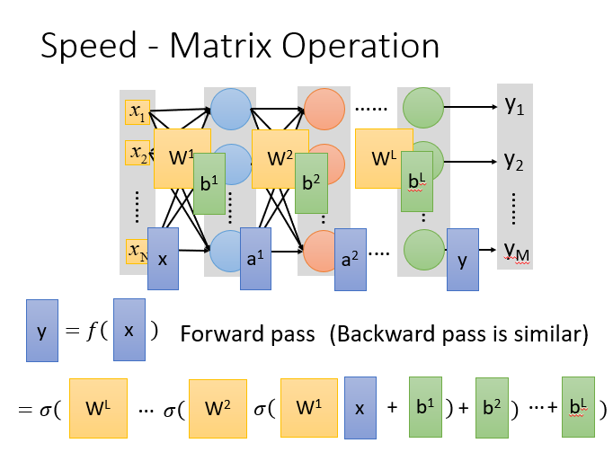

# “Hello world” of Deep Learning


# keras 是什么
Keras 是一个用 Python 编写的高级神经网络 API，它能够以 TensorFlow, CNTK, 或者 Theano 作为后端运行。


# 示例

以手写数字识别为例
## 步骤1：定义模型（Define a set of function）



neural network是长什么样的，在keras首先定义model是sequential
```python
model = sequential()
```

- 第1个隐藏层
	- 你看要你的neural长什么样子，自己就决定长什么样子，举例，这里hidden layer 有两个layer，每个layer都有500 Neural。已经定义了一个model，然后model.add，加一个Fully connect laye(这里用Dense表示)，然后input，output
	- 然后增加一个activation(激活函数)，将sigmoid当做activation(也可以使用其他的当做activation)
```
model.add(activation('sigmoid'))
```
- 第2个隐藏层
	- 这个layer的input就是上一个layer的output，不用说input是500Neural，keras自己知道

- 输出层：
	- output为10dimension
	- activation为softmax


## 步骤2：模型评估（Goodness of Function）


- 评估模型的好坏


compile 编译
```python
model.compile()
```
定义一个loss是什么(不同的场合，需要不同的loss function)
```python
loss = ('cateqorical crossentropy')  #损失函数
```
```python
optimizer #优化器
```
```python
metrics #指标
```

## 步骤3：最佳模型（pick the best function）

### 3.1 Configuration


```python
model.compile = (loss = 'categorical crossentropy', optimizer = 'adam')
```
- optimizer后面可以跟不同的方式，这些方式都是GD，只是用的learning rate不同，有一些machine会自己决定learning rate
### 3.2 Find the optimal network parameters

- 给定四个输入, x_train, y_train, batch_size, nb_epoch
- 训练数据就是一张一张的图片, 每张图片对应的标签就是数字
- Two dimension matrix(X_train)，第一个dimension代表你有多少个example，第二个dimension代表你有多少个pixel
- Two dimension matrix(y_train)，第一个dimension代表你有多少个training example，第二个dimension代表label(黑色的为数字，从0开始计数)

#### mini-batch 的原理详解
keras model参数`batch_size`和`nb_epoch`


我们在做梯度下降和深度学习时，我们并不是真的最小化总损失,我们会把训练数据随机分成几个mini-batch。
具体步骤：
- 随机初始化神经网络的参数 (跟梯度下降一样)
- 先随机选择第一个batch出来,对选择出来的batch里面total loss, 计算偏微分，根据${L}'$去更新参数
- 然后随机选择第二个batch ，对第一个选择出来的batch里面total loss, 计算偏微分，根据${L}''$更新参数
- 反复上述过程，直到把所有的batch都统统过一次，一个epoch才算结束。
注意：假设今天有100个batch的话，就把这个参数更新100次，把所有的batch都遍历过叫做一个epoch。
```
 model.fit(x_train, y_train, batch_size =100, nb_epoch = 20)
```
1. 这里的batch_size代表一个batch有多大(就是把100个example，放到一个batch里)
2. nb_epoch等于20表示对每个batch重复20次

#### 使用mini-batch的原因：Speed



- batch-szie不同时，一个epoch所需的时间是不一样的（上图用batch size=1是166s，当batch size=10是17s）
- batch =10相比于batch=1，较稳定
- Speed-- why minni batch is faster than stochastic GD(为什么批量梯度下降比随机梯度下降要快)
  因为利用计算机的平行运算，之前也提到过矩阵运算会使计算速度快很多。
- 很大的batch size会导致很差的表现（不能设置太大也不能设置太小）

用随机梯度下降的时候两个矩阵x是分开计算的，当用mini batch的时候，直接是用两个x合并在一起，一起计算得到$Z^1$和$Z^2$，对GPU来说上面运算时间是下面运算时间的两倍，这就是为什么我们用上mini batch和GPU的时候速度会加快的原理。但是如果你用了GPU没用mini batch的话，那也达不到加速的效果。
## 模型保存和使用

```python
#case1：测试集正确率
score = model.evaluate(x_test,y_test)
print("Total loss on Testing Set:", score[0])
print("Accuracy of Testing Set:", score[1])

#case2：模型预测
result = model。predict(x_test)
```
