# 为什么用CNN

我们都知道CNN常常被用在影像处理上，如果你今天用CNN来做影像处理，当然也可以用一般的neural network来做影像处理，不一定要用CNN。比如说你想要做影像的分类，那么你就是training一个neural network,input一张图片，那么你就把这张图片表示成里面的pixel，也就是很长很长的vector。output就是(假如你有1000个类别，output就是1000个dimension)dimension。那我相信根据刚才那堂课内容，若给你一组training data你都可以描作出来。

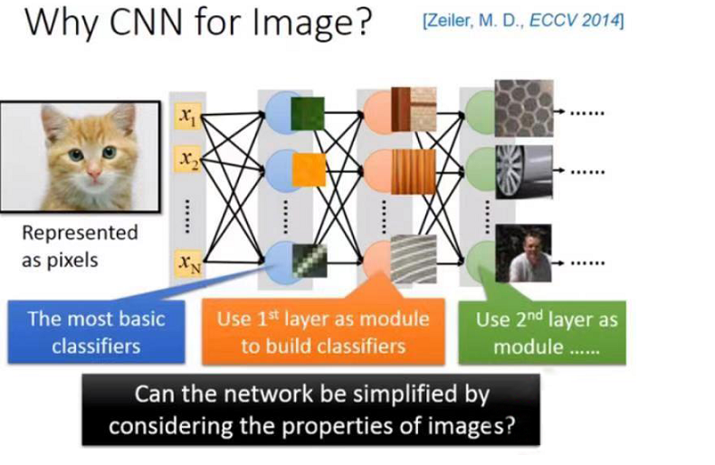

但是呢，我们现在会遇到的问题是这样的，实际上我们在training neural network时，我们会期待说：在network的structure里面，每一个neural就是代表了一个最基本的classifier，事实在文件上根据训练的结果，你有可能会得到很多这样的结论。举例来说：第一层的neural是最简单的classifier，它做的事情就是detain有没有绿色出现，有没有黄色出现，有没有斜的条纹。

第二个layer是做比这个更复杂的东西，根据第一个layer的output，它看到直线横线就是窗框的一部分，看到棕色纹就是木纹，看到斜条纹+灰色可能是很多的东西(轮胎的一部分等等)

再根据第二个hidden layer的outpost，第三个hidden layer会做更加复杂的事情。

但现在的问题是这样的，当我们一般直接用fully connect feedforward network来做影像处理的时候，往往我们会需要太多的参数，举例来说，假设这是一张100 *100的彩色图(一张很小的imgage)，你把这个拉成一个vector，(它有多少个pixel)，它有100 *100 3的pixel。
如果是彩色图的话，每个pixel需要三个value来描述它，就是30000维(30000 dimension)，那input vector假如是30000dimension，那这个hidden layer假设是1000个neural，那么这个hidden layer的参数就是有30000 *1000，那这样就太多了。那么CNN做的事就是简化neural network的架构。我们把这里面一些根据人的知识，我们根据我们对影像就知道，某些weight用不上的，我们一开始就把它滤掉。不是用fully connect feedforward network，而是用比较少的参数来做影像处理这件事。所以CNN比一般的DNN还要简单的。

等一下我们讲完会觉得发现说：你可能觉得CNN运作很复杂，但事实上它的模型是要比DNN还要更简单的。我们就是用power-knowledge 去把原来fully connect layer中一些参数拿掉就成了CNN。

## Small region

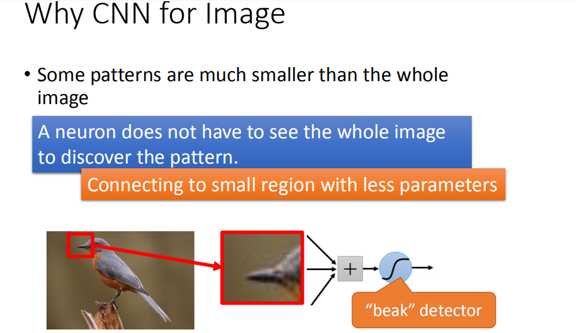

我们先来讲一下，为什么我们有可能把一些参数拿掉(为什么可以用比较少的参数可以来做影像处理这件事情)

这里有几个观察，第一个是在影像处理里面，我们说第一层的 hidden layer那些neural要做的事就是侦测某一种pattern，有没有某一种patter出现。大部分的pattern其实要比整张的image还要小，对一个neural来说，假设它要知道一个image里面有没有某一个pattern出现，它其实是不需要看整张image，它只要看image的一小部分。

举例来说，假设我们现在有一张图片，第一个hidden layer的某一种neural的工作就是要侦测有没有鸟嘴的存在(有一些neural侦测有没有爪子的存在，有没有一些neural侦测有没有翅膀的存在，有没有尾巴的存在，合起来就可以侦测图片中某一只鸟)。假设有一个neural的工作是要侦测有没有鸟嘴的存在，那并不需要看整张图，其实我们只需要给neural看着一小红色方框的区域(鸟嘴)，它其实就可以知道说，它是不是一个鸟嘴。对人来说也是一样，看这一小块区域这是鸟嘴，不需要去看整张图才知道这件事情。所以，每一个neural连接到每一个小块的区域就好了，不需要连接到整张完整的图。

## Same Patterns

第二个观察是这样子，同样的pattern在image里面，可能会出现在image不同的部分，但是代表的是同样的含义，它们有同样的形状，可以用同样的neural，同样的参数就可以把patter侦测出来。

比如说，这张图里面有一张在左上角的鸟嘴，在这张图里面有一个在中央的鸟嘴，但是你并不需要说：我们不需要去训练两个不同的detector，一个专门去侦测左上角的鸟嘴，一个去侦测中央有没有鸟嘴。如果这样做的话，这样就太冗了。我们不需要太多的冗源，这个nerual侦测左上角的鸟嘴跟侦测中央有没有鸟嘴做的事情是一样的。我们并不需要两个neural去做两组参数，我们就要求这两个neural用同一组参数，就样就可以减少你需要参数的量

## Subsampling
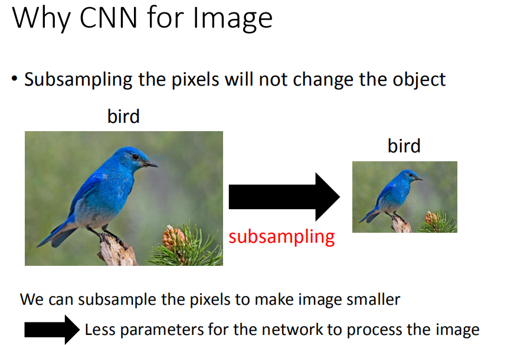

第三个是：我们知道一个image你可以做subsampling，你把一个image的奇数行，偶数列的pixel拿掉，变成原来十分之一的大小，它其实不会影响人对这张image的理解。对你来说：这张image跟这张image看起来可能没有太大的差别。是没有太大的影响的，所以我们就可以用这样的概念把image变小，这样就可以减少你需要的参数。

# CNN架构

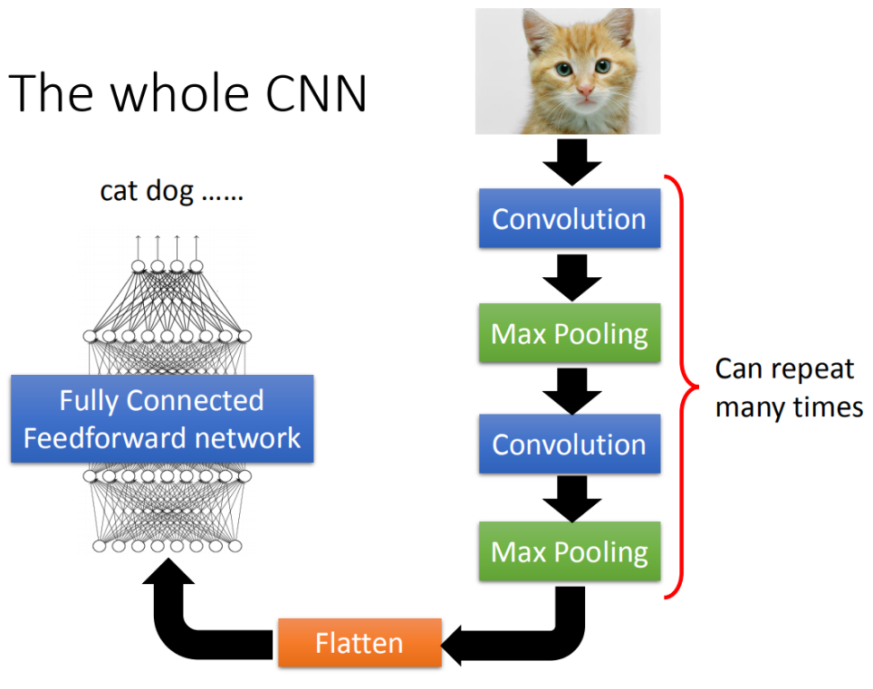

所以整个CNN的架构是这样的，首先input一张image以后，这张image会通过convolution layer，接下里做max pooling这件事，然后在做convolution，再做max pooling这件事。这个process可以反复无数次，反复的次数你觉得够多之后，(但是反复多少次你是要事先决定的，它就是network的架构(就像你的neural有几层一样)，你要做几层的convolution，做几层的Max Pooling，你再定neural架构的时候，你要事先决定好)。你做完决定要做的convolution和Max Pooling以后，你要做另外一件事，这件事情叫做flatten，再把flatten的output丢到一般fully connected feedforward network，然后得到影像辨识的结果。

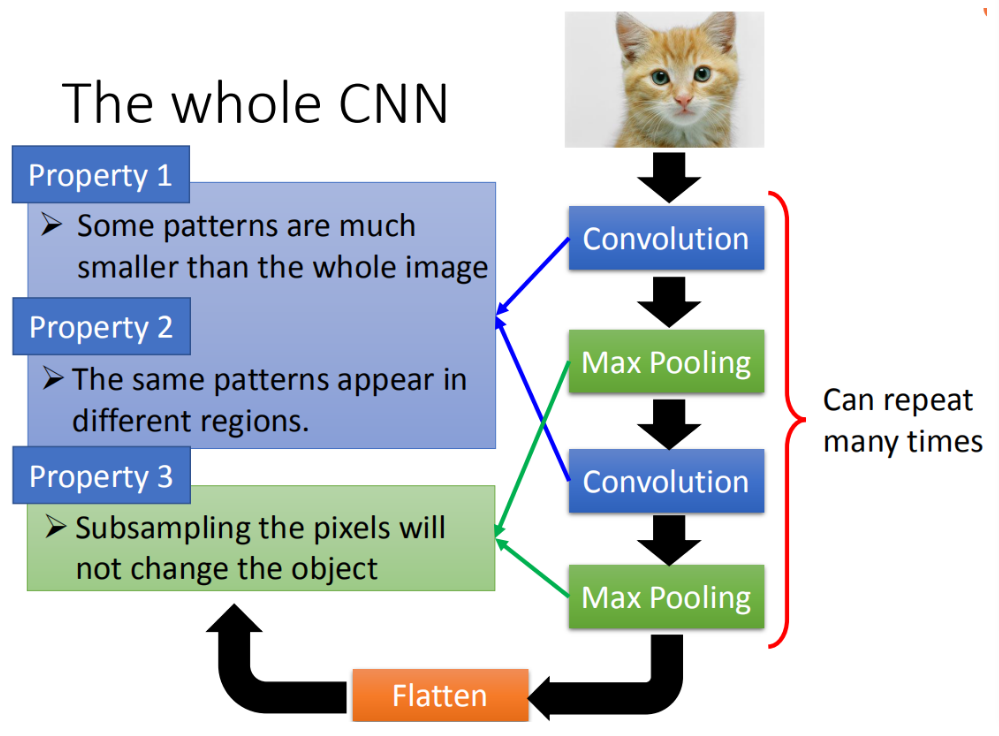

我们刚才讲基于三个对影像处理的观察，所以设计了CNN这样的架构。

第一个观察是，要生成一个pattern，不要看整张的image，你只需要看image的一小部分。第二是，通用的pattern会出现在一张图片的不同的区域。第三个是，我们可以做subsampling

前面的两个property可以用convolution来处理掉，最后的property可以用Max Pooling这件事来处理。等一下我们要介绍每一个layer再做的事情，我们就先从convolution开始看起。

# Convolution

## Propetry1

假设现在我们的network的input是一张6*6的Image，如果是黑白的，一个pixel就只需要用一个value去描述它，1就代表有涂墨水，0就代表没有涂到墨水。那在convolution layer里面，它由一组的filter，(其中每一个filter其实就等同于是fully connect layer里面的一个neuron)，每一个filter其实就是一个matrix(3 *3)，这每个filter里面的参数(matrix里面每一个element值)就是network的parameter(这些parameter是要学习出来的，并不是需要人去设计的)

每个filter如果是3* 3的detects意味着它就是再侦测一个3 *3的pattern(看3 *3的一个范围)。在侦测pattern的时候不看整张image，只看一个3 *3的范围内就可以决定有没有某一个pattern的出现。这个就是我们考虑的第一个Property

## Propetry2

这个filter咋样跟这个image运作呢？首先第一个filter是一个3* 3的matrix，把这个filter放在image的左上角，把filter的9个值和image的9个值做内积，两边都是1,1,1(斜对角)，内积的结果就得到3。(移动多少是事先决定的)，移动的距离叫做stride(stride等于多少，自己来设计)，内积等于-1。stride等于2，内积等于-3。我们先设stride等于1。

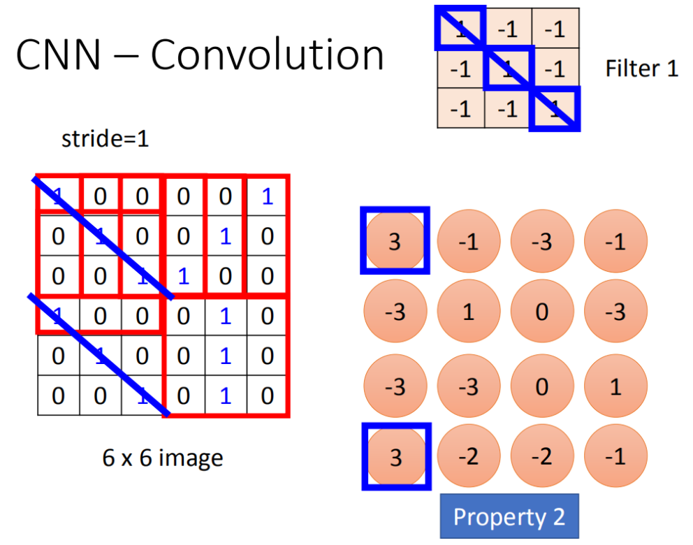

你把filter往右移动一格得到-1，再往右移一格得到-3，再往右移动一格得到-1。接下里往下移动一格，得到-3。以此类推(每次都移动一格)，直到你把filter移到右下角的时候，得到-1(得到的值如图所示)

经过这件事情以后，本来是6 *6的matrix，经过convolution process就得到4 *4的matrix。如果你看filter的值，斜对角的值是1,1,1。所以它的工作就是detain1有没有1,1,1(连续左上到右下的出现在这个image里面)。比如说：出现在这里(如图所示蓝色的直线)，所以这个filter就会告诉你：左上跟左下出现最大的值

就代表说这个filter要侦测的pattern，出现在这张image的左上角和左下角，这件事情就考虑了propetry2。同一个pattern出现在了左上角的位置跟左下角的位置，我们就可以用filter 1侦测出来，并不需要不同的filter来做这件事。

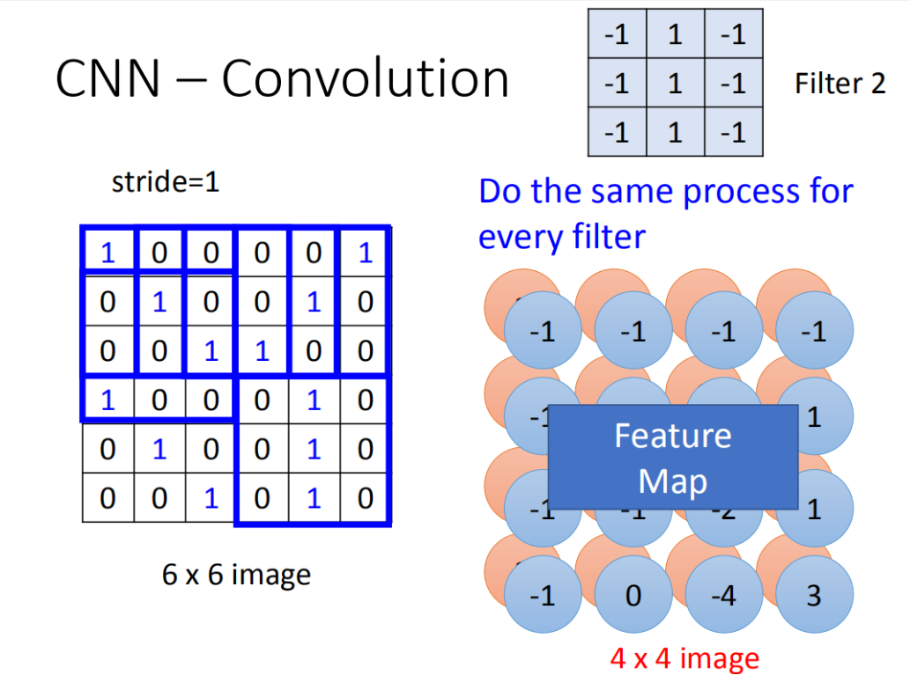

在一个convolution layer 里面会有很多的filter(刚才只是一个filter的结果)，那另外的filter会有不同的参数(图中显示的filter2)，它也做跟filter1一模一样的事情，在filter放到左上角再内积得到结果-1，依次类推。你把filter2跟 input image做完convolution之后，你就得到了另一个4*4的matrix，红色4 *4的matrix跟蓝色的matrix合起来就叫做feature map，看你有几个filter，你就得到多少个image(你有100个filter，你就得到100个4 *4的image)

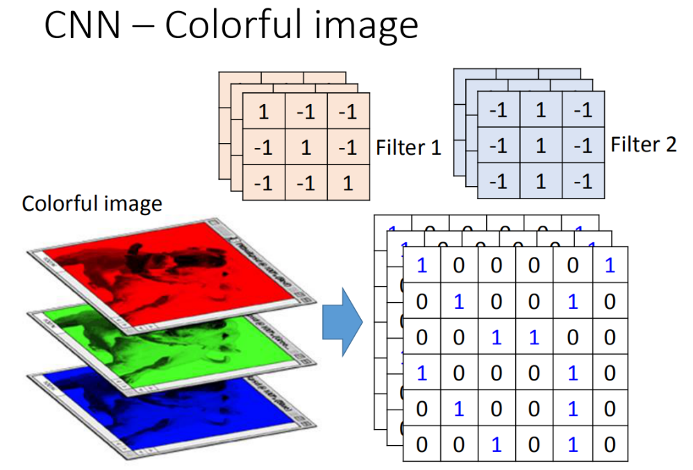

 刚才举的例子是一张黑白的image，所以input是一个matrix。若今天换成彩色的image,彩色的image是由RGB组成的，所以，一个彩色的image就是好几个matrix叠在一起，就是一个立方体。如果要处理彩色image，这时候filter不是一个matrix，filter而是一个立方体。如果今天是RGB表示一个pixel的话，那input就是3*6 *6，那filter就是3 *3 *3。
 
 在做convolution的话，就是将filter的9个值和image的9个值做内积(不是把每一个channel分开来算，而是合在一起来算，一个filter就考虑了不同颜色所代表的channel)

#  convolution和fully connected之间的关系

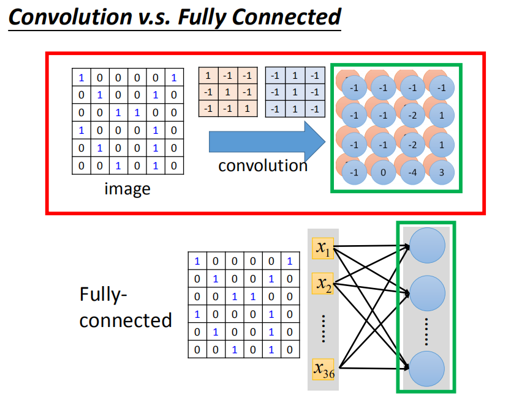

convolution就是fully connected layer把一些weight拿掉了。经过convolution的output其实就是一个hidden layer的neural的output。如果把这两个link在一起的话，convolution就是fully connected拿掉一些weight的结果。

我们在做convolution的时候，我们filter1放到左上角(先考虑filter1)，然后做inner product，得到内积为3，这件事情就等同于把6* 6的image拉直(变成如图所示)。然后你有一个neural的output是3，这个neural的output考虑了9个pixel，这9个pixel分别就是编号(1,2,3,7,8,9,13,14,15)的pixel。这个filter做inner product以后的output 3就是某个neuron output 3时，就代表这个neuron的weight只连接到(1,2,3,7,8,9,13,14,15)。这9个weight就是filter matrix里面的9个weight(同样的颜色)

在fully connected中，一个neural应该是连接在所有的input(有36个pixel当做input，这个neuron应连接在36个input上)，但是现在只连接了9个input(detain一个pattern，不需要看整张image，看9个input就好)，这样做就是用了比较少的参数了。

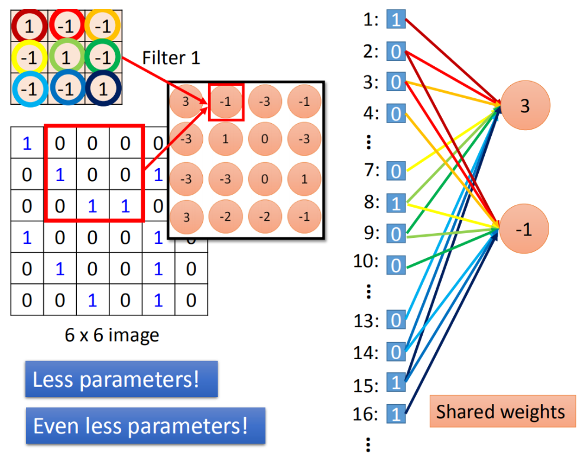

将stride=1(移动一格)做内积得到另外一个值-1，假设这个-1是另外一个neural的output，这个neural连接到input的(2,3,4，8,9,10,14，15,16)，同样的weight代表同样的颜色。在9个matrix

当我们做这件事情就意味说：这两个neuron本来就在fully connect里面这两个neural本来是有自己的weight，当我们在做convolution时，首先把每一个neural连接的wight减少，强迫这两个neural共用一个weight。这件事就叫做shared weight，当我们做这件事情的时候，我们用的这个参数就比原来的更少。

# Max pooling

相对于convolution来说，Max Pooling是比较简单的。我们根据filter 1得到4*4的maxtrix，根据filter2得到另一个4 *4的matrix，接下来把output ，4个一组。每一组里面可以选择它们的平均或者选最大的都可以，就是把四个value合成一个value。这个可以让你的image缩小。

假设我们选择四个里面的max vlaue保留下来，这样可能会有个问题，把这个放到neuron里面，这样就不能够微分了，但是可以用微分的办法来处理的

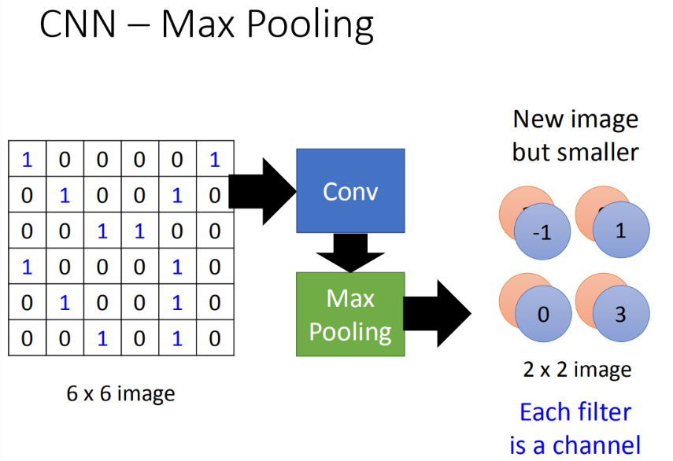

做完一个convolution和一次max pooling，就将原来6 * 6的image变成了一个2 *2的image。这个2 *2的pixel的深度depend你有几个filter(你有50个filter你就有50维)，得到结果就是一个new image but smaller，一个filter就代表了一个channel。

这件事可以repeat很多次，通过一个convolution + max pooling就得到新的 image。它是一个比较小的image，可以把这个小的image，做同样的事情，再次通过convolution + max pooling，将得到一个更小的image。

这边有一个问题：第一次有25个filter，得到25个feature map，第二个也是由25个filter，那将其做完是不是要得到`$25^2$`的feature map。其实不是这样的！

假设第一层filter有2个，第二层的filter在考虑这个imput时是会考虑深度的，并不是每个channel分开考虑，而是一次考虑所有的channel。所以convolution有多少个filter，output就有多少个filter(convolution有25个filter，output就有25个filter。只不过，这25个filter都是一个立方体)

# Flatten

flatten就是feature map拉直，拉直之后就可以丢到fully connected feedforward netwwork，然后就结束了。

# CNN in Keras

唯一要改的是：network structure和input format，本来在DNN中input是一个vector，现在是CNN的话，会考虑 input image的几何空间的，所以不能给它一个vector。应该input一个tensor(高维的vector)。为什么要给三维的vector？因为image的长宽高各是一维，若是彩色的话就是第三维。所以要给三维的tensor

**model.add(Convolution2D**( **25, 3, 3**)

25代表有25个filter，3 *3代表filter是一个3 *3的matrix

**Input_shape=(28,28,1)**

假设我要做手写数字辨识，input是28 *28的image，每个pixel都是单一颜色。所以input_shape是(1,28,28)。如果是黑白图为1(blacj/white)，如果是彩色的图时为3(每个pixel用三个值来表述)。

**MaxPooling2D**(( 2, 2 ))

2,2表示把2*2的feature map里面的pixel拿出来，选择max value

假设我们input一个1 *28 * 28的image，你就可以写model.add(Convolution2D( 25, 3, 3, Input_shape=(28,28,1)))。通过convplution以后得到output是25 *26 26(25个filter，通过3 *3得到26 * 26)。然后做max pooling，2 *2一组选择 max value得到 25 *13 * 13

然后在做一次convolution，假设我在这选50个filter，每一个filter是3 *3时，那么现在的channel就是50。13 *13的image通过3 *3的filter，就成11 *11，然后通过2 *2的Max Pooling，变成了50 *5 *5

在第一个convolution layer里面，每一个filter有9个参数，在第二个convolution layer里面，虽然每一个filter都是3 *3，但不是3 *3个参数，因为它input channel 是25个，所以它的参数是3 *3 *25(225)。

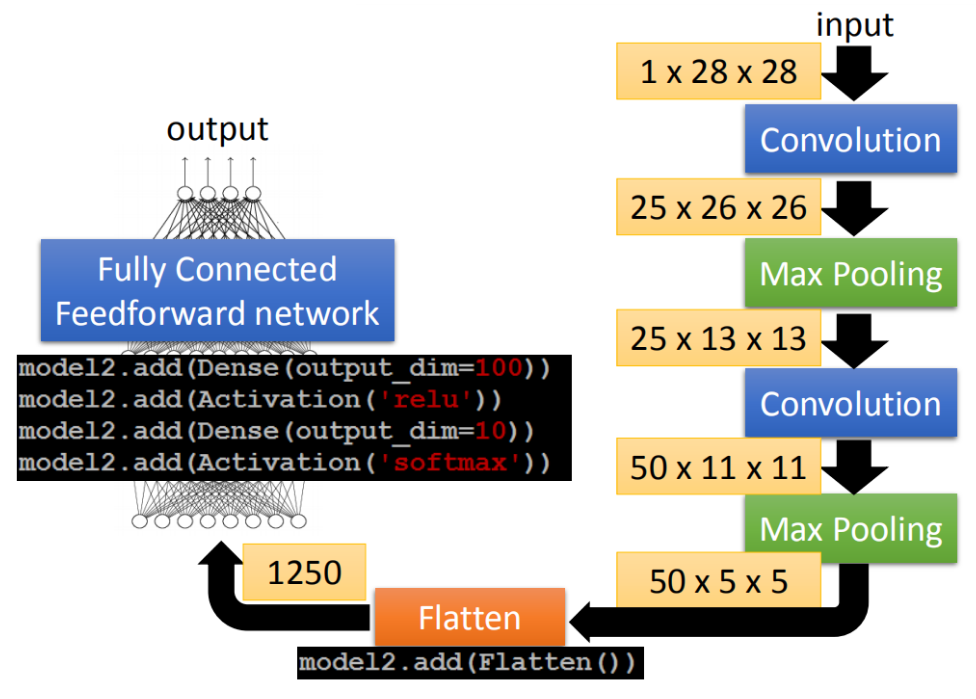

通过两次convolution，两次Max Pooling，原来是1 *28 *28变为50 *5 *5。flatten的目的就是把50 *5 *5拉直，拉直之后就成了1250维的vector，然后把1250维的vector丢到fully connected。

# CNN学到了什么?

很多人常会说：deep learning就是一个黑盒子，然后你learn以后你不知道它得到了什么，所以有很多人不喜欢用这种方法。但还有很多的方法分析的，比如说我们今天来示范一下咋样分析CNN，它到底学到了什么。

分析input第一个filter是比较容易的，因为一个layer每一个filter就是一个3*3的mmatrix，对应到3 *3的范围内的9个pixel。所以你只要看到这个filter的值就可以知道说：它在detain什么东西，所以第一层的filter是很容易理解的，但是你没有办法想要它在做什么事情的是第二层的filter。在第二层我们也是3 *3的filter有50个，但是这些filter的input并不是pixel(3 *3的9个input不是pixel)。而是做完convolution再做Max Pooling的结果。所以这个3 *3的filter就算你把它的weight拿出来，你也不知道它在做什么。另外这个3 *3的filter它考虑的范围并不是3 *3的pixel(9个pixel)，而是比9个pxiel更大的范围。不要这3 *3的element的 input是做完convolution再加Max Pooling的结果。所以它实际上在image上看到的范围，是比3 *3还要更大的。那我们咋样来分析一个filter做的事情是什么呢，以下是一个方法。

我们知道现在做第二个convolution layer里面的50个filter，每一个filter的output就是一个matrix(11*11的matrix)。假设我们现在把第k个filter拿出来，它可能是这样子的(如图)，每一个element我们就叫做`$a_{ij}^k$`(上标是说这是第k个filter，i,j代表在这个matrix里面的第i row和第j column)。

接下来我们定义一个东西叫做："Degree of the activation of the k-th filter"，我们定义一个值代表说：现在第k个filter有多被active(现在的input跟第k个filter有多match)，第k个filter被启动的Degree定义成：这个11*11的 matrix里面全部的 element的summation。(input一张image，然后看这个filter output的这个11 *11的值全部加起来，当做是这个filter被active的程度)

截下来我们要做的事情是这样子的：我们想知道第k个filter的作用是什么，所以我们想要找一张image，这张image它可以让第k个filter被active的程度最大。

假设input一张image，我们称之为X，那我们现在要解的问题就是：找一个x，它可以让我们现在定义的activation Degree `$a^k$`最大，这件事情要咋样做到呢？其实是用gradient ascent你就可以做到这件事(minimize使用gradient descent，maximize使用gradient ascent)

这是事还是蛮神妙的，我们现在是把X当做我们要找的参数用gradient ascent做update，原来在train CNN network neural的时候，input是固定的，model的参数是你需要用gradient descent找出来的，用gradient descent找参数可以让loss被 minimize。但是现在立场是反过来的，现在在这个task里面，model的参数是固定的，我们要让gradient descent 去update这个X，可以让这个activation function的Degree of the activation是最大的。

这个是得到的结果，如果我们随便取12个filter出来，每一个filter都去找一张image，这个image可以让那个filter的activation最大。现在有50个filter，你就要去找50张image，它可以让这些filter的activation最大。我就随便取了前12个filter，可以让它最active的image出来(如图)。

这些image有一个共同的特征就是：某种纹路在图上不断的反复。比如说第三张image，上面是有小小的斜条纹，意味着第三个filter的工作就是detain图上有没有斜的条纹。那不要忘了每一个filter考虑的范围都只是图上一个小小的范围。所以今天一个图上如果出现小小的斜的条纹的话，这个filter就会被active，这个output的值就会比较大。那今天如果让图上所有的范围通通都出现这个小小的斜条纹的话，那这个时候它的Degree activation会是最大的。(因为它的工作就是侦测有没有斜的条纹，所以你给它一个完整的数字的时候，它不会最兴奋。你给它都是斜的条纹的时候，它是最兴奋的)

所以你就会发现：每一个filter的工作就是detain某一张pattern。比如说：第三图detain斜的线条，第四图是detain短的直线条，等等。每一个filter所做的事情就是detain不同角度的线条，如果今天input有不同角度的线条，你就会让某一个activation function，某一个filter的output值最大

## 分析全连接层

在做完convolution和Max Pooling以后，要做一件事情叫做flatten，把flatten的结果丢到neural network里面去。那我们想要知道：在这个neural network里面，每一个neural的工作是什么。

我们要做的事情是这样的：定义第j个neural，它的output叫做`$a_j$`。接下来我们要做事情就是：找一张image(用gradient ascent的方法找一张X)，这个image X你把它丢到neural network里面去，它可以让`$a_j$`的值被maximize。找到的结果就是这样的(如图)

如图是随便取前9个neural出来，什么样的图丢到CNN里面可以让这9个neural最被active output的值最大，就是这9张图(如图)

这些图跟刚才所观察到图不太一样，在刚在的filter观察到的是类似纹路的图案，在整张图上反复这样的纹路，那是因为每个filter考虑是图上一个小小的range(图上一部分range)。现在每一个neural，在你做flatten以后，每个neural的工作就是去看整张图，而不是是去看图的一小部分。

那今天我们考虑是output呢？(output就是10维，每一维对应一个digit)我们把某一维拿出来，找一张image让那个维度output最大。那我们会得到咋样的image呢？你可以想象说：每一个output，每一个dimension对应到某一个数字。

现在我们找一张image，它可以让对应在数字1的output 最大，那么那张image显然就像看起来是数字1。你可以期待说：我们可以用这个方法让machine自动画出数字。

但是实际上我们得到的结果是这样子的，每一张图分别代表数字0-9。也就是说：我们到output layer对应到0那个neuron，其实是这样的(如图)，以此类推。你可能会有疑惑，为什么是这样子的，是不是程序有bug。为了确定程序没有bug，再做了一个实验是：我把每张image(如图)都丢到CNN里面，然后看它classifier的结果是什么。CNN确定就说：这个是1，这个是，...，这个是8。CNN就觉得说：你若拿这张image train出来正确率有98的话，就说：这个就是8。所以就很神奇

这个结果在很多的地方有已经被观察到了，今天的这个neuron network它所学到东西跟我们人类是不太一样的(它所学到的东西跟我们人类想象和认知不一样的)。你可以查看这个链接的paper(如图)

[相关的paper](https://www.youtube.com/watch?v=M2IebCN9H)

## 让图更像数字

我们有没有办法让这个图看起来更像数字呢？想法是这样的：一张图是不是数字我们有一些基本的假设，比如说：这些就算你不知道它是什么数字(显然它不是digit)，人类手写出来的就不是这个样子。所以我们应该对x做constraint，我们告诉machine，有些x可能会使y很大但不是数字。我们根据人的power-knowledge就知道，这些x不可能是一些数字。那么我们可以加上咋样的constraint呢？(图中白色的亮点代表的是有墨水的，对一个digit来说，图白的部分其实是有限的，对于一个数字来说，一整张图的某一个小部分会有笔画，所以我们应该对这个x做一些限制)

假设image里面的每一个pixel用`$x_{ij}$`来表示，(每一个image有28 *28的pixel)我们把所有image上`$i,j$`的值取绝对值后加起来。如果你熟悉machine learning的话，这一项就是L1-regularization。然后我们希望说：在找一个x可以让`$y^i$`最大的同时让`$|x_{ij}|$`的summation越小越好。也就是我们希望找出的image，大部分的地方是没有涂颜色的，只有非常少的部分是有涂颜色的。如果我们加上constraint以后我们得到的结果是这样的(如右图所示)，跟左边的图比起来，隐约可以看出来它是一个数字(得到的结果看起来像数字)

你可能会有一个问题，绝对值咋样去微分，下堂课会讲到

你如果加上一些额外的constraint，比如说：你希望相邻的pixel
是同样的颜色等等，你应该可以得到更好的结果。不过其实有更多很好的方法可以让machine generate数字

# Deep Dream

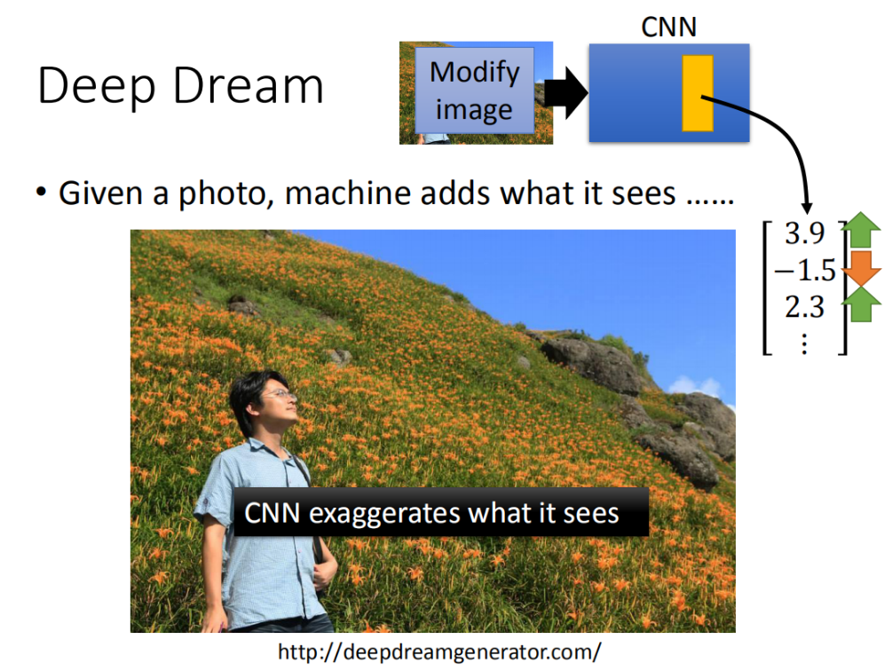

其实上述的想法就是Deep Dream的精神，Deep Dream是说：如果你给machine一张image，它会在这张image里加上它看到的东西。咋样做这件事情呢？你先找一张image，然后将这张image丢到CNN中，把它的某一个hidden layer拿出来(vector)，它是一个vector(假设这里是：[3.9, -1.5, 2.3...])。接下来把postitive dimension值调大，把negative dimension值调小(正的变的更正，负的变得更负)。你把这个(调节之后的vector)当做是新的image的目标(把3.9的值变大，把-1.5的值变得更负，2.3的值变得更大。然后找一张image(modify image)用GD方法，让它在hidden layer output是你设下的target)。这样做的话就是让CNN夸大化它所看到的东西，本来它已经看到某一个东西了，你让它看起来更像它原来看到的东西。本来看起来是有一点像东西，它让某一个filter有被active，但是你让它被active的更剧烈(夸大化看到的东西)。

如果你把这张image拿去做Deep Dream的话，你看到的结果是这样子的。右边有一只熊，这个熊原来是一个石头(对机器来说，这个石头有点像熊，它就会强化这件事情，所以它就真的变成了一只熊)。Deep Dream还有一个进阶的版本，叫做Deep Style

# Deep style

今天input一张image，input一张image，让machine去修改这张图，让它有另外一张图的风格 (类似于风格迁移)

得到的结果就是这样子的

[这里给一个reference给参考](https://arxiv.org/abs/158.06576)

其中做法的精神是这样的：原来的image丢给CNN，然后得到CNN的filter的output，CNN的filter的output代表这张image有什么content。接下来你把呐喊这张图也丢到CNN里面，也得到filter的output。我们并不在意一个filter ，而是在意filter和filter之间
的convolution，这个convolution代表了这张image的style。

接下来你用同一个CNN找一张image，这张image它的content像左边这张相片，但同时这张image的style像右边这张相片。你找一张image同时可以maximize左边的图，也可以maximize右边的图。那你得到的结果就是像最底下的这张图。用的就是刚才讲的gradient ascent的方法找一张image，然后maximize这两张图，得到就是底下的这张图。

# CNN的应用

## 围棋

我们现在CNN已经在很多不同的应用上，而不是只有影像处理上。比如：CNN现在有一个很知名的应用，就用用在下围棋上面。为什么CNN可以用来下围棋上面呢？

我们知道如果让machine来下围棋，你不见得需要用CNN。其实一般的topic neuron network也可以帮我们做到这件事情。你只要learn一个network(也就是找一个function)，它的input是棋盘，output是棋盘上的位置。也就是说：你根据这个棋盘的盘式，如果你下一步要落子的话，你落子的位置其实就可以让machine学会。

所以你用Fully-connected feedforward network也可以帮我们做到让machine下围棋这件事情。也就是你只要告诉input是一个19 *19的vector，每一个vector的dimension对应到棋盘上面的每一个位置。machine就可以学会下围棋了。
如果那个位置有一个黑子的话就是1，如果有一个白子的话就是-1，反之就是0。

但是我们这边采用CNN的话，我们会得到更好的performance。我们之前举的例子是把CNN用在影像上面，也就是input是matrix(也就是把19*19的vector表示成19 *19的matrix)，然后当做一个image来看，然后让它output 下一步落子的位置就结束了。

告诉machine说：看到落子在“5之五”，CNN的output就是在“天元”的地方是1，其他地方是0。看到“5之五”和“天元”都有子，CNN的output就是在“五之5”的地方是1，其他地方是0。这个是supervised部分

现在大家都说“AlphaGo”，都是懂懂的样子。但是自从“AlphaGo”用了CNN以后，大家都觉得说：CNN应该很厉害。所以如果你没有用CNN来处理你的问题，别人就会问你为什么不用CNN来处理问题(比如说：面试的时候)，CNN不是比较强吗

什么时候应该用CNN呢？image必须有该有的那些特性，在CNN开头就有说：根据那三个观察，所以设计出了CNN这样的架构。在处理image时是特别有效的。为什么这样的架构也同样可以用在围棋上面(因为围棋有一些特性跟影像处理是非常相似的)

第一个是：在image上面，有一些pattern是要比整张image还要小的多的(比如：鸟喙是要比整张的image要小的多)，只需要看那一小的部分就知道那是不是鸟喙。在围棋上也有同样的现象，如图所示，一个白子被三个黑子围住(这就是一个pattern)，你现在只需要看这一小小的范围，就可以知道白子是不是没“气”了，不需要看整个棋盘才能够知道这件事情，这跟image是有同样的性质。

在“AlphaGo”里面它的第一个layer filter其实就是用5*5的filter，显然做这个设计的人觉得说：围棋最基本的pattern可能都是在5 *5的范围内就可以被侦测出来，不需要看整个棋牌才能知道这件事情。

接下来我们说image还有一个特性：同样的pattern会出现在不同的regions，而他们代表的是同样的意义，在围棋上可能也会有同样的现象。像如图这个pattern可以出现在左上角，也可以出现在右下角，它们都代表了同样的意义。所以你可以用同一个pattern来处理在不同位置的同样的pattern。所以对围棋来说，是有这两个特性的。

## AlphaGo

但是没有办法让我想通的地方就是第三点，我们可以对一个image做subsampling，把image变为原来的1/4的大小，但是也不会影响你看这张图的样子。因为基于这个观察，所以有Max Pooling这个layer。但是对围棋来说，你可以做这件事情吗？你可以丢到奇数行偶数类，这样它还是同一个盘式吗，显然不是的，这个让我相当的困扰。

“AlphaGo”里面有用了Max Pooling这个架构，或许这是一个弱点。可以针对这个弱点去攻击它，击败它。但是“AlphaGo”(比李世石还强)，没有这个显而易见的弱点

有一天我突然领悟到“AlphaGo”的CNN架构里面有什么特别的地方(“AlphaGo”Paper的附录)，在“AlphaGo”Paper里面只说了一句：用CNN架构，但它没有在正文里仔细描述CNN的架构，会不会实际上CNN架构里有什么特别的玄机呢？

在“AlphaGo”Paper的附录里面，描述了neuron network structure，它的input是一个19 *19 *48的image。19 *1是可以理解，因为棋盘就是19 *19。48是咋样来的呢？对于“AlphaGo”来说，它把每一个位置都用48个value来描述。这里面的value包括：我们只要在一个位置来描述有没有白子，有没有黑子；还加上了domain-knowledge(不只是说：有没有黑子或者白子，还会看这个位置是不是出于没“气”的状态，等等)

如果读完这段你会发现：第一个layer有做 zero pads。也就是说：把原来19*19的image外围补上更多的0，让它变成23 *23的image。

第一个hidden layer用的是5*5 filter(总共有k个filter)，k的值在Paper中用的是192(k=192)；stride设为1；使用RLU activation function等等。

然后你就会发现“AlphaGo”是没有用Max Pooling，所以这个neuron network的架构设计就是“运用之妙，存乎一心”。虽然在image里面我们都会用Max Pooling这个架构，但是针对围棋的特性来设计neuron network的时候，我们是不需要Max Pooling这个架构的，所以在“AlphaGo”里面没有这个架构.

## 语音

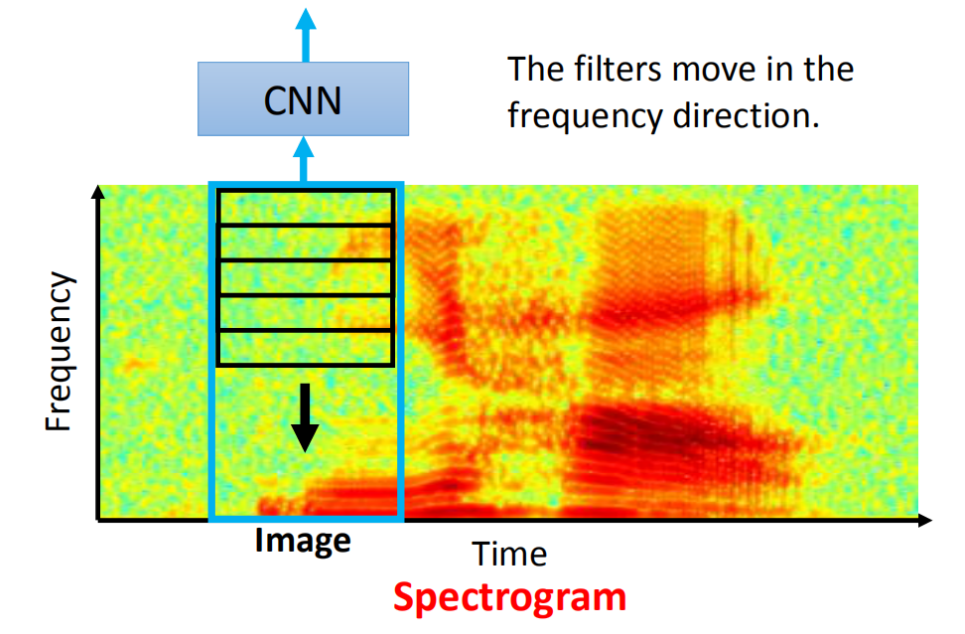

CNN也可以用在其它的task里面，比如说：CNN也用在影像处理上。如图是一段声音，你可以把一段声音表示成Spectrogram(横轴是时间，纵轴是那段时间里面声音的频率)，红色代表：在那段时间里那一频率的energy比较大。

这张image其实是我说“你好”，然后看到的Spectrogram。有通过训练的人，看这张image，就知道这句话的内容是什么。

人既然可以看这个image就可以知道是什么样的声音讯号，那我们也可以让机器把这个Spectrogram当做一张image。然后用CNN来判断：input一张image，它是对应什么样的声音讯号(单位可能是phone)。但是神奇的地方是：CNN里面的时候，在语音上，我们通常只考虑在frequency方向上移动的filter。也就是说：我们的filter是长方形的，其中宽是跟image的宽是一样的，我们在移动filter的时候，我们移这个方向(如图所示)

如果把filter向时间的方向移动的话，结果是没有太大的帮助。这样的原因是：在语音里面，CNN的output还会接其他的东西(比如:LSTM)，所以在向时间方向移动是没有太多的帮助。

为什么在频率上的filter会有帮助呢？我们用filter的目的是：为了detain同样的pattern出现在不同的range，我们都可以用同一个的filter detain出来。那在声音讯号上面，男生跟女生发同样的声音(同样说“你好”)，Spectrogram看起来是非常不一样的，它们的不同可能只是频率的区别而已(男生的“你好”跟女生的“你好”，它们的pattern其实是一样的)

所以今天我们把filter在frequency direction移动是有效的。当我们把CNN用在application时，你永远要想一想，这个application的特性是什么，根据那个application的特性来design network的structure

## 文本
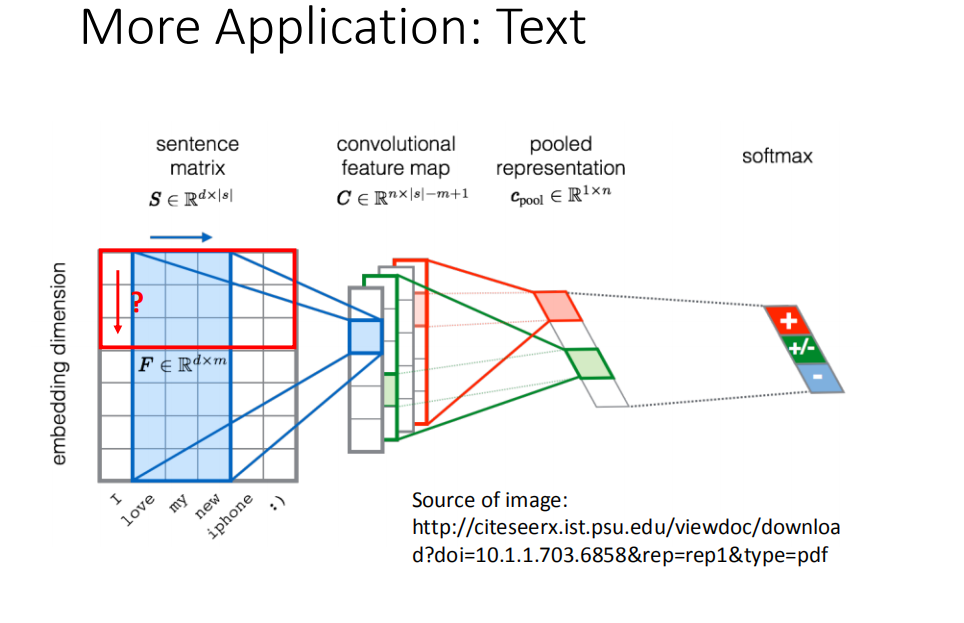

[相关的paper](http://citeseerx.ist.psu.edu/viewdoc/download?doi=10.1.1.703.6858&rep=rep1&type=pdf)

我们知道CNN耶可以用在文字处理上面，这个是从paper截下来的图。在文字处理上面，假设你要做的是：让machine侦测这个word sequence代表的是positive还是negative。首先input一个word sequence，你把word sequence里面的每一个word都用一个vector来表示。这边的每一个vector代表word本身的sementic，如果两个word含义越接近的话，那它们的vector在高维的空间上就越接近，这个就叫做“wordembedding”(每一个word用vector来表示)。

当你把每一个word用vector来表示的时候，你把sentence所有的word排在一起，它就变成一张image。你可以把CNN套用在这个image上面。

当我们把CNN用在文字处理上的时候，你的filter其实是这个样子的(如图所示)。它的高跟image是一样的，你把filter沿着句子里面词汇的顺序来移动，然后你就会得到一个vector。不同的filter就会得到不同的vector，然后Max Pooling，然后把Max Pooling的结果丢到fully connect里面，就会得到最后的结果。在文字处理上，filter只在时间的序列上移动，不会在“embedding dimension”这个方向上移动。如果你有做过类似的task(文字处理)，知道“embedding dimension”指的是什么，你就会知道在“embedding dimension”反向上移动是没有帮助的，因为在word embedding里面每一个dimension的含义其实是独立的。所以当我们如果使用CNN的时候，你会假设说：第二个dimension跟第一个dimension有某种特别的关系；第四个dimension跟第五个dimension有某种特别的关系。这个关系是重复的(这个pattern出现在不同的位置是同样的意思)。但是在word embedding里面，不同dimension是独立的(independent)。所以在embedding dimension移动是没有意义的，所以你在做文字处理的时候，你只会在sentence顺序上移动filter，这个是另外的例子。

## Reference
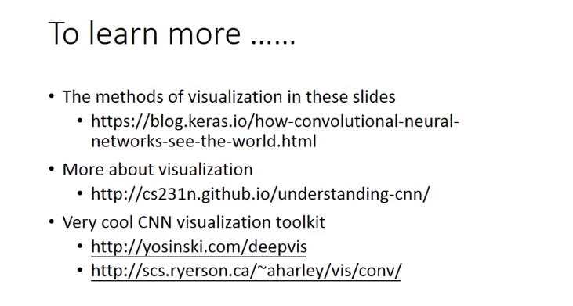

如果你想知道更多visualization事情的话，以上是一些reference。

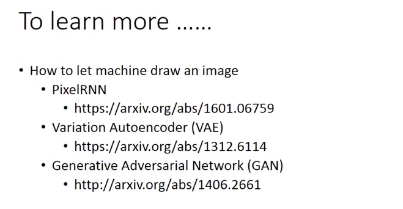

如果你想要用Degree的方法来让machine自动产生一个digit，这件事是不太成功的，但是有很多其它的方法，可以让machine画出非常清晰的图。这里列了几个方法，比如说：PixelRNN，VAE，GAN来給参考.

