# Unsupervised Learning:  Deep Auto-encoder

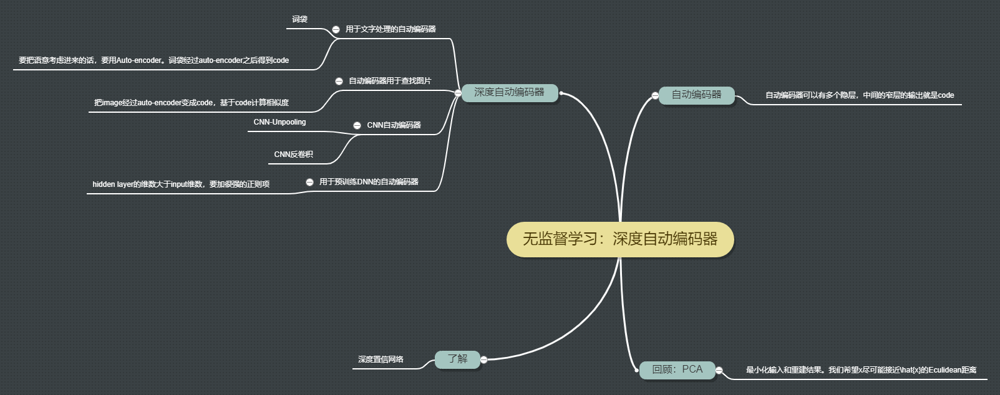

## Auto-encoder
Auto-encoder的想法是这样子的：我们先去找一个encoder，这个encoder input一个东西(假如说，我们来做NMIST的话，就是input一张digit，它是784维的vector)，这个encoder可能就是一个neural network，它的output就是code(这个code远比784维要小的，类似压缩的效果)，这个coder代表了原来input一张image compact representation。

但是现在问题是：我们现在做的是Unsupervised learning，你可以找到一大堆的image当做这个NN encoder的input，但是我们不知道任何的output。你要learn 一个network，只有一个input，你没有办法learn它。那没有关系，我们要做另外一件事情：想要learn 一个decoder，decoder做的事情就是：input一个vector，它就通过这个NN decoder，它的output就是一张image。但是你也没有办法train一个NN decoder，因为你只要output，没有input。

这两个network，encoder decoder单独你是没有办法去train它。但是我们可以把它接起来，然后一起train。也就是说：建一个neural network ，input一张image，中间变成code，再把code变成原来的image。这样你就可以把encoder跟decoder一起学，那你就可以同时学出来了。

那我们刚才在PCA里面看过非常类似的概念，从PCA开始讲起。我们刚才讲过说：PCA其实在做的事情是：input一张image x(在刚才的例子里面，我们会让x-`$\bar{x}$`当做input，这边我们把减掉`$\bar{x}$`省略掉，省略掉并不会太奇怪，因为通常在做NN的时候，你拿到的data其实会normlize，其实你的data mean是为0，所以就不用再去减掉mean)，把x乘以一个weight，通通NN一个layer得到c，c乘以matrix w的tranpose得到`$hat{x}$`。`$\hat{x}$`是根据这些component的reconstruction的结果

### Recap:PCA 
在PCA里面，我们就是minimize input跟reconstruction的结果。我们要让x跟`$\hat{x}$`的Eculidean distance越接近越好，这是PCA做的是事情。如果把它当成neural network来看的话，input x就是input layer，output `$\hat{x}$`就是output layer，中间的component weight就是hidden layer(在PCA里面是，它是linear)。那这个hidden layer我们通常叫它Bottleneck later。

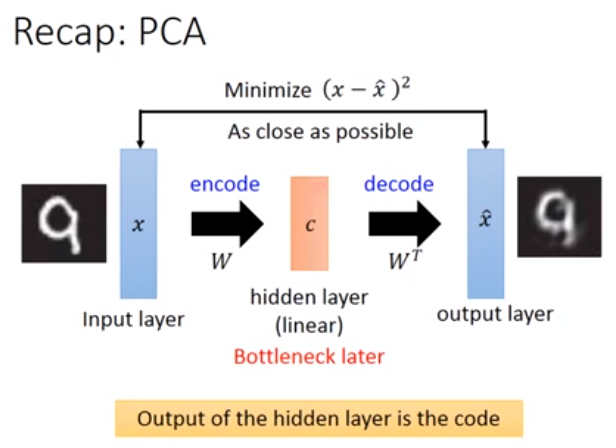

为什么叫Bottleneck later呢？所以你的component的数目通常会比你的input dimension还要小的多，如果你要当做layer看的话，是一个特别窄的layer，所以我们叫它Bottleneck later(因为你在dimension reduction)

前面那个部分是在做encode，把input变为一组code。后面这个部分在做decode，如果把component weight相成code的话，后面这件事就是把code变成原来的image。hidden layer的output就是我们要找的那些code。你可以用gradient descent来解PCA，PCA只有一个hidden layer，那我们想把变成更多的hidden layer。

可以变成更多的hidden layer，你就搞一个很深的neural network，它有很多很多层。然后在这个很多很多层的neural network里面，你input一个x，最后得到的output是`$\hat{x}$`，你会希望x跟`$\hat{x}$`越接近越好。

中间你会有一个特别窄的layer，这个特别窄的layer，有着特别少的neural ，这些layer的output就代表了一组code。从input layer到bottle layer，就是encode。从bottle layer到最后的`$\hat{x}$`就是decode，这个deep的Auto-encoder最早出现2006年。

### Deep Auto-encoder

那如果按照刚才在PCA里面看到的，从input到hidden layer的`$W_1$`好像要跟最后一个layer的output的weight互为transpose(`$W_1^T$`)。你在training的时候，你可以做到这件事情，可以把左边的weight跟右边的weight 乘起来，在他们在做training的时候，永远保持值是一样。做这件事情的好处就是，你现在的Auto-encode的参数就少一半，比较不会有overfitting的情形。但是这件事情不是必要的，没有什么理由说，input到hidden layer的`$W_1$`好像要跟最后一个layer的output的weight互为transpose(`$W_1^T$`)。所以现在常见的做法是：兜一个neural network，一直train下去，不管它weight是什么，就是你的结果。
 
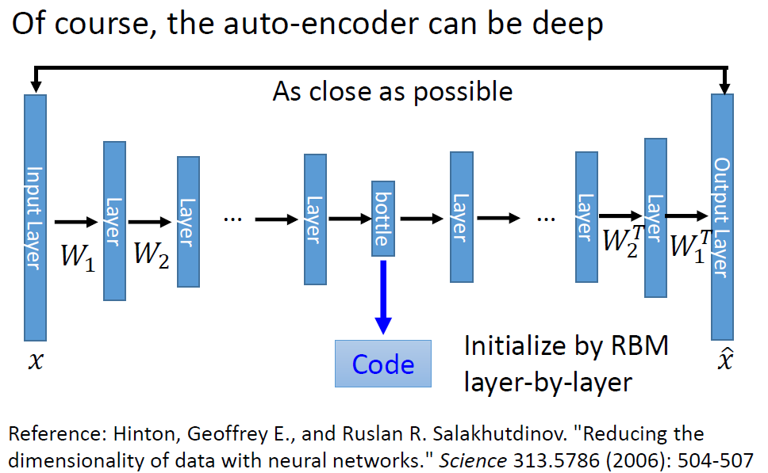

original image你做PCA，从784维降到30维，然后从30维reconstruction回784维，得到的image差不多，可以看出说，它是比较模糊的。如果今天是用deep encoder的话，784维先扩为1000维，再不断的下降，下降到30维(你很难说：为什么它会设计成这样子)，然后再把它解回来。你会发现说，如果你今天用的是deep Auto-encoder的话，它的结果看起来非常的好。

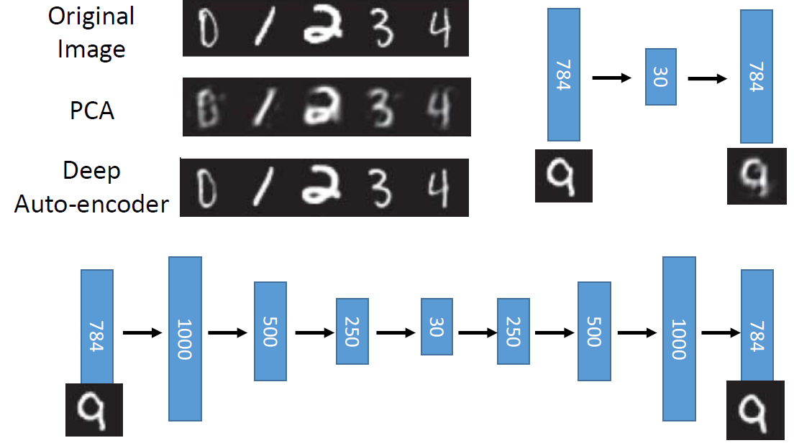

那如果你今天不是把它将到30维，而是把它降到二维的话，所以的digit被混在一起(不同的颜色代表了不同的数字)。如果你是用depp Auto-encoder的话，你会发现说：这些数字是分开的。

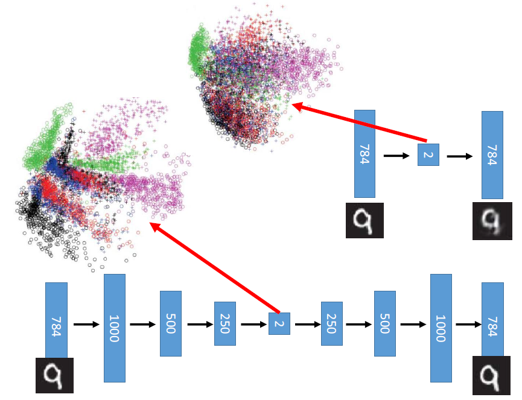

### Auto-encoder-Text Retrieval
这个Auto-encoder也可以用在文字处理上，比如说：我们把一篇文章压成一个code。举例来说：现在要做文字的搜寻，在文字搜寻里面有一招叫做：vector space model。vector space model是说：我们现在把一篇文章都表示成一个空间中的vector(图中蓝色的圈圈就是一篇文章，经过降维后)。假设使用者查询一个词汇，我们把查询的词汇也变成一个空间中的点。接下里你就是计算这个查询词汇跟每一篇document之间的inner product，选择较为接近，相似程度最高的。这个模型要work，现在把一个document变成一个vector表现的是好还是不好。咋样把一个document表示成一个vector，一个方法叫做“Bag-of-word”。这个“Bag-of-wor”的想法是说：我们现在开一个vector，这个vector的sentence就是let think sentence(假设世界上有10w词汇，这个vector的sentence就是10w维)

假设现在有一篇document，有一个句子是："this is an apple"，那这个document如果把它表示成一个vector的话就是在this那一维是1，is那一维是1，an那一维是1，apple那一维是1，其它为0。有时候，你想要做的更好，你想要乘上weight，代表那一个词汇的重要性。这个重要性。但是用这个模型，它没有考虑Semantics相关的东西，它不知道台湾大学就是指的台大，它不知道apple，orange是水果。对它来说：is,an,apple之间是没有任何关系的。

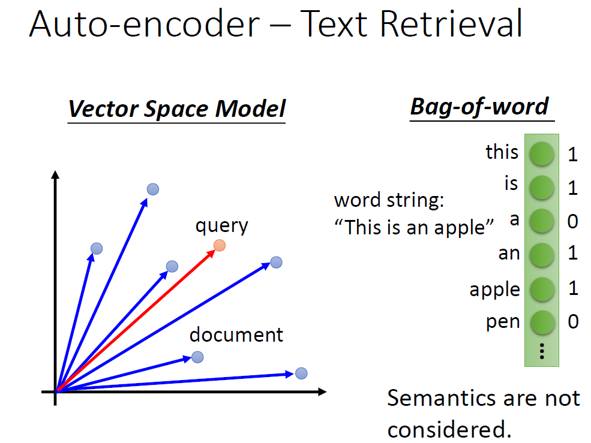

那我们可以用Auto-encoder被考虑进来，举例来说，你learn一个Auto-encoder，它的input就是一个document 或者是一个query，通过encoder把它压成二维。每一个点代表一个document，不同颜色的类代表document属于哪一类。今天要做搜寻的时候，今天输入一个词汇，那你就把那个query也通过这个encoder把它变为一个二维的vector。假设query落在这一类，你就可以知道说：这个query是跟Energy markets有关的document retrieve出来，这个看起来结果是相当惊人的。如果你用LSA的话，你得不到类似的结果

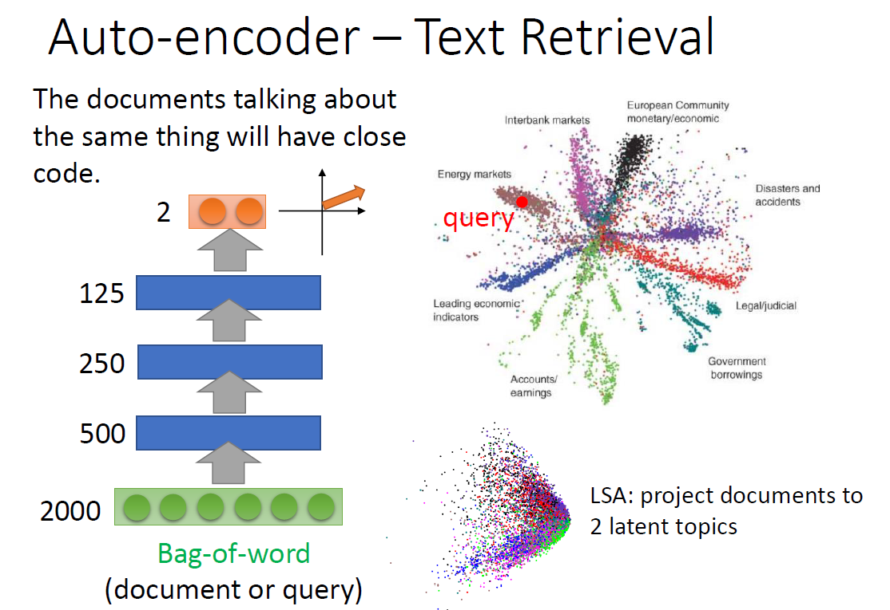

### Auto-encoder-Similar Image Search
Auto-encoder也用在image search上面，假设这张图是你要找的对象(image query)，计算这个image query跟其他database之间pixel的相似程度，然后你再看出最像的几张是要的结果。如果你只是这么做的话，其实得不到太好的结果。

你拿这张image(Wack Jackson)去跟database里面的image算相似度的话，你找出最像的应该是这几张(如图)，所以你算pixel的话是得不到好的结果

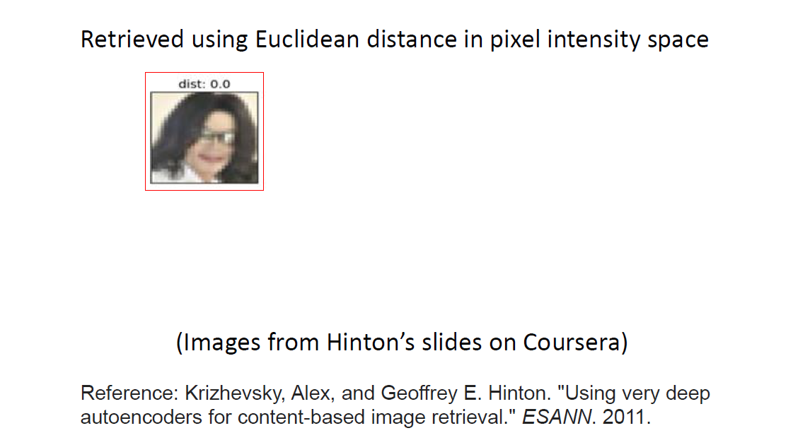

你可以用Auto-encoder把每一张image变成一个code，然后再code上面，再去做搜寻。因为做这件事情是unsupervised ，所以learn一个Auto-encoder是unsupervised，所以你要多少data都行(supervised是很缺data的，unsupervised是不缺data的)

input一张32*32的image，每一个pixel是RGB来表示(32 * 32 *3)，变成8192维，然后dimension reduction变成4096维，最后一直变为256维，你用256维的vector来描述这个image。然后你把这个code再通过另外一个decoder(形状反过来，变成原来的image)，它的reconstruction是右上角如图。

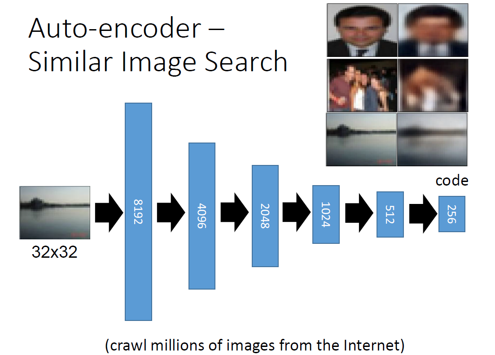

如果你不是在pixel上算相似度，是在code上算相似度的话，你就会得到比较好的结果。举例来说：你是用Wack Jackson当做image的话，你找到的都是人脸，可能这个image在pixel label上面看起来是不像的，但是你通过很多的hidden layer把它转成code的时候，在那个256维的空间上看起来是像的

Auto-encoder可以用在Pre-training上面，我们都知道你在train一个neural network的时候，你有时候很烦恼说：你要怎么做参数的initialization。有没有一些方法让你找到一组好的initialization，这种找比较好的initialization的方法就叫做“Pre-training”。你可以用Auto-encoder来做Ptr-training

肿么做呢，假如说：我要INIST initialization，你可以做一个neural network input784维，第一个hidden layer是1000，第二个hidden layer是1000，第三个hidden layer是500，然后到10维。那我做Pre-taining的时候，我先train一个Auto-encoder，这个Auto-encoder input784维，中间有1000维的vector，然后把它变回784维，我期望input 跟output越接近越好。你在做这件事的时候，你要稍微小心一点，我们一般做Auto-encoder的时候，你会希望你的coder要比dimension还要小。比dimension还要大的话，你会遇到的问题是：它突然就不learn了。所以你今天发现你的hidden layer比你的input还要大的时候，你要加一个很强的regularization在1000维上，你可以对这1000维的output做L1的regularization，你会希望说：这1000维的output里面，某几维是可以有值的，其他维要必须为0。这样你就可以避免Auto-encoder直接把input并起来再输出的问题。总之你今天的code比你input还要大，你要注意这种问题。

现在我们先learn了一个Auto-encoder，从784维到1000维的`$w^1$`把它保留下来(把它fix住)。接下来把所有的database里面的digit通通变成1000维的vector，接下来你在learn另外一个Auto-encoder，它把1000维的vector变成1000维的code，再把1000维的code变成1000维的vector。你再learn这样的Auto-encoder，它是会让input跟output越接近越好。然后你再把`$w^2$`把它保存下来

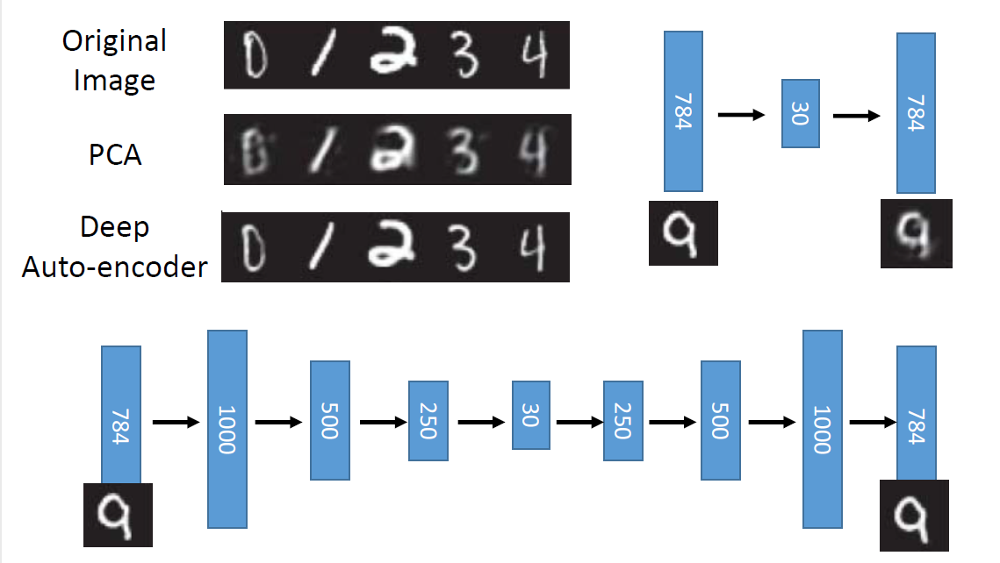

然后你再把`$w^2$`把它保存下来，fix住`$w^2$`的值。learn第三个Auto-encoder，input100维，code500维，output1000维，然后得到weight`$w^3$`

然后你再把`$w^3$`把它保存下来，这个`$w^1,w^2,w^3$`就等于是你再learn你的neural network时的initialization，然后你再random initialization500维到10维，然后再用backpropagation再去调一遍，称这个步骤为find-tune(`$w^1,w^2,w^3$`都是很好的weight，所以你只是微调它)

这一招(pre-training)在过去learn一个deep的neural network还是很需要的，不过现在neural network不需要pre-training往往都能train的起来。如果你今天有很多的unlabel data，少量的label data，你可以用大量的unlabel data先去把`$w^1,w^2,w^3$`learn 好，你最后的label data只需要稍微调整你的weight就好了。所以pre-training在大量的unlabel data时还是有用的。

有一个方法可以让Auto-encoder做的更好，这个叫做De-noising Auto-encoder(可以参考reference)。你把原来的input x加上一些noise变成`$x^{'}$`，然后你把`$x^{'}$`encode以后变成c，再把c decode回来变成y。但是要注意一下，现在在De-noising Auto-encoder， 你是要output 跟原来的input(加noise之前的x)越接近越好。你learn出来的结果有biased，因为encode不止learn到了这件事，它还learn到了把杂序滤掉这件事。

还有另外一招叫做contractive auto-encoder，做的事情是：它会希望说，我们在learn这个code的时候加上一个contract，这个contract是：当input有变化的时候，对code的影响是被minimize的。其实这件事也很像De-noise auto-encoder，只是从不同的角度来看,De-noise auto-encoder是说：加上noise以后，你还要reconstruct没有noise的结果。Contractive auto-encoder是说：当input变化时，也就是加了noise以后，对code的影响是要小的，所以它们做的事还是蛮类似的。

## Auto-encoder for CNN

接下来将CNN auto-encoder，那如果我们今天要处理的对象是image的话，我们都知道要用CNN。那在CNN里面处理image的时候，会有一些convolution layer，有pooling layer，用convolution 和pooling交替，让image越来越小。那今天是做auto-encoder的话，你不止要一个encoder，还要一decoder。如果encoder是做convolution pooling convolution pooling，那decoder就是在做deconvolution unpooling deconvolution unpooling(相反的事情)，让input跟output越接近越好。

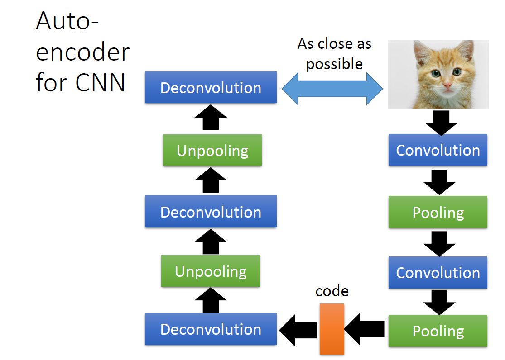

###  CNN-Unpooling

在做pooling的时候，现在有4*4的matrix，接下里你把matrix里面这个pixel分组(4个一组)，接下来从每一组挑一个最大的，那image就变成原来的1/4。如果你是在做unpooling的话，你会做另外一件事，你会先记得说：我刚才在做pooling的时候是从哪里取值的(从哪取值，哪里就是白的)。你要做unpooling的话，你要把原来小的matrix扩大(pooling的时候，是把大的matrix变为原来的1/4，现在是把比较小的matrix变成原来的4倍)。那肿么做呢，这时候你之前记录的位置就可以派上用场，你之前记的说：我在pooling的时候是左上角，所以现在做unpooling时，就把这个值放到左上角，其他补0，此次类推。这个就是unpooling的一种方式，做完unpooling以后，比较小的image会变得比较大，比如说：原来是14 * 14的image会变成28 *28的image。你会发现说：它就是把原来的14 *14的image做一下扩散，有些补0

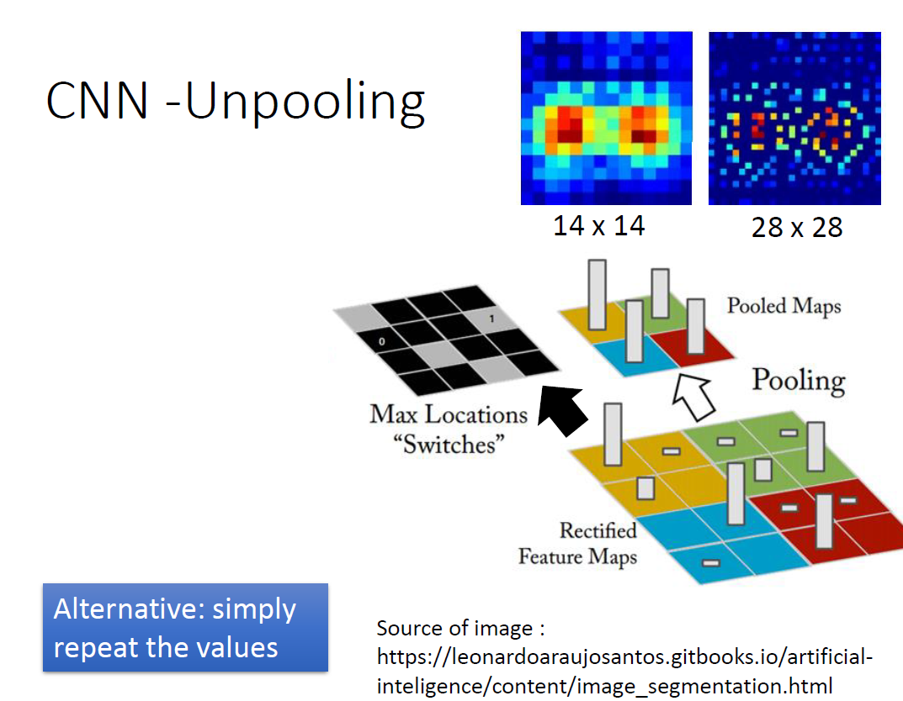

这不是unpooling唯一的做法，在keras里面它的做法是一样的，它是reapeat哪些value。

 

接下来比较难理解的是Deconvolution，事实上Deconvolution就是convolution。举例例子(一维的convolution)，input有五个dimension，然后我们的filter size是3，我们把input这个三个value分别乘上红色，蓝色，绿色的weight得到一个output。再把这个filter移动，再把这个value乘上红色，蓝色，绿色的weight得到一个output，这个是convolution。

你的想象可能是：deconvolution是convolution的相反，本来是三个值变成一个值，现在做deconvolution是1个值变成三个值(如图)，它已经贡献了一些值，第二个也贡献了一些值，那么就把这加起来(重叠的地方就加起来)。这件事就等同于做convolution，等同于input是三个value，我们会在旁边补0，接下里我们一样做convolution。做convolution的时候，三个input乘上红色、蓝色、绿色的weight等于一个值，以此类推。这两个框框做的事情是一样的(我们检查中间这个值，它是三个value加起来，这三个value是：第一个output乘以绿色，第二个output乘以蓝色，第三个output乘以红色，然后再加起来)

### CNN-Deconvolution
你将最后框(deconvolution)跟convolution相比较的话，不同点是：它们的weight是相反的，但是它们都做的是convolution这件事

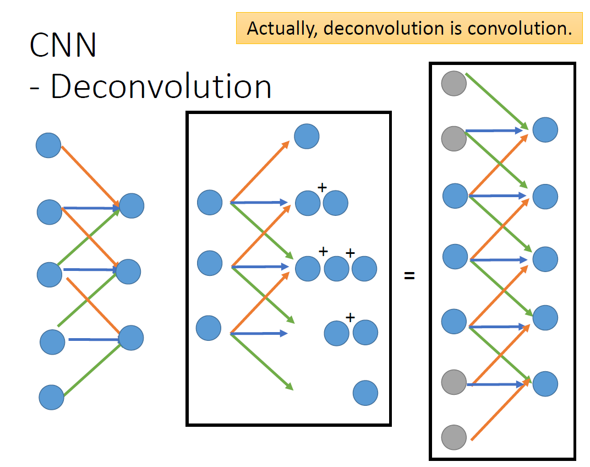

等到RNN的时候再讲sequence-to-sequence auto-encoder，我们刚才看到auto-encoder的input是vector，但很多东西你不该把它表示成vector。比如说语音(一段声音讯号有长有短，它不是vector)，文章。你可能用bag-of-word变成一个vector，但是你会失去词汇和词汇之间的前后关系，所以是不好的。

我们刚才都是用encoder来把原来的image变成少的dimension，我们也用decoder，这个decoder来产生新的image。把这个learn好的decoder拿出来，然后你给它一个random input number，它的output希望就是一张图。
## Auto-encoder-Pre-training DNN
我把每一张784维的image，通过hidden layer，把它project到二维，二维再通过hidden layer解回原来的image。在decoder的部分，那个二维的vector画出来如图。

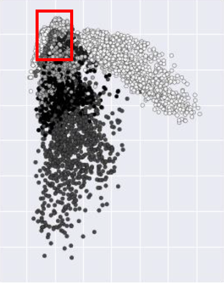

我在红色的框框里面，等间隔的去sample vector出来，把vector丢进NN Decoder里面，然
后让它output一张image出来。这些二维的vector，它不见得是某个image comprise以后的结果，
它不见得原来的image就是对应的vector，丢到decoder里面，看看它产生什么。我们发现：在这个红色的框框内，
等距离的做sample

可能有人说：你肿么知道要sample都这个位置，因为我必须要先观察一下二维vector的分布，才能知道说：哪边是有值的，才有可能说，从哪个地方sample出来，可能是个image。可是这样子你要先分析一下二维的code有点麻烦，那咋样确保在我们希望的range里面都是image呢？有一个很简单的做法，就是在你的code上面加regularization(L2 regularization)，让code比较接近0。你在sample的时候就是在0附近，这样你就可以有可能sample出的vector都能对应到数字。

train出来，你的code都会集中在接近0的地方。它就以0为核心，然后分在在接近0的地方。然后我就以0为中心，然后在这个红框等距的sample image ，sample出来就是如图。

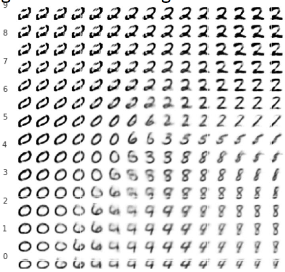

这个是很有趣的，这两个dimension是有意义的。横轴(从左到右)代表的是有没有一个圈圈(本来是一个很圆的圈圈，慢慢的变为1)，纵轴代表是：本来是直的，然后慢慢就倒斜。

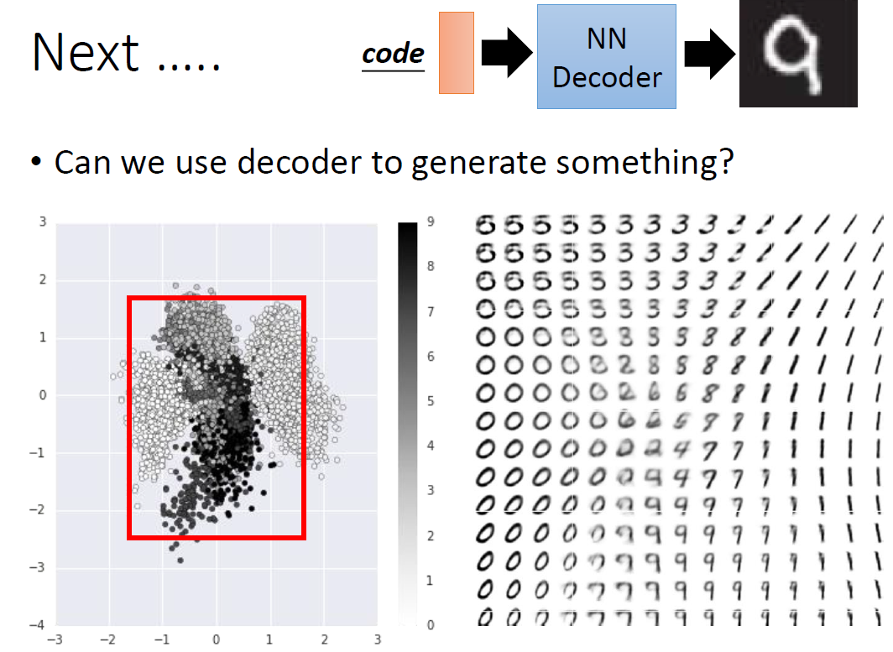

