# Unsupervised learning Generation(l)
http://note.youdao.com/noteshare?id=d4ed06cd35f3cca02ed45c8d372f52d4&sub=626D051130254D85A44BC331C659FC53

## Creation-Image Processing
有关generation model，这里有一篇很好的reference。在这篇reference里开头引用Richard Feynman的话。这句话来自Richard Feynman办公室黑板上一句话："why i cannot creater, i do not understand"。所以一个东西，不知道咋样产生它的话就不是完全理解。

Generative Models: https://openai.com/blog/generative-models/

所以，对machine来说是一样的。比如machine在影像处理上可以做到分类，可以辨识猫和狗的不同。但它并不真的了解猫什么，狗是什么。也许在未来有一天，machine它可以画出一只猫，它会猫这个概念或许就不一样了。这是一个非常热门的主题，有很多相关的研究，我们来看一下相关的研究。

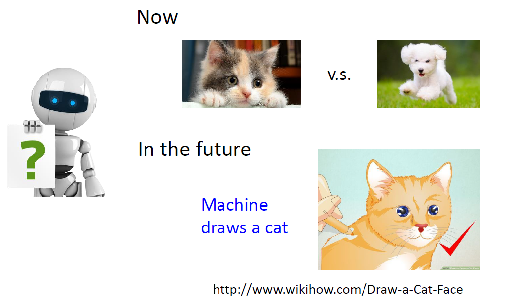 

在这些研究里，大概可以分为三个方法。分别是：PixelRNN, VAE, Generative Adversarial Network(GAN)，这些方法其实都非常新，其中最旧的是VAE(2013年提出来的)，GAN是2014年提出来的

## PixelRNN 
假设我们今天目的是：让machine自己画一张图出来，让machine画出一张3*3(9pixel)的image。肿么做呢？我们让machine每一次就画一个pixel，画完9个pixel，就画完一张图了。

我们随机给这个image随机涂一个pixel，接下来你learn一个model，input是涂上红色的pixel，output就是接下里要吐出什么样的pixel。假设吐出的是蓝色的pixel，就把蓝色的pixel就摆在image上面。肿么描述一个pixel呢？一个pixel就是RGB三个颜色channel所构成的，所以一个pixel就是一个三维的vector。所以你就是learn一个neural network，它可以input一个三维的vector，然后output出另一外三维的vector(这个三维vector的三个值就代表RGB三个值)，你就这个neural network的output转成一个颜色，把它读上去就结束了，所以这张图有两个点(两个pixel)。

你再用一个model input红色和蓝色的pixel，output下一个pixel(比如说是浅蓝色的pixel)。那你可能会有问题是：neural network不是input fix vector，output 另一个fix vector，那你咋样input一个pixel之后，用同一个neural network learn两个pixel呢？这个就是RNN可以处理的地方，RNN可以处理 variable input pixel。如果你无法理解的话，你可以想想说：还有pixel的地方我就补0。

接下来你给它一个红色、蓝色、浅蓝色的pixel，它吐出来一个灰色的pixel，那你就把灰色的pixel画在图上。接下来重复刚才的步骤，把下一个pixel再涂上去。把9个pixel都涂完。就画完一张图了。

那要train这种neural network很简单，完全就是unsupervised，你不需要任何的label。收集一大堆image，你的machine就会知道说：看到第一个pxiel是这样的，第二个pixel是什么，看到第一二的pxiel，就知道第三个pixel是什么，看到一二三pixel，就知道第四个pixel是什么，这个就是pixel RNN。你可能想说：这一招这么简单，它会work吗？其实它是会work的。

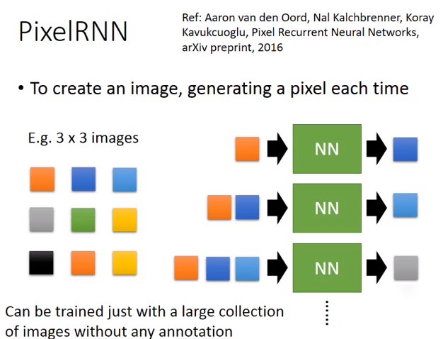 

在不同generate image的方法里面，Pixel RNN产生的图是最清晰的，其他的方法产生的图没有办法像RNN产生的图这么清晰。

如图是真实的image(狗)，如果我们把狗的下半身遮掉。接下来我们让machine predict说：given这些pixel(为遮住的image)，狗的下半身要长什么样子，让machine把狗的下半身画出来。machine画出了很多的image(如图)

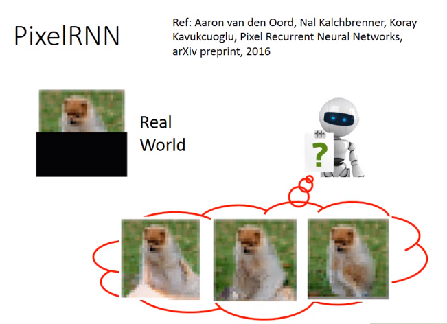 

在Google的demo里面，它把影像都是机器人手背上的影像，(它在机器人手背上装一个摄影机)，那就就会看到说：影像的前半段是机器人的手伸向一块膜布，然后影像的后半段是：机器人把膜布拿起来。膜布拿起来的影视是机器自己脑补的结果，并不存在现实生活中，机器predict接下来会发生什么样的事情。

## Practicing Generation Models

如果你要练习Generation的话，如果做NMIST的话是有点虚弱，但是你可以用这个task，这个task是 Pokemon Creation。这边有792张宝可梦的小图，那我们要让机器看过这些小图以后，它自己产生新的宝可梦出来。这个口号就是：“Don't catch them! Create them”(用创造代替补抓)(image source来自于图中的链接)

原来的image是40*40的pixel，我觉得40 *40有点稍微大了，所以我只取了中间的部分(变成了20 *20的image)，看起来如图(虽然影像解析度不是很高，但还是可以很清楚的看出这就是宝可梦)。

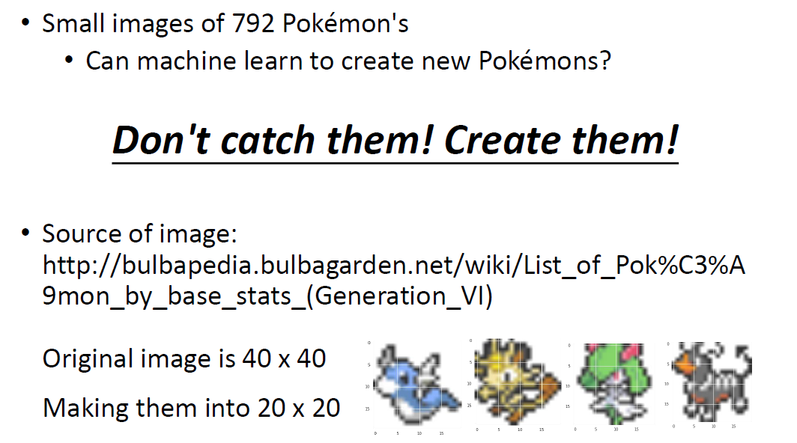 

你可能很直觉的说：一个pixel就是一个用三维的vector(三个数字)来描述它(每一个数字代表了RGB)。比如：如果有一个pixel用三个channel来表示(R=50, G=150,B=100)，我实际上这样做感觉实际结果不是太好，我觉得一个原因是因为是：你这样做，产生的图都很灰。如果你要产生鲜明颜色的话，RGB某一个value特别高，其他都接近于0(RGB三个value都差不多就是灰色)。但是你在learn的时候，你往往没有办法真的让B=0或者G=0。如果你今天把0-255 normalization 0-1，你用sigmoid function的话，通通落在0.5左右(中间)，很难落子极端的值。所以它产生的值都差不多，所以每张图看起来都是灰色的，看起来就不是那么的好看。

所以我做了一下处理，我把每一个pixel都用a 1-of-N encoding来表示，在这个1-of-N encoding里面，每一个dimension就代表了一个颜色。也就是说：每一个pixel都是用一个vector来表示，第一个dimension代表黄色，第二个dimension代表蓝色，第三个dimension代表绿色等。也就是说不让它RGB去合成颜色，而是让它产生一个颜色。假设一个绿色进来，就是第三维是1，其他为0，所以一个pixel我们用这种方式来描述它。

但是有一个问题是：颜色太多了，RGB可能都会有(256的三次方)，有太多可能的颜色。肿么办呢？我先做clustering，把同样接近的颜色cluster在一起。也就是说：这三个绿算是同一种颜色，都用上面这一个绿来表示它。那我把出现颜色比较少的颜色跟出现次数比较多的颜色把它合并起来，所以得到了176种不同的颜色。

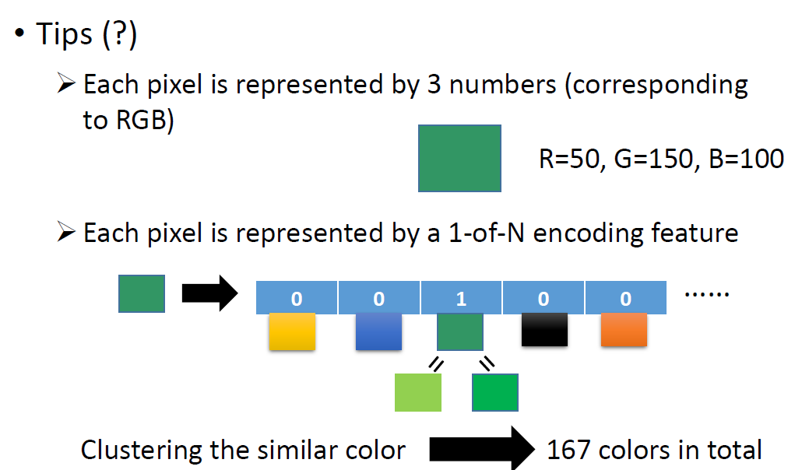 

在这个data里面，每一个row就代表了一张image，每一个数字就代表了一个颜色。那肿么知道每个数字代表了什么颜色呢？比如说9就代表了255 255 255，所以0代表白色。2是49 49 49，代表灰色等等。我做了一个pixel RNN的实验，你会很怀疑说：只有700多张图，你train的起来吗？train是train的起来的，但问题是你是否会得到好的结果。惊人的发现是可以的，我没有花太多时间来调参数，用了一层的LSTM还有512cells。

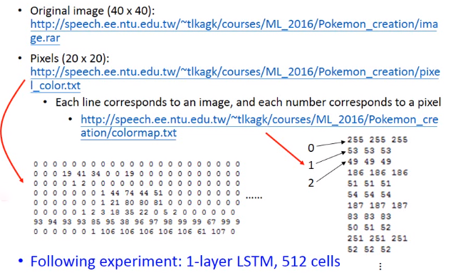 

这个是实验的结果，首先要强调的是，我特意留了三张宝可梦是machine没有看过的，你在training data里面是没有这三张宝可梦。接下来我给machine看这三张宝可梦的前半部分，把剩下的部分盖起来，让machine predict它长什么样子。

 
第一张图看起来是一个兔子，把它下半部generate出来是如图这样子，但它其实是长这样子的(real pokemon)。第二张感觉是铁家勇之类的，machine generate出来是绿毛虫，但是真正的是蜥蜴。第三张machine generate出来是狗或者狐狸之类的，但真正的是这样子(real pokemon)

但是我们今天只给它看只有25% percent的图，machine generate出来如图。generate出来跟原来的不一样并不代表它画的错的，说这种的task很难被evaluate的，这也是做generate的难点。
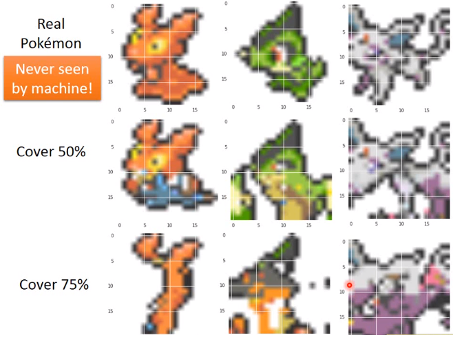

刚才是给machine一个开头让它画下去，接下里就什么都不给它，让它从头就开始画。但是你什么都不给它，让它从头开始画的话，它可能每一张image都是一样的，所以你要故意加一些random，也就是说它要predict下一个pixel的时候，不见得是选几率最后的那个pixel，它会有一定几率选一个几率比较低的颜色出来画在图上面，这样它每一次画的图都才会有点不一样。

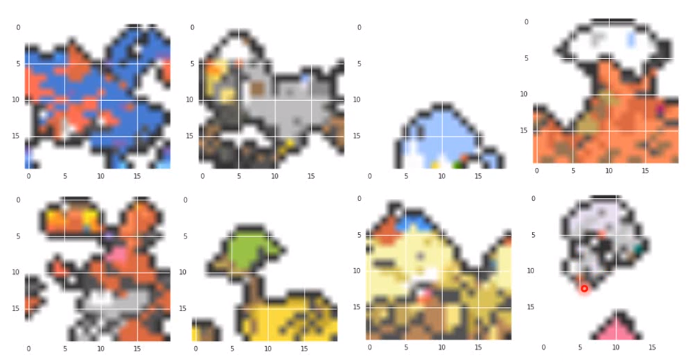

## Auto-encoder

我们之前已经有讲过Auto-encoder，那我们在讲Auto-encoder的时候，input一张image通过encoder变成code，再通过decoder把这个image解回来，希望input跟output越接近越好。你learn完这个auto-encoder以后，你其实就可以把这个decoder拿出来，然后你再给它input一个randomly的vector，把这个random vector当做code,code是10维，那你就是generate 10维的vector，然后丢到decoder里面，它output就可以是一张完整的image

但实际上这么做，你得到的performance通常不一定会很好。你要用你一个variational atuoencoder(VAE)，那你得到的结果会比较好。VAE的结构跟atuo-encoder非常像，它只是在中间加可一些神妙的小trick。encoder跟decoder的位置维持原状，但是在encoder的地方，我们不是直接output code，我们先output两个vector。假设你code是三维的话吗，你这output两个vector也是三维(`$m_1,m_2,m_3,\sigma_{1}\sigma_{2},\sigma_{3}$`)，接下来你用normal distribution去generate也是三维的vector，它的三维分别是`$e_1,e_2,e_3$`。接下来exp(`$\sigma_{1}\sigma_{2},\sigma_{3}$`)跟`$e_1,e_2,e_3$`相乘，然后把它跟`$m_1,m_2,m_3$`加起来，你得到`$c_1,c_2,c_3$`，`$c_i=exp(\sigma_i)*e_i+m_i$`，在丢到decoder里面，希望说decoder能够minimize reconstruction error。

但是光这么做是不够的，它还有第二项，这一项是：我把它三个dimension加起来，去minimize(`$1+\sigma_{i}-(m_i)^2-exp(\sigma_{i})$`)，你要minimize reconstruction error同时还要minimize这一项。

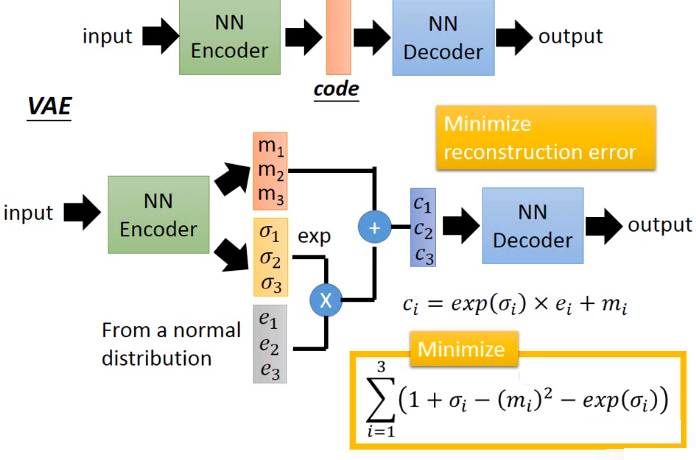

这是openai用VAE做的结果，你会发现说：用VAE得到的图是不太清楚的。Pixel RNN 跟VAE不同的地方是：用VAE的话：你可以做以下的事情，你可以control 你要generate的image。

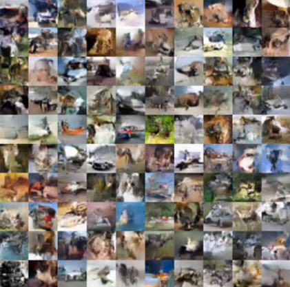

### pokemon creation

假设我们将这个VAE用在pokemon creation上面。那我们在train的时候，input一个pokemon，然后你output一个的pokemon，然后learn出来的这个code就设为10维。learn好这个pockmon的VAE以后，我么就把decoder的部分拿出来。因为我们现在有一个decoder，可以input一个vector。所以你在input的时候你可以这样做：我现在有10维的vector，我固定其中8维只选其中的二维出来，在这两维dimension上面散不同的点，然后把每个点丢到decoder里面，看它合出来的image长什么样子。那如果我们做这件事情的话，散不同的点，你就可以看到说：这个code的每一个dimension分别代表什么意思。如果我们可以解读code每一个dimension代表的意思，那以后我们就可以把code当做拉杆一样可以调整它，就可以产生不同的pokemon。

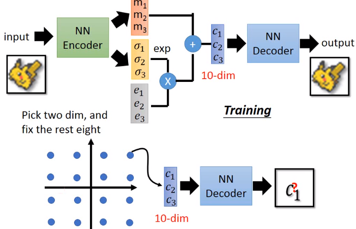

VAE做出来的是这样子的，这是变化code两个dimension以后的结果。但是你可以从这个变化看出来：没一个dimension是真的有一些含义的。比如说：我们看纵轴的变化，上面看起来是站的东西，后面会逐渐的倒下。左边到右边的话，变化是：站的越来越直。你可以从这两个dimension变化发现说：它确实是有学到一些东西的，如果我们要图更清楚的话，我们就可以控制这两个dimension，就可以产生不同的pokemon。

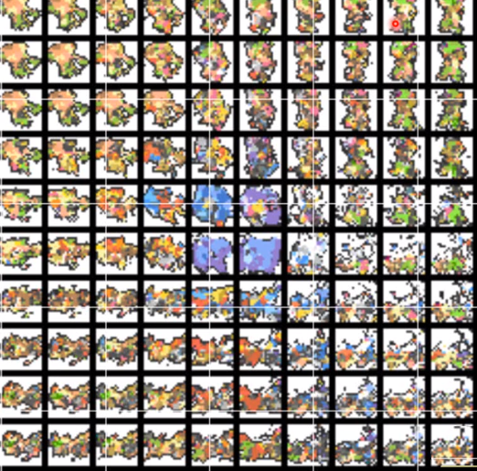

这是另外两个dimension的结果。你看直的话：它本来是一个仓鼠的样子，从上往下，你会发现它的脚越来越长，后来变成一个脚很长的鸟，后来变成有两只脚很长的鸟，等等的变化。所以可以说：随着input code的不同，你就可以产生不同的pokemon。

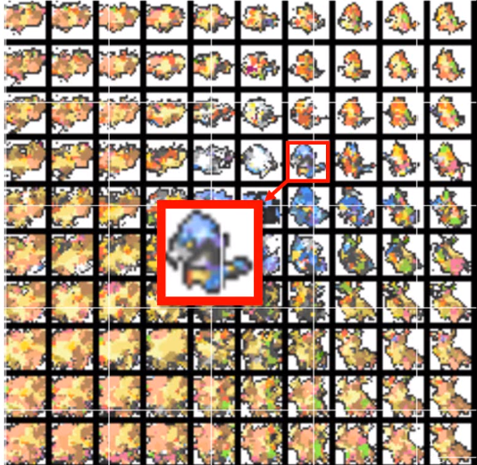

在这么多的图里面，都没有清楚的，没有像样的。我找到这一只(原来的pokemon是没有这一只的)，它的头看起来像是一只海马，尾巴像鳄鱼。

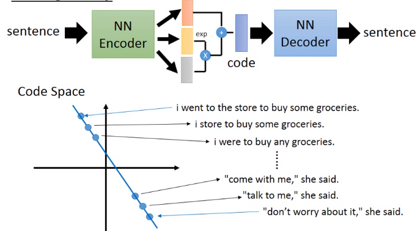

有人说：可以用VAE来写诗，做法是这样子的。VAE的encoder input是一个sentence，output也是一个sentence。

咋样让machine写诗呢，做法是这样子的。你先胡乱选两个句子，一个句子是：“i went to the store to buy some groceries”，一个句子是：“don't worry about it ,she said”。接下来你通过这个encoder把这两个句子都找出code，就变为在code space上面的两个点，你把这两个点相连，然后中间等间距的取一些点，在把中间等间隔取的点，丢到decoder里面，还原出去。把“i went to the store to buy some groceries”偏一点的话，得到的句子是：“i store to buy some groceies”，在偏一点得到:"i were to buy any groceries"，然后一直下来。在“don't worry about it ,she said”附近变为“talk to me ,she said”
