# 回归定义和应用例子
## 回归定义
Regression 就是找到一个函数 $function$ ，通过输入特征 $x$，输出一个数值 $Scalar$。
## 应用举例
- 股市预测（Stock market forecast）
	- 输入：过去10年股票的变动、新闻咨询、公司并购咨询等
	- 输出：预测股市明天的平均值
- 自动驾驶（Self-driving Car）
	- 输入：无人车上的各个sensor的数据，例如路况、测出的车距等
	- 输出：方向盘的角度
- 商品推荐（Recommendation）
  	- 输入：商品A的特性，商品B的特性
	- 输出：购买商品B的可能性
- Pokemon精灵攻击力预测（Combat Power of a pokemon）：
	- 输入：进化前的CP值、物种（Bulbasaur）、血量（HP）、重量（Weight）、高度（Height）
	- 输出：进化后的CP值

# 模型步骤
- step1：模型假设，选择模型框架（线性模型）
- step2：模型评估，如何判断众多模型的好坏（损失函数）
- step3：模型优化，如何筛选最优的模型（梯度下降）

## Step 1：模型假设 - 线性模型（Linear Model）
### 一元线性模型（单个特征）
以一个特征 $x_{cp}$ 为例，线性模型假设 $y = b + w·x_{cp}$ ，所以 $w$ 和 $b$ 可以猜测很多模型：
$$
f_1: y = 10.0 + 9.0·x_{cp} \\
f_2: y = 9.8 + 9.2·x_{cp} \\
f_3: y = - 0.8 - 1.2·x_{cp} \\
···
$$

虽然可以做出很多假设，但在这个例子中，显然 $f_3: y = - 0.8 - 1.2·x_{cp}$ 的假设是不合理的，不能进化后CP值是个负值吧~~

### 多元线性模型（多个特征）
在实际应用中，输入特征肯定不止 $x_{cp}$ 这一个。例如，进化前的CP值、物种（Bulbasaur）、血量（HP）、重量（Weight）、高度（Height）等，特征会有很多。

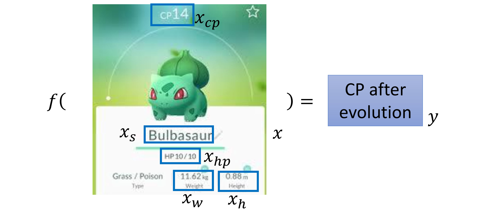

所以我们假设 **线性模型 Linear model**：$y = b + \sum w_ix_i$
- $x_i$：就是各种特征(fetrure)  $x_{cp},x_{hp},x_w,x_h,···$	
- $w_i$：各个特征的权重 $w_{cp},w_{hp},w_w,w_h,··$
- $b$：偏移量

注意：接下来的内容需要看清楚是【单个特征】还是【多个特征】的示例

## Step 2：模型评估 - 损失函数（Goodness of function）
【单个特征】: $x_{cp}$

### 收集和查看训练数据
这里定义 $x^1$ 是进化前的CP值，$\hat{y}^1$ 进化后的CP值，$\hat{}$ 所代表的是真实值

将10组原始数据在二维图中展示，图中的每一个点 $(x_{cp}^n,\hat{y}^n)$ 对应着 进化前的CP值 和 进化后的CP值。

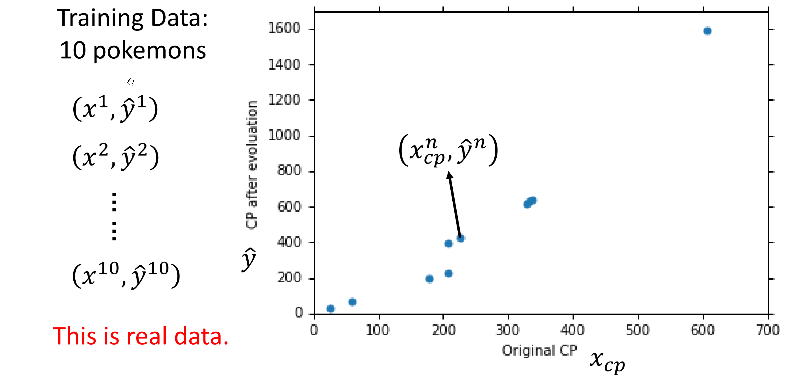

### 如何判断众多模型的好坏
有了这些真实的数据，那我们怎么衡量模型的好坏呢？从数学的角度来讲，我们使用距离。求【进化后的CP值】与【模型预测的CP值】差，来判定模型的好坏。也就是使用损失函数（Loss function） 来衡量模型的好坏，统计10组原始数据 $\left ( \hat{y}^n - f(x_{cp}^n) \right )^2$ 的和，和越小模型越好。如下图所示：

如果觉得看着这个图会晕，忽略图4，直接看公式推导的过程：

$$
\begin{aligned}  
L(f) & = \sum_{n=1}^{10}\left ( \hat{y}^n - f(x_{cp}^n) \right )^2，将【f(x) = y】, 【y= b + w·x_{cp}】代入 \\
& = \sum_{n=1}^{10}\left ( \hat{y}^n - (b + w·x_{cp}) \right )^2\\
\end{aligned} 
$$

最终定义 损失函数 Loss function：$L(w,b)= \sum_{n=1}^{10}\left ( \hat{y}^n - (b + w·x_{cp}) \right )^2$

我们将 $w$, $b$ 在二维坐标图中展示，如图所示：

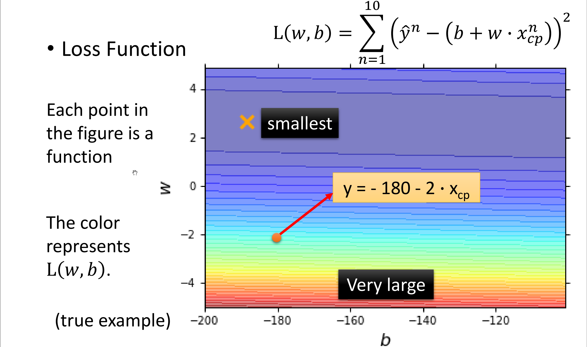

- 图中每一个点代表着一个模型对应的 $w$ 和 $b$
- 颜色越深代表模型更优

可以与后面的图11（等高线）进行对比

## Step 3：最佳模型 - 梯度下降（Grdient Descent）
【单个特征】: $x_{cp}$

### 如何筛选最优的模型（参数w，b）
已知损失函数是 $L(w,b)= \sum_{n=1}^{10}\left ( \hat{y}^n - (b + w·x_{cp}) \right )^2$ ，需要找到一个令结果最小的 $f^*$，在实际的场景中，我们遇到的参数肯定不止 $w$, $b$。

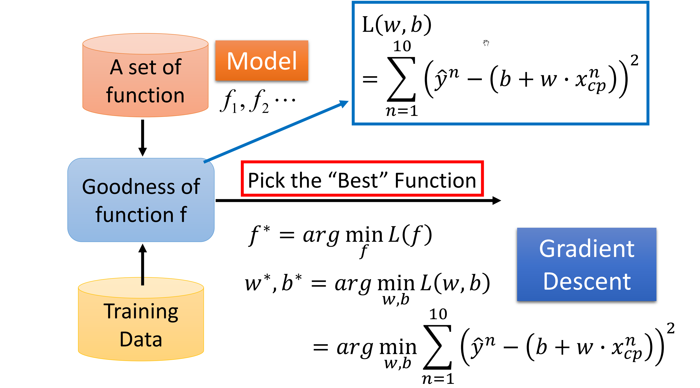

先从最简单的只有一个参数$w$入手，定义$w^* = arg\ \underset{x}{\operatorname{\min}} L(w)$

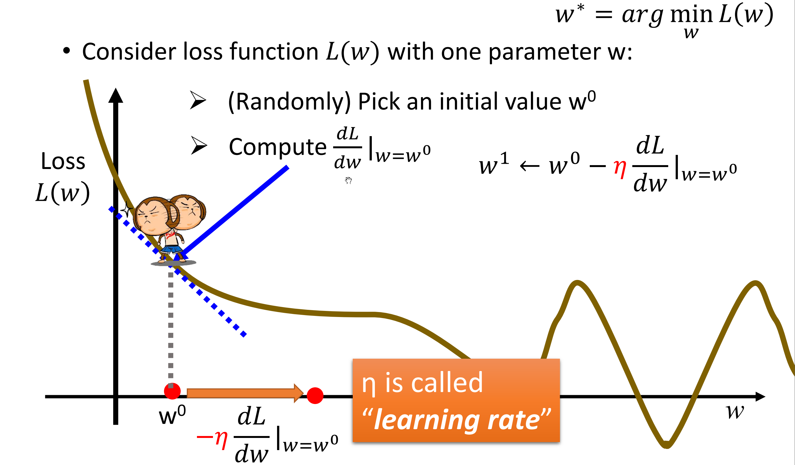

首先在这里引入一个概念 学习率 ：移动的步长，如图7中 $\eta$

- 步骤1：随机选取一个 $w^0$
- 步骤2：计算微分，也就是当前的斜率，根据斜率来判定移动的方向
	- 大于0向右移动（增加$w$）
	- 小于0向左移动（减少$w$）
- 步骤3：根据学习率移动
- 重复步骤2和步骤3，直到找到最低点

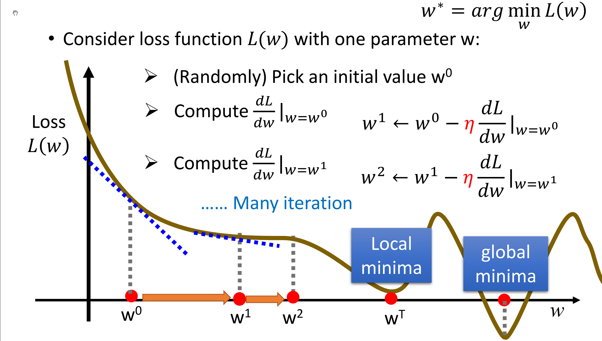

步骤1中，我们随机选取一个 $w^0$，如图8所示，我们有可能会找到当前的最小值，并不是全局的最小值，这里我们保留这个疑问，后面解决。

解释完单个模型参数$w$，引入2个模型参数 $w$ 和 $b$ ， 其实过程是类似的，需要做的是偏微分，过程如图9所示，偏微分的求解结果文章后面会有解释，详细的求解过程自行Google。

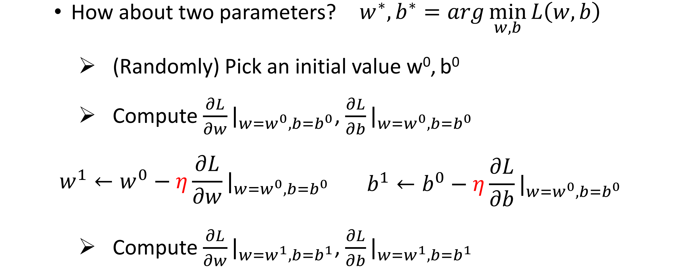

整理成一个更简洁的公式：

### 梯度下降推演最优模型的过程

如果把 $w$ 和 $b$ 在图形中展示：

- 每一条线围成的圈就是等高线，代表损失函数的值，颜色约深的区域代表的损失函数越小
- 红色的箭头代表等高线的法线方向

### 梯度下降算法在现实世界中面临的挑战

我们通过梯度下降gradient descent不断更新损失函数的结果，这个结果会越来越小，那这种方法找到的结果是否都是正确的呢？前面提到的当前最优问题外，还有没有其他存在的问题呢？

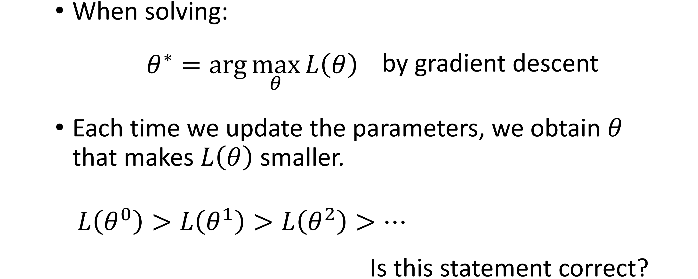

其实还会有其他的问题：
- 问题1：当前最优（Stuck at local minima）
- 问题2：等于0（Stuck at saddle point）
- 问题3：趋近于0（Very slow at the plateau）

注意：其实在线性模型里面都是一个碗的形状（山谷形状），梯度下降基本上都能找到最优点，但是再其他更复杂的模型里面，就会遇到 问题2 和 问题3 了

### w和b偏微分的计算方法

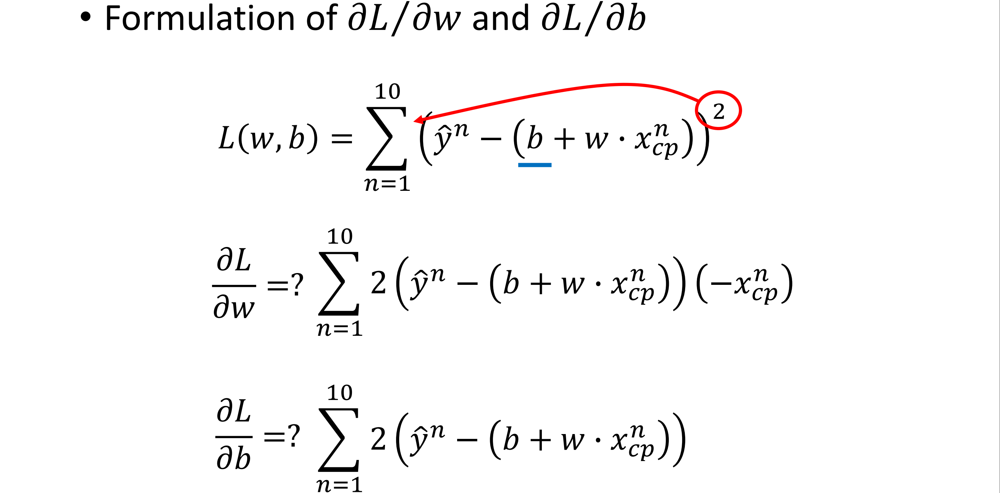

# 如何验证训练好的模型的好坏
使用训练集和测试集的平均误差来验证模型的好坏
我们使用将10组原始数据，训练集求得平均误差为31.9，如图所示：

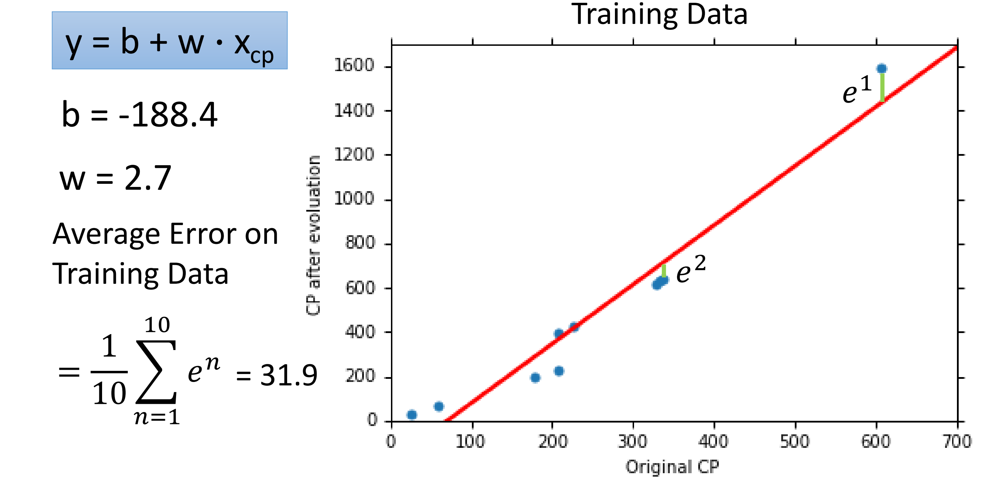

然后再使用10组Pokemons测试模型，测试集求得平均误差为35.0 如图所示：

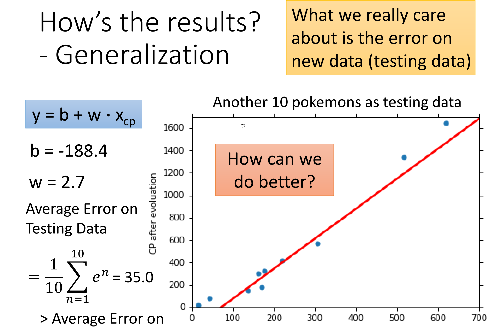

# 更强大复杂的模型：1元N次线性模型

在模型上，我们还可以进一部优化，选择更复杂的模型，使用1元2次方程举例，如图17，发现训练集求得平均误差为15.4，测试集的平均误差为18.4

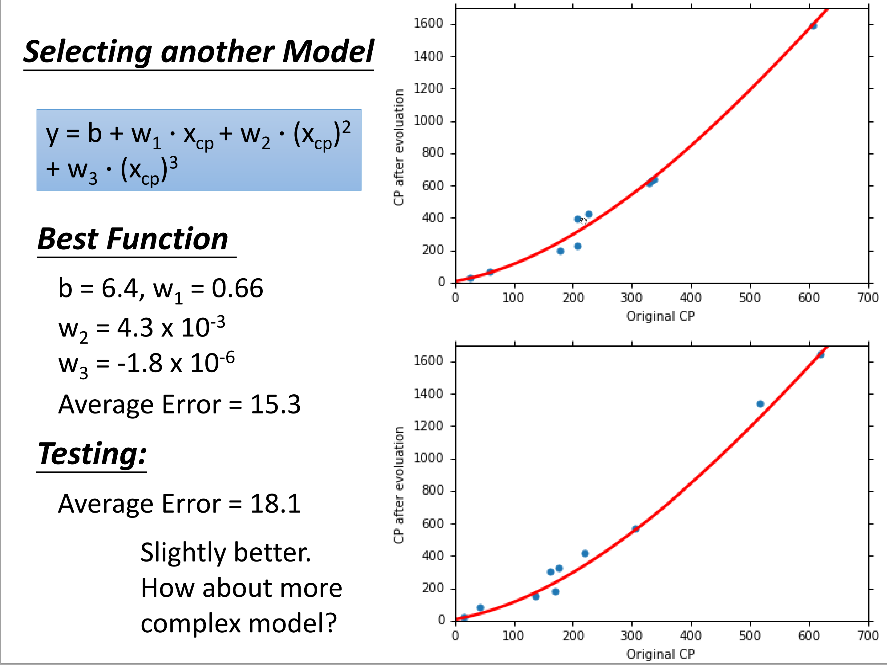

这里我们又提出一个新的问题：是不是能画出直线就是线性模型，各种复杂的曲线就是非线性模型？
其实还是线性模型，因为把 $x_{cp}^1$ = $(x_{cp})^2$ 看作一个特征，那么 $y = b + w_1·x_{cp} + w_2·x_{cp}^1$ 其实就是线性模型。

# 过拟合问题出现
在模型上，我们再可以进一部优化，使用更给次方的模型，如图所示
- 训练集平均误差【15.4】【15.3】【14.9】【12.8】
- 测试集平均误差【18.4】【18.1】【28.8】【232.1】

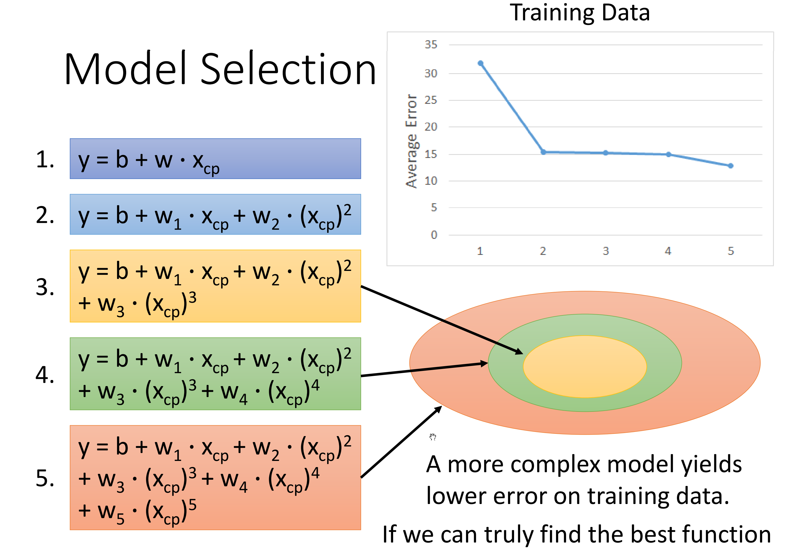

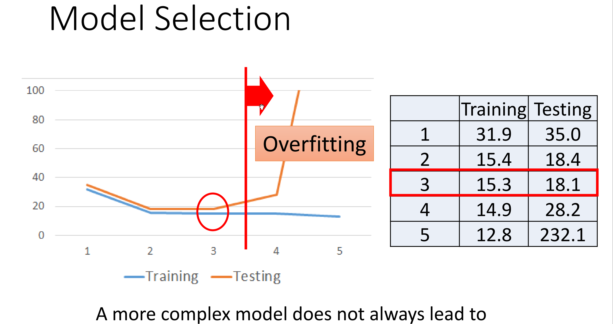

在训练集上面表现更为优秀的模型，为什么在测试集上效果反而变差了？这就是模型在训练集上过拟合的问题。

如图所示，每一个模型结果都是一个集合，$5次模型包 \supseteq  4次模型 \supseteq  3次模型$
所以在4次模型里面找到的最佳模型，肯定不会比5次模型里面找到更差

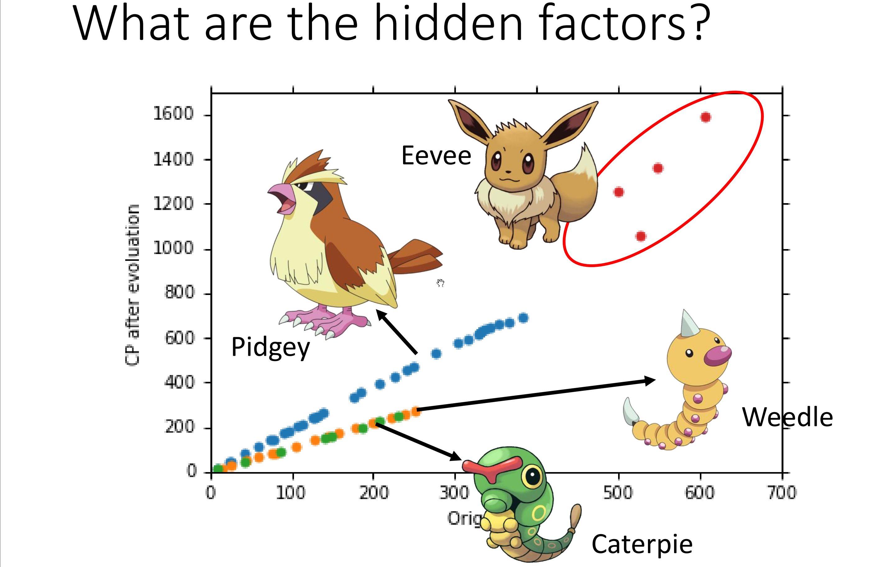

将错误率结果图形化展示，发现3次方以上的模型，已经出现了过拟合的现象：

# 步骤优化

输入更多Pokemons数据，相同的起始CP值，但进化后的CP差距竟然是2倍。如图21，其实将Pokemons种类通过颜色区分，就会发现Pokemons种类是隐藏得比较深得特征，不同Pokemons种类影响了进化后的CP值的结果。

## Step1优化：2个input的四个线性模型是合并到一个线性模型中

通过对 Pokemons种类 判断，将 4个线性模型 合并到一个线性模型中

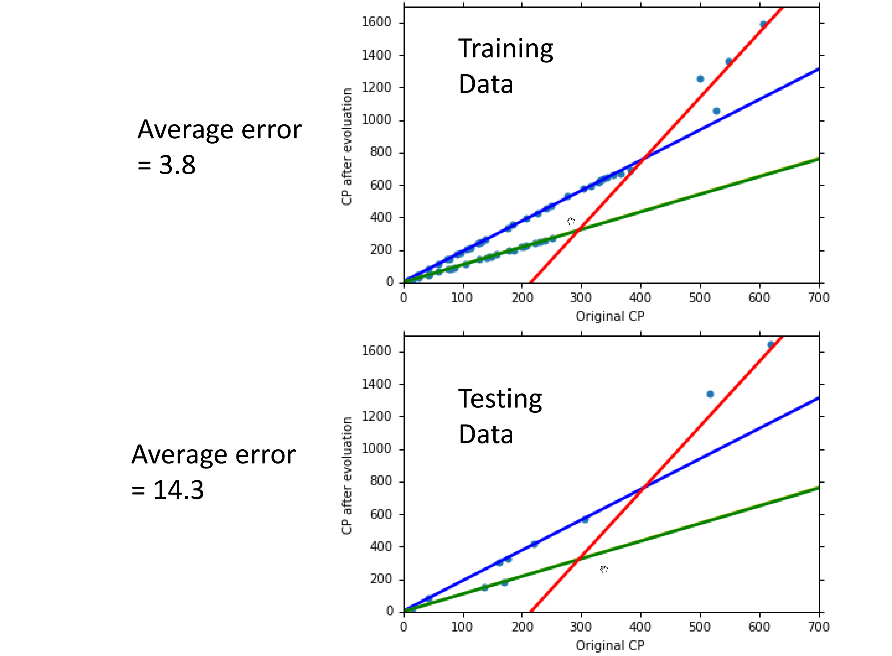

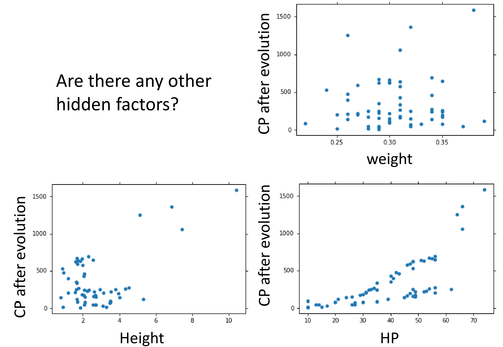

## Step2优化：如果希望模型更强大表现更好（更多参数，更多input）

在最开始我们有很多特征，图形化分析特征，将血量（HP）、重量（Weight）、高度（Height）也加入到模型中

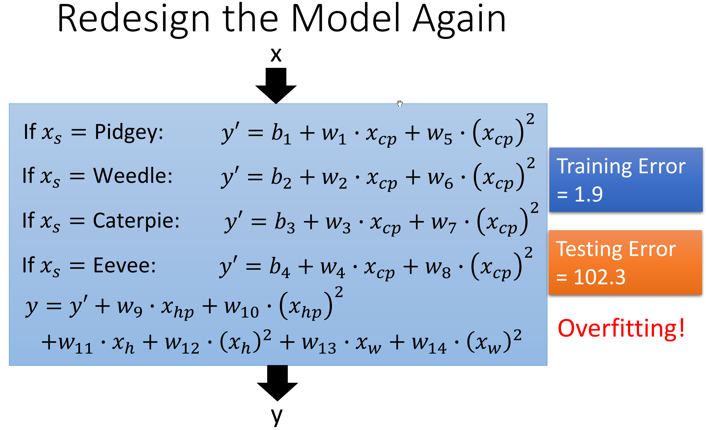

更多特征，更多input，数据量没有明显增加，仍旧导致overfitting

## Step3优化：加入正则化regularization

更多特征，但是权重 $w$ 可能会使某些特征权值过高，仍旧导致overfitting，所以加入正则化

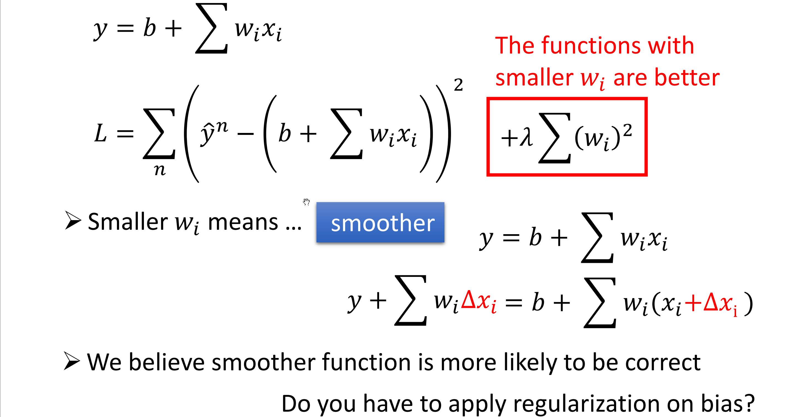

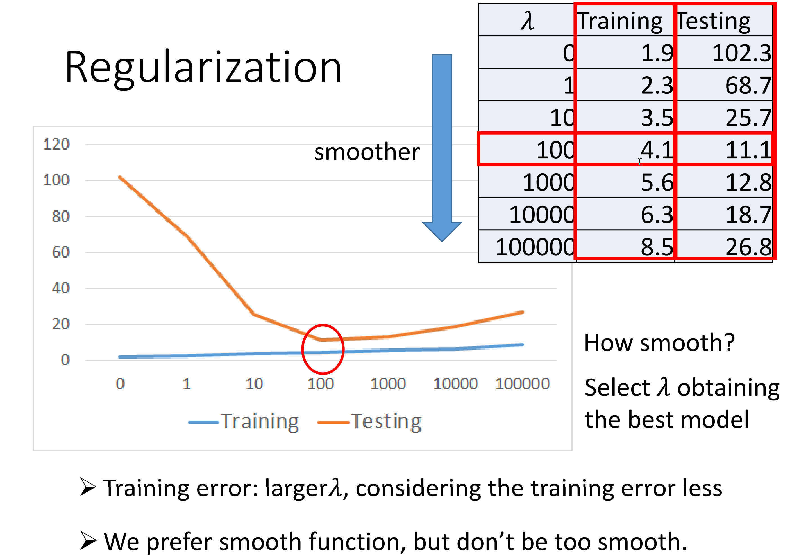

- $w$ 越小，表示 $function$ 较平滑的， $function$输出值与输入值相差不大 
- 在很多应用场景中，并不是 $w$ 越小模型越平滑越好，但是经验值告诉我们 $w$ 越小大部分情况下都是好的。
- $b$ 的值接近于0 ，对曲线平滑是没有影响

# 总结

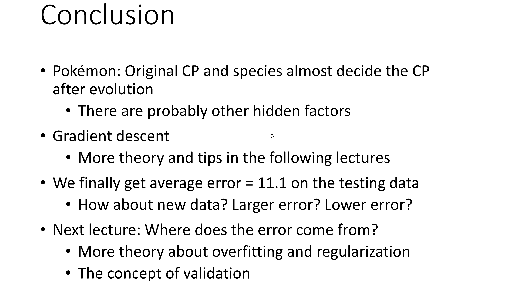

- **Pokemon**：原始的CP值极大程度的决定了进化后的CP值，但可能还有其他的一些因素。
- **Gradient descent**：梯度下降的做法；后面会讲到它的理论依据和要点。
- **Overfitting和Regularization**：过拟合和正则化，主要介绍了表象；后面会讲到更多这方面的理论

