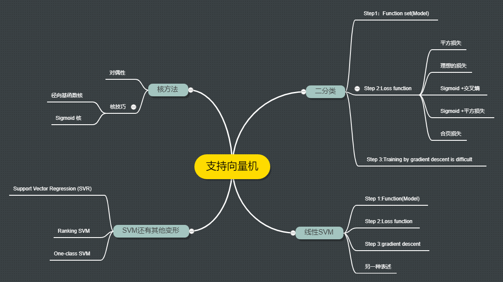
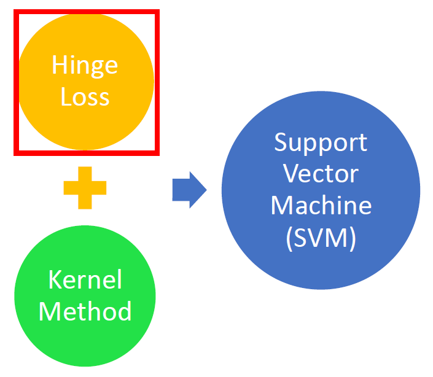
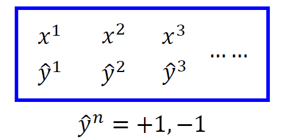
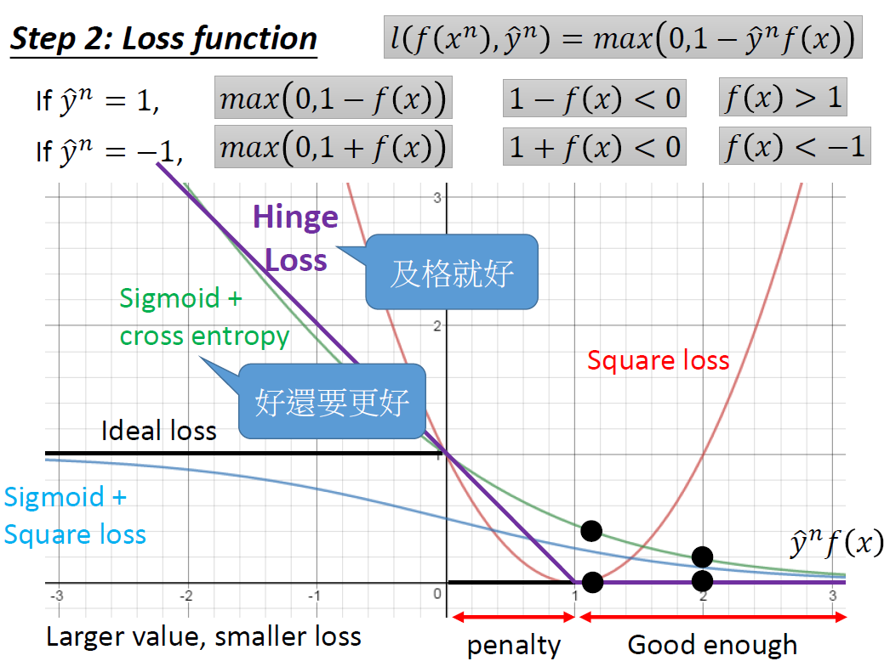
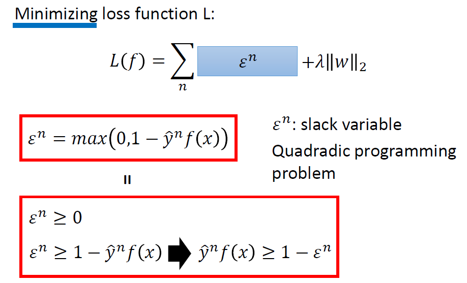
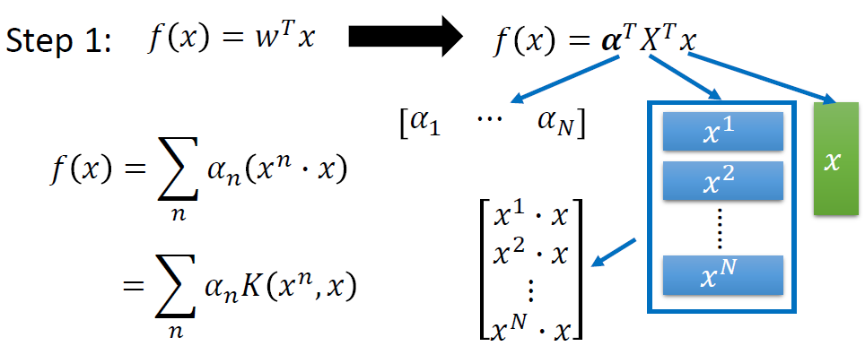
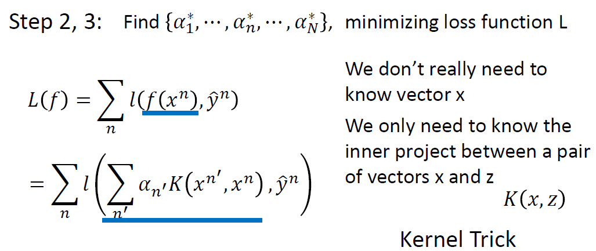
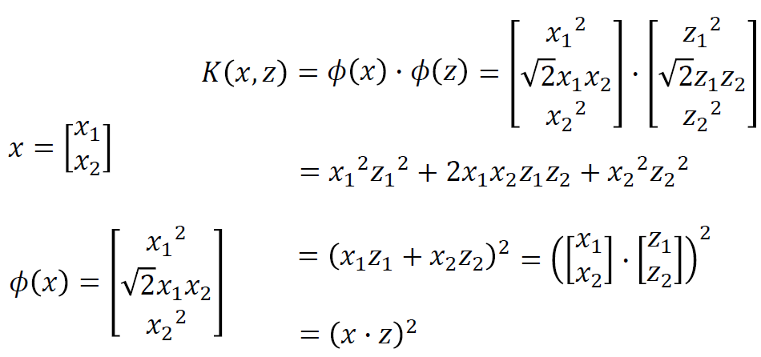
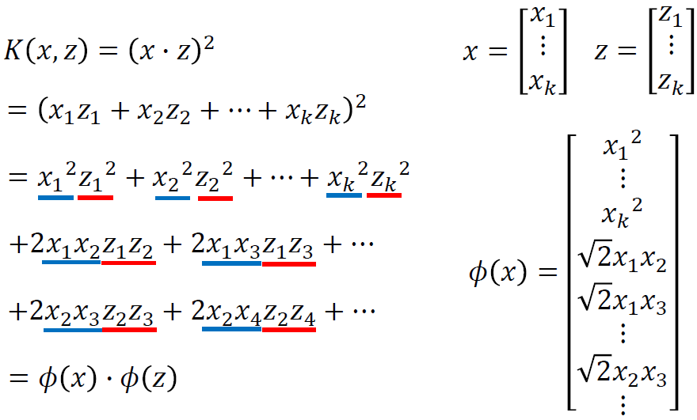
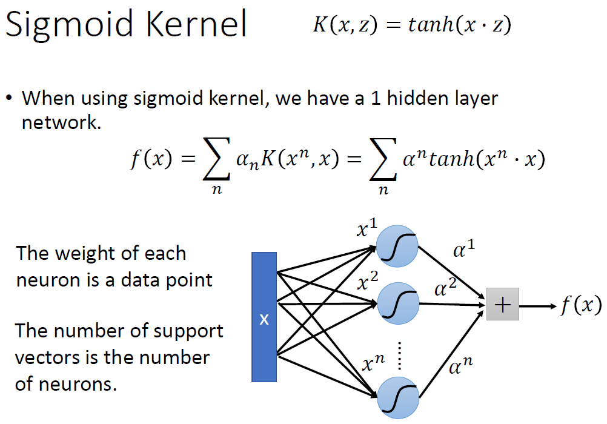



 ## Support Vector machine是什么呢？
 Support Vector machine他有两个特色：
- 第一个是hingeloss,等一下我们会讲，hinge loss是什么
- 另外一个是他最厉害的地方：kernel trick

把hinge loss+kernel trick就是Support Vector machine 

## 机器学习三个Step
之前在讲逻辑回归的时候使用的是1和0表示两个类别，现在使用$+1$跟$-1$表示只不过是朝三暮四的差别
数据集的label为+1或-1(可以自定义，+1、-1计算方便一些) 

### Step1：Function set(Model)
定义一个函数为$g(x)$，这个$g(x)$它里面有另外一个function。

### Step 2:Loss function

$$
L(f)=\sum_{n} \delta\left(g\left(x^{n}\right) \neq \hat{y}^{n}\right)
$$
最理想的损失函数是写成如上形式，$L(f)$代表$g(x)$所犯的错误数，但是指数函数$\delta\left(g\left(x^{n}\right) \neq \hat{y}^{n}\right)$没办法微分。

因此换一个函数来表示：$l\left(f\left(x^{n}\right), \hat{y}^{n}\right)$ ，至于$l$里面是什么样子的，我们可以随意定。
（理想状况是假设$\hat{y}^{n} 跟f(x)$他们是反向的，他们相乘以后，得到的值是负数，那你得到的$loss$就是$1$，如果他们是同向的，你的$loss$就是$0$，这个就是理想状况）

上图的横轴为$\hat{y}^{n} f(x)$，纵轴是损失函数$l$的值，希望$\hat{y}=+1$ 时，$f(x)$ 越正越好，$\hat{y}=-1$ 时，$f(x)$ 越负越好。即$\hat{y} f(x)$越大越好，损失函数越小。可微分的损失函数可以自己选。
- Square Loss为图中的红色曲线

$\widehat{y}^{n}>1$时，$l\left(f\left(x^{n}\right), \hat{y}^{n}\right)=\left(f\left(x^{n}\right)-1\right)^{2}$
$\widehat{y}^{n}<1$时，$l\left(f\left(x^{n}\right), \hat{y}^{n}\right)=\left(f\left(x^{n}\right)+1\right)^{2}$
这种是不合理的，我们不希望$\hat{y}^{n} f(x)$很大的时候，有一个很大的loss。
- Sigmoid+Square loss为图中蓝色曲线

$l\left(f\left(x^{n}\right), \hat{y}^{n}\right)=\left(\sigma\left(\hat{y}^{n} f(x)\right)-1\right)^{2}$

- Sigmoid+cross entropy 为图中绿色曲线

$l\left(f\left(x^{n}\right), \hat{y}^{n}\right)=\ln \left(1+\exp \left(-\hat{y}^{n} f(x)\right)\right)$

比较一下蓝绿两条线，如果我们横坐标，从-2移到-1，绿色这条线变化很大，蓝色反之，造成的效果就是，横坐标非常negative时，绿色调整参数可以取得较好的回报，所以它很乐意把negative的值变大，而蓝色反之，很懒惰。

- Ideal loss 为图中黑色的曲线
$l\left(f\left(x^{n}\right), \hat{y}^{n}\right)=\frac{\ln \left(1+\exp \left(-\hat{y}^{n} f(x)\right)\right)}{ln2}$

- hinge loss为图中紫色曲线

$l\left(f\left(x^{n}\right), \hat{y}^{n}\right)=\max \left(0,1-\hat{y}^{n} f(x)\right)$
最小化hinge loss  能够得到理想损失函数的最小值

比较紫绿两条线，它们最大的不同就是对待做得好的example的态度，如果把横坐标从1挪到2，对绿色来说它的变化更大，而紫色对此的态度是及格就好，不会再努力变大。Hinge Loss可能会微胜Sigmoid + cross entropy。Hinge loss的好处是不害怕离群值, 学习出的结果比较鲁棒

## Linear SVM
线性SVM的损失函数与逻辑回归的损失函数有点区别。Linear SVM三步模型如下图所示：
- Step 1:Function(Model)

 
- Step 2:Loss function

 
$\sum_{n} l\left(f\left(x^{n}\right), \hat{y}^{n}\right)$ 为凸函数，$\lambda\|w\|_{2}$也为凸函数。两者相加之和也为凸函数。表面上看是不可微分的，但是实际上是可以使用梯度下降做优化器
 

-  Step3：gradient descent

忽略正则项

$$L(f)=\sum_{n} l\left(f\left(x^{n}\right), \hat{y}^{n}\right) \quad l\left(f\left(x^{n}\right), \hat{y}^{n}\right)=\max \left(0,1-\hat{y}^{n} f\left(x^{n}\right)\right)$$

$$\begin{aligned} \frac{\partial l\left(f\left(x^{n}\right), \hat{y}^{n}\right)}{\partial w_{i}}=& \frac{\partial l\left(f\left(x^{n}\right), \hat{y}^{n}\right)}{\partial f\left(x^{n}\right)} \frac{\partial f\left(x^{n}\right)}{\partial w_{i}} \\ =\frac{\partial l\left(f\left(x^{n}\right), \hat{y}^{n}\right)}{\partial f\left(x^{n}\right)} x_i^n \end{aligned}$$

$$
\begin{aligned} & f\left(x^{n}\right) =& w^{T} \cdot x^{n} \end{aligned}
$$

$$
\frac{\partial L(f)}{\partial w_{i}}=\sum_{n}-\delta\left(\hat{y}^{n} f\left(x^{n}\right)<1\right) \hat{y}^{n} x_{i}^n= \sum_{n}c^{n}(w)
x_{i}^n
$$

$c^{n}(w)$依赖于现在的参数w

$$
w_{i} \leftarrow w_{i}-\eta \sum_{n} c^{n}(w) x_{i}^{n}
$$

## Linear SVM的另一种表述
最小化损失函数L：
$$
L(f)=\sum l\left(f\left(x^{n}\right), \hat{y}^{n}\right)+\lambda\|w\|_{2}
$$
使用$\varepsilon^{n}$取代$lf\left(x^{n}\right)$,

红框框上下两个式子不是一样的，上面的式子是确定的取值，下面的式子是范围

但是求$L(f)=\sum l\left(f\left(x^{n}\right), \hat{y}^{n}\right)+\lambda\|w\|_{2}$的最小值时。
这两个式子就会变成等价的。因为我们的目标是最小化$L(f)$，所以我们需要选择一个最小的$\varepsilon^{n}$，使得$L(f)$最小。
$$\begin{cases}
 &  \varepsilon^{n} \geq 0 \\ 
 &  \varepsilon^{n} \geq 1-\hat{y}^{n} f(x)
\end{cases}\Rightarrow \varepsilon^{n}\geq\max \left(0,1-\hat{y}^{n} f(x)\right)$$
$\hat{y}^{n} f(x) \geq 1-\varepsilon^{n}$是常见的SVM的约束，$\varepsilon^{n}$是松弛因子（不能是负的，否则就不是松弛了）。这是一个二次规划问题（quadratic programming problem），可代入QP solver求解或用gradient descent求解。

## Kernel method
### 对偶性(Dual Representation)
实际上是最小化损失函数的权重参数$w^{*}$ 可以表示为数据点$x^{n}$的线性组合。这里从另外的角度解释。 Linear SVM也可以用梯度下降来更新参数，

 

根据前面得到的公式，每次更新权重都加上$x^{n}$ 的线性组合，那么如果$w$ 初始化为0向量的话，得到的$w$就是$\boldsymbol{x}^{n}$ 的线性组合。其中的权重$c^{n}(w)$是损失函数$l\left(f\left(x^{n}\right), \hat{y}^{n}\right)$对$f\left(x^{n}\right)$的偏导数。
如果损失函数采用的是Hinge Loss，$c^{n}(w)$往往就是0，不是所有的$x_n$都会拿来加到$w$里面去的，从而$\alpha_{n}^{\*}$可能是稀疏的，就是有的数据点对应的$\alpha_{n}^{\*}$可能是0，  具有非零$\alpha_{n}^{\*}$ 的数据点$x^{n}$是支持向量。这样的好处是模型比较鲁棒：不是支持向量的数据点，就算去掉也不会对结果有影响，异常点只要不是支持向量，就不会对结果有影响。反观logistic regression（用cross entropy作损失函数），它在更新参数时的权重就不是稀疏的，所以每笔data都对结果有影响。

### Step1：Function set(Model)

把$w$写成$x^{n}$的线性组合，最大的好处是可以使用Kernel trick.
 

 $f(x)$ 可写为$f(x)=\Sigma_{n} \alpha_{n}\left(x^{n} \cdot x\right)$ ，由于用的损失函数是Hinge Loss, 所以$\alpha_{n}$是稀疏的，只需要算支持向量(即不为0的$x$)与数据点$x$之间的内积即可。 
 
  
 
 可以把内积$\left(x^{n} \cdot x\right)$写作核方法 $K\left(x^{n}, x\right)$

这样，整体损失函数可以改写为图中的式子，我们只需要知道核函数 $K(x, z)$即可，这就叫核技巧. 

### Step 2，3:Loss function + Train
找到一组$\left[\begin{array}{lll}{\alpha_{1}} & {\cdots} & {\alpha_{N}}\end{array}\right]$，使得损失函数最小。

这样的好处就是不需要真正知道$x$，只需要知道$x$和$z$的内积。这叫做Kernel trick，Kernel trick不只可用于SVM，也可用于逻辑回归，线性回归等。（图中”project”应改为”product”）
## Kernel Trick

当我们将所有x转换为$\phi(x)$时，内核技巧很有用，$\phi(x)$是x做feature transformation后的结果, ，将k维投影到更高维，每个维度考虑所有feature两两之间的关系。

- 直接计算$K(x, z)$有时可能比“特征变换+内积”更快。
假设x,z不是2维，而是高维，想要将它投影到更高的一个空间，就会考虑所有点 两两之间的关系，如果使用的是和方法的话，可以轻易的算出$K(x, z)$

### (径向基函数核)radial basis function kernel
RBF Kernel, x与z越像，则$K(x, z)$越大。它是两个无穷维特征向量的内积。将核函数展开并使用泰勒级数，可见核函数是无穷项之和，每项都可写成内积形式，将与x,z有关的向量分别串起来，得到两个无穷维的向量，这两个向量的内积就是RBF核函数。由于使用了无穷维的特征，在用RBF核函数时要小心过拟合（可能在训练集上得到很好的performance, 而在testing data 上得到很糟的performance）。 
 
 
 
### sigmoid 核
Sigmoid Kernel. （图中$\alpha^{n}, \alpha^{1}, \alpha^{2}$ 应改为$\alpha^{n}, \alpha^{1}, \alpha^{2}$ ）. sigmoid kernel可看做一个单隐层网络，神经元个数就是支持向量个数，神经元权重就是支持向量各维度的数值。

我们可以直接设计$K(x, z)$而不是考虑$\phi(x), \phi(z)$，因为当x是像序列这样的结构化对象时，难以设计$\phi(x)$，核方法的好处就是可以直接去设计核函数不用考虑x和z的特征长什么样

### SVM还有其他变形：
* Support Vector Regression (SVR)
* Ranking SVM
* One-class SVM
