# Introduction of Structured Learning
什么是Structured Learning呢? 到目前为止，我们考虑的input都是一个vector，output也是一个vector，不管是SVM还是 Deep Learning的时候，有没有想过我们的input，output都是vector而已，但是实际上我们要真正面对的问题往往比这个更困难，我们可能需要input或者output是一个sequence，我们可能希望output是一个list，是一个tree，是一个bounding box等等。
像你在final里面，比如recommendation的final里面你希望output直接是一个list，而不是一个个element。当然，大原则上我们知道怎么做，我们就是要找一个function，它的input就是我们要的object，它的output就是另外一种object，只是我们不知道要怎么做。比如说，我们目前学过的deep learning的Neural Network的架构，你可能不知道多个Network怎样input才是一个tree structure,output才会是一个另外一个tree structure。

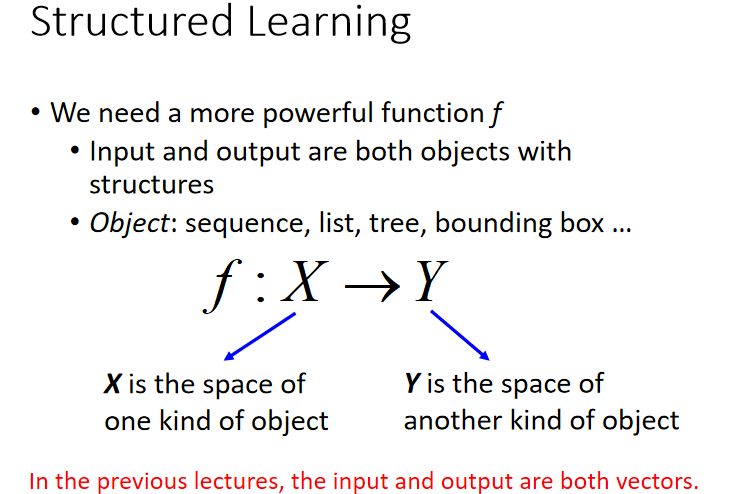

特点：

- 输入输出都是一种带有结构的对象
- 对象：sequence,list,tree,bounding box

## Example Application(应用场景)

Structured Learning 的应用比比皆是

- Speech recognitian(语音辨识)

	input 是一个signal sequence，output是另一个text sequence
- Translation(翻译)

	input 是一种语言的sequence,output是另外一种语言的sequence

- Syntatic Paring(文法解析)

	input 是一个sentence，output 是一个文法解析树

- Object Detection(目标检测)

	或者你要做Object detection，input 是一张image，output是一个bounding box。你会用这个bounding box把这个object给框出来。

- Summarization

	或者你要做一个Summarization，input是一个大的document，output是一个summary。input 和output都是一个sequence。

- Retrieval

	或者你要做一个Retrieval，input是搜寻的关键词，output是搜寻的结果，是一个webpage的list。

那么Structured到底要怎么做呢？虽然这个Structured听起来很困难，但是实际上它有一个Unified Framework，统一的框架。具体看下一节

## Unified Framework（统一框架）

怎么做呢？在Training的时候，就是找到function，这边写作$F$，这个大写$F$的input是$X$跟$Y$，它的output是一个real number。这个大写的$F$它所要做的事情就是衡量出输入x，输出y都是structure的时候，x和y有多匹配。越匹配，R值越大。

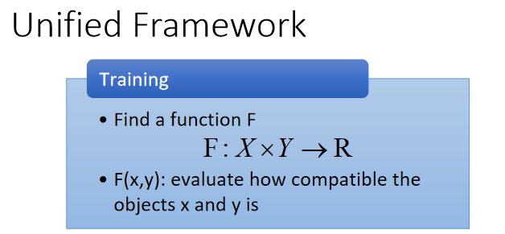

那testing的时候，给定一个新的x，我们去穷举所有的可能的y，一一带进大写的$F$ function，看哪一个y可以让$F$函数值最大，此时的$\tilde{y}$就是最后的结果，model的output。

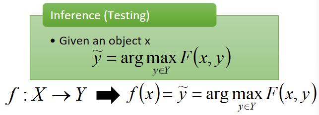

之前我们所要做的事情，是找一个小写的$f:X\rightarrow Y$，可以想象成现在小写的$f(x)=\tilde{y}=arg \max_{y \in Y}F(x,y)$，这样讲可能比较抽象，我们来举个实际的例子

## Examples
### Object Detection（目标检测）
- 任务描述
用一个方框标识出一张图片中的要它找的object，在我们的task中input是一张image，outpu是一个Bounding Box。举例来说，我们的目标是要检测出Haruhi。input是一张image，output就是Haruhi所在的位置这样。

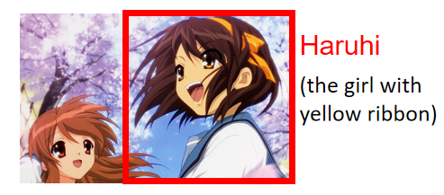

那你可能说侦测Haruhi，有什么作用，没什么作用实际上。但是它还有其他的作用，比如侦测人脸呀，无人驾驶呀~

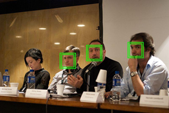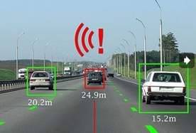

在做object detection的时候，也可以用Deep Learning。事实上，Deep Learning 和Structured Learning是有关系的，这个是我个人的想法，Gan就是F(X,Y)，具体的后续再讲。
- 实现方式
那么Object Detection是怎么做的呢?怎么套入Unified Framework呢？input就是一张image，output就是一个Bounding Box，F(x,y)就是这张image配上这个红色的bounding box，它们有多匹配。如果是按照detection的例子，就是它有多正确，真的吧Harihu给框出来。所以你会期待，给这一张图，如果框得很对，那么它的分数就会很高。如下图右侧所示。

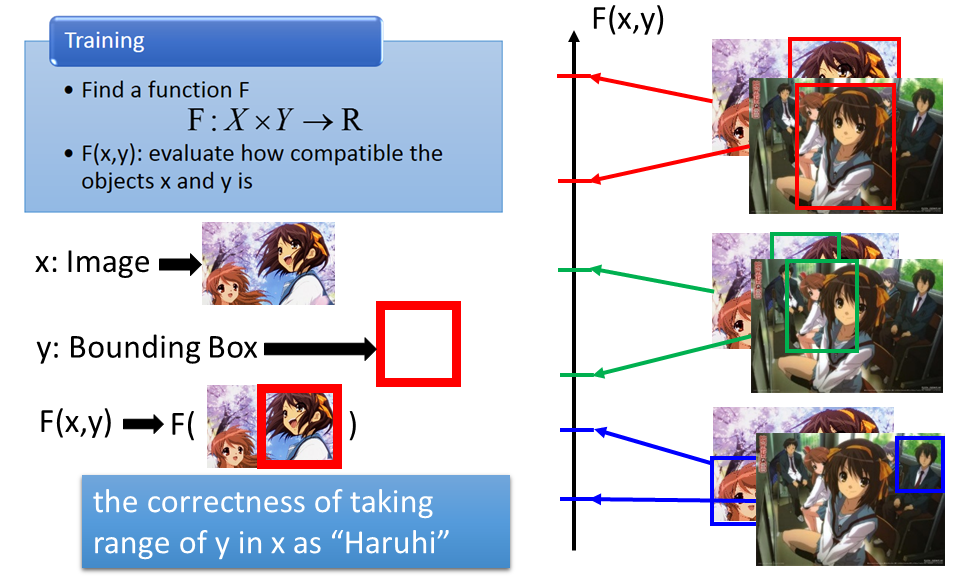

接下来，testing的时候，给一张image，这个x是从来没有看过的东西。你穷举所有可能的bounding box，画在各种不同的地方，然后看说哪一个bounding box得到的分数最高。红色的最高，所以红色的就是你的model output。

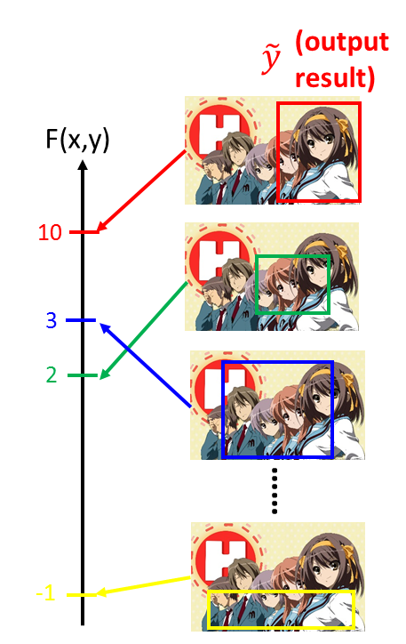

在别的task上其实也是差不多的，比如Summarization

### Summarization（摘要提取）

- 任务描述
input 一个长document，里面有很多句子。output是一个summary，summary可以从document上取几个句子出来。

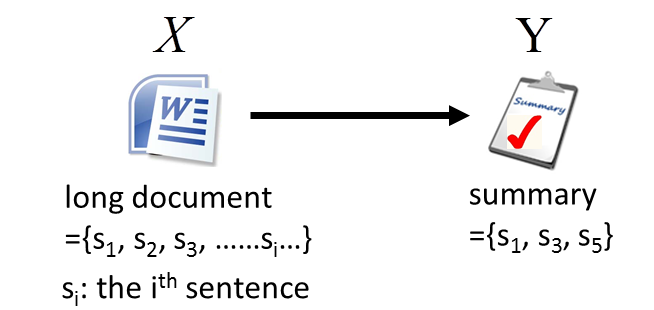

- 实现方式
那么我们training的时候，你的这个F(x,y)，当document和summary配成一对的时候，F的值就很大，如果document和不正确的summary配成一对的时候，F的值就很小，对每一个training data 都这么做。
testing的时候，就穷举所有可能的summary，看哪个summary配上的值最大，它就是model的output。

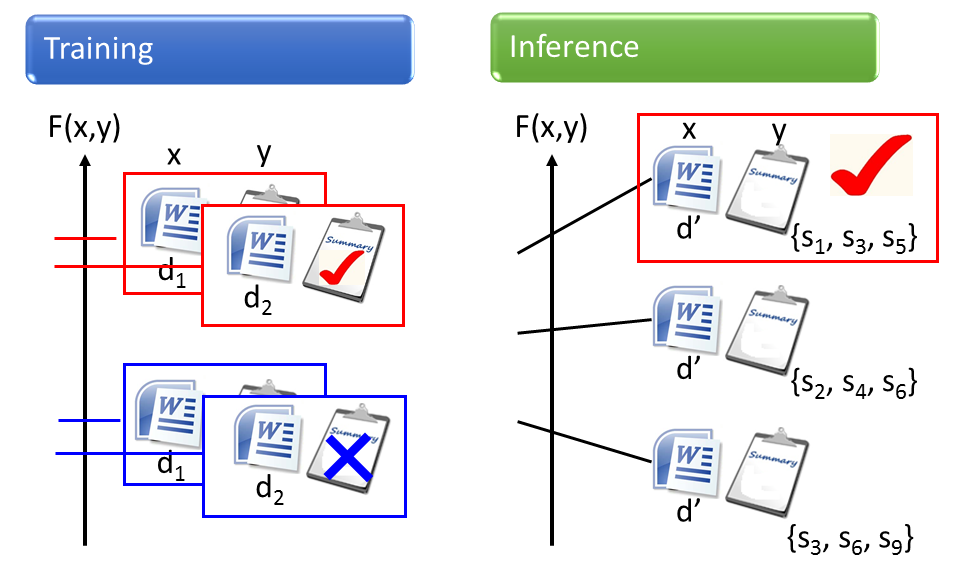

### Retrieval（搜索）

- 任务描述
也是一样，retrieval的task，input 是一个查询集（查询关键字），output是一个webpages的list

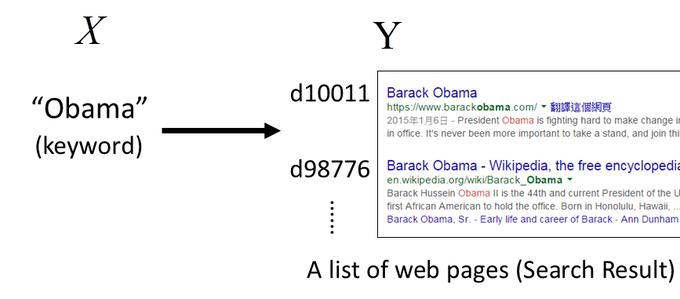

- 实现方式
Training的时候，我们要知道input一个子时，output是哪一些list，才是perfect。以及那些output是不对的，分数就会很低。
Testing的时候，根据input，穷举所有的可能，看看哪个list的分数最高，就是model的输出。

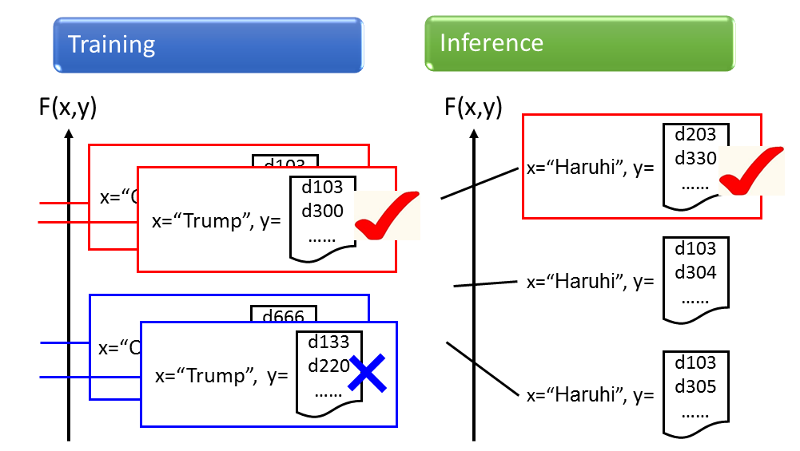

## 概率描述

这个Unified Framework或许你听得觉得很怪这样，第一次听到，搞什么东西呀。那么我换一个说法，我们在Training的时候要estimate x和y的联合概率P(x,y)，即x和y一起出现的几率，这样，input就是X和Y，output就是一个介于0到1之间的数。

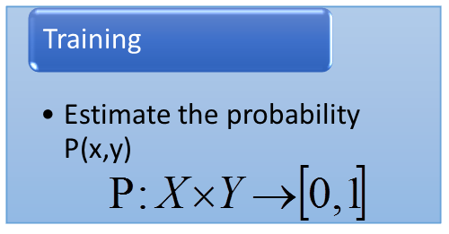

那我在做testing的时候，给我一个object x，我去计算所有的p(y|x)，哪一个y的几率最高，$\tilde {y}$就是model的输出。

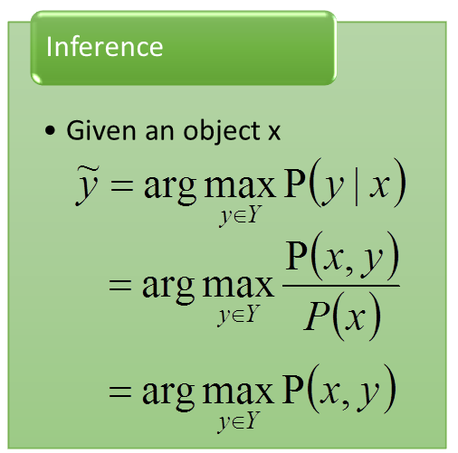

用几率表达的方式

- 缺点
	- 几率解释性有限，比如搜寻，我们说查询值和结果共同出现的几率就很怪
	- 几率值限定在[0,1]范围，不一定有必要
- 优点
	- 具有现象意义，几率比较容易描述现象

扩展，Energy-based model 也是structured learning，参考http://www.cs.nyu.edu/~yann/research/ebm/

## 三个问题

这个Unified Framework好像听起来很厉害，其实要做这个Framework要解三个问题
### Problem 1 ：Evaluation
第一个问题是，F(x,y)到底长什么样子，你很难想象F(x,y)到底长啥样子。input 是一张image 加上一个bounding box的时候，output会是一个bounding box。input 是一个keyword 和 一个list，这个F(x,y)应该长啥样子。

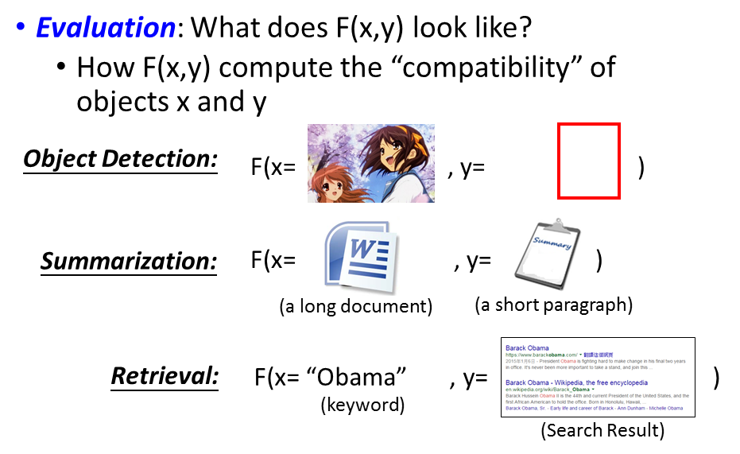

### Problem 2 : Inference
再来就是那个荒唐的Inference，怎么解 “arg max”这个问题。这个Y可是很大的，比如说你要做Object Detection，这个Y是所有可能的bounding box。这件事情做得到吗？

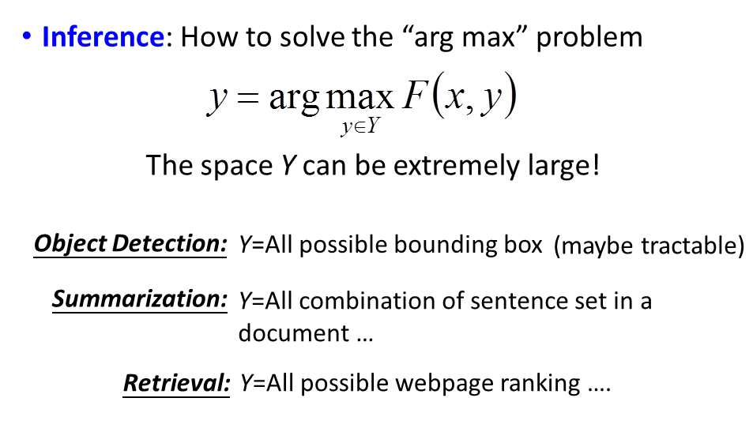

### Problem 3 : Training
第三个问题是Training，给定training data ，如何找到F(x,y)。Training Principle的时候，我们希望正确的$F(x,\hat{y})$能大过其他的情况，这个Training 是可以完成的。

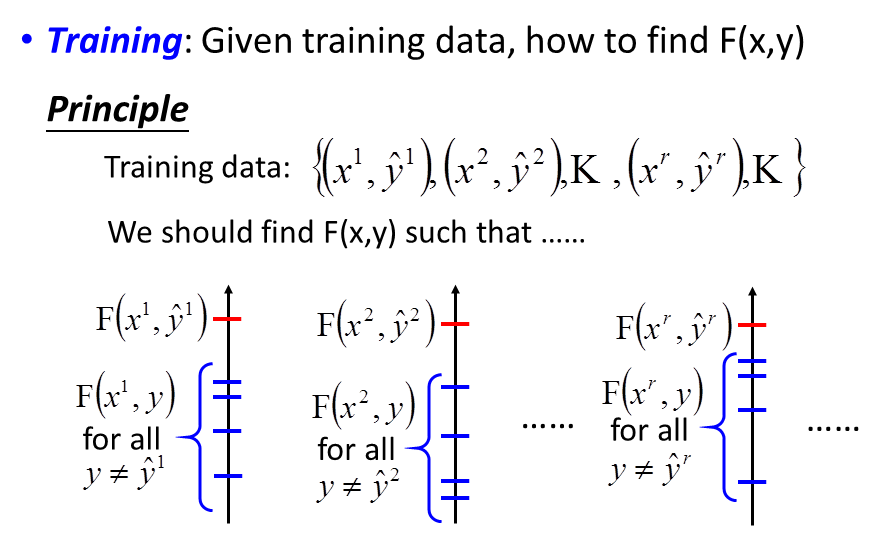

只要你解出这三个问题，你就可以做Structured Learning。
这三个问题可以跟HMM的三个问题联系到一起，也可以跟DNN联系到一起，怎么说呢，比如说我们现在要做手写数字辨识，input一个image，把它分成10类，那我的F长什么样子呢，我先把x扔进一个DNN，得到一个N(x)，接下来我再input y，y是一个vector，把这个y和N(x)算cross entropy，negative 这个CE(N(x),y)就是F(x,y)。

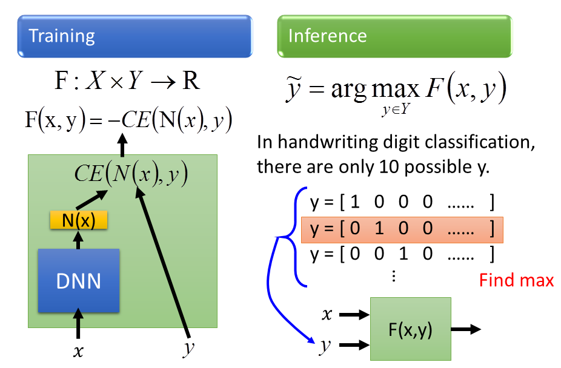

接下来，在testing的时候，就是说，我穷所有可能的辨识结果，也就是说十个y，每个都带进去这个Function里面，看哪个辨识结果能够让F(x,y)最大，它就是我的辨识结果。这个跟我们之前讲的知识是一模一样的。
