# Structured Linear Model
上一章讲了，Structured learning 需要求解三个问题

假如第一Problem中的F(x,y)有一种特殊的形式，那么第三个Problem就不是个问题。所以我们就要先来讲special form应该长什么样子。
## Problem 1
那么special form必须是Linear，也就是说一个(x,y)的pair，首先我用一组特征来描述(x,y)的pair，其中$\phi_{i}$代表一种特征，也就说(x,y)具有特征$\phi_1$是$\phi_1(x,y)$这个值，具有特征$\phi_2$是$\phi_2(x,y)$这个值，等等。然后F(x,y)它长得什么样子呢?
$$
F(x,y)=w_1\phi_1(x,y)+w_2\phi_2(x,y)+w_3\phi_3(x,y)+...\\
$$
向量形式可以写为$F(x,y)=\mathbf{w}^T\phi(x,y)$
- object detection
举个object detection的例子，框出Harihu，$\phi$函数可能为
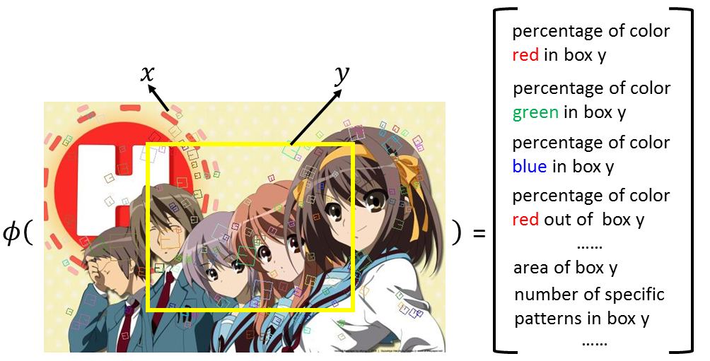
红色的pixel在框框里出现的百分比为一个维度，绿色的pixel在框框里出现的百分比为一个维度，蓝色的是一个维度，或者是红色在框框外的百分比是一个维度，等等，或者是框框的大小是一个维度，或者现在在image中比较state-of-the-art 可能是用visual work，visual work就是图片上的小方框片，每一个方片代表一种pattern，不同颜色代表不同的pattern，就像文章词汇一样，你就可以说在这个框框里面，编号为多少的visual work出现多少个就是一个维度的feature。
这些feature要由人找出来的吗？还是我们直接用一个model来抽呢，F(x,y)是一个linear function，它的能力有限，没有办法做太厉害的事情。如果你想让它最后performer是好的话，那么就需要抽出很好的feature。用人工抽取的话，不见得能找出好的feature，所以如果是在object detection 这个task上面，state-of-the-art 方法，比如你去train一个CNN，这是一个很潮的东西。你可以把image丢进CNN，然后input一个vector，这个vector能够很好的代表feature信息。现在google在做object detection 的时候都是用类似的方法。其实是用deep network 随加上 structured learning 的方法做的，抽feature是用deep learning的方式来做，具体如下图
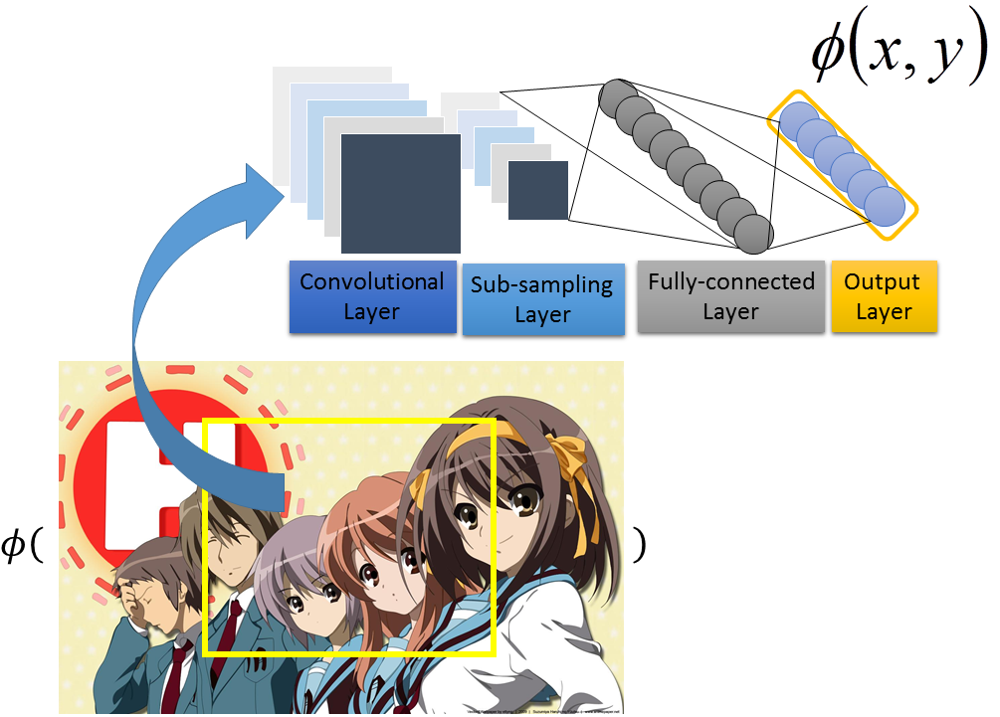
- Summarization
你的x是一个document，y是一个paragraph。你可以定一些feature，比如说$\phi_1(x,y)$表示y里面包含“important”这个单词则为1，反之为0，包含的话y可能权重会比较大，可能是一个合理的summarization，或者是$\phi_2(x,y)$，y里面有没有包含“definition”这个单词，或者是$\phi_3(x,y)$，y的长度，或者你可以定义一个evaluation说y的精简程度等等，也可以想办法用deep learning找比较有意义的表示。具体如下图
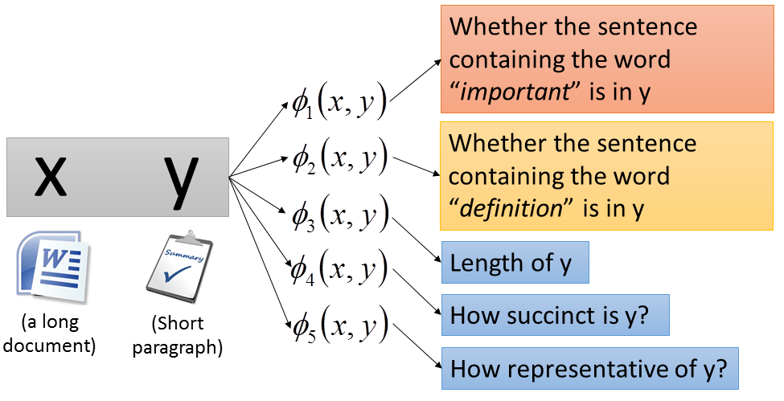
- Retrieval
那比如说是Retrieval，其实也是一样啦。x是keyword，y是搜寻的结果。比如$\phi_1(x,y)$表示y第一笔搜寻结果跟x的相关度，或者$\phi_2(x,y)$表示y的第一笔搜寻结果有没有比第二笔高等等，或者y的Diversity的程度是多少，看看我们的搜寻结果是否包含足够的信息。具体如下图
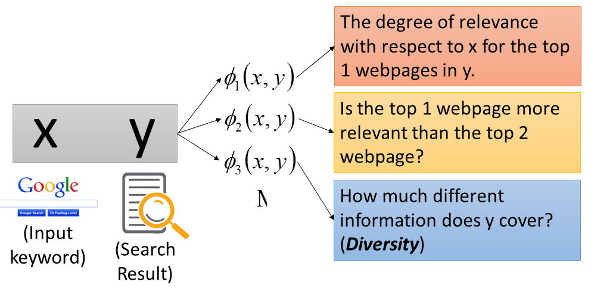
## Problem 2
如果第一个问题定义好了以后，那第二个问题怎么办呢。我们本来这个$F(x,y)=w \cdot \phi(x,y)$ 但是我们一样需要去穷举所有的y，$y = arg \max _{y \in Y}w \cdot \phi(x,y)$ 来看哪个y可以让F(x,y)值最大。这个怎么办呢？假设这个问题已经被解决的样子

## Problem 3
- 描述
假装第二个问题已经被解决的情况下，我们就进入第三个问题。有一堆的Training data：$\{(x^1,\hat{y}^1),(x^2,\hat{y}^2),...,(x^r,\hat{y}^r,...)\}$，我希望找到一个function F(x,y)，其实是希望找到一个$w$，怎么找到这个$w$使得以下条件被满足
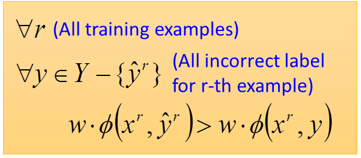
对所有的training data而言，希望正确的$w\cdot \phi(x^r,\hat{y}^r)$应该大过于其他的任何$w\cdot \phi(x^r,y)$。用比较具体的例子来说明，假设我现在要做的object detection，我们收集了一张image $x^1$，然后呢，知道$x^1$所对应的$\hat{y}^1$，我们又收集了另外一张图片，对应的框框也标出。两张如下图所示
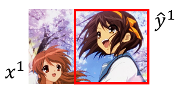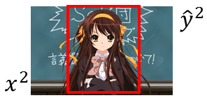
对于第一张图，我们假设$(x^1,\hat{y}^1)$所形成的feature是红色$\phi(x^1,\hat{y}^1)$这个点，其他的y跟x所形成的是蓝色的点。如下图所示
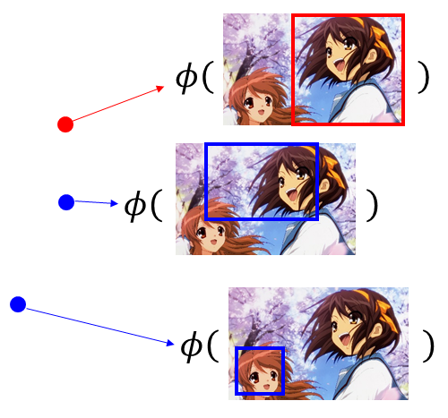
红色的点只有一个，蓝色的点有好多好多。$(x^2,\hat{y}^2)$所形成的feature是红色的星星，$x^2$与其他的y所形成的是蓝色的星星。可以想象，红色的星星只有一个，蓝色的星星有无数个。把它们画在图上，假设它们是如下图所示位置
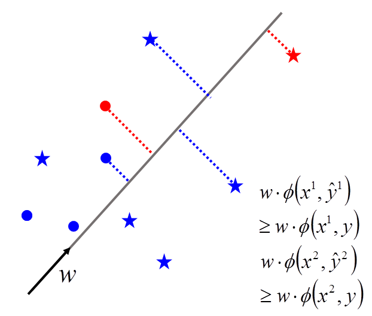
我们所要达到的任务是，希望找到一个$w$，那这个$w$可以做到什么事呢？我们把这上面的每个点，红色的星星，红色的圈圈，成千上万的蓝色圈圈和蓝色星星通通拿去和$w$做inner cdot后，我得到的结果是红色星星所得到的大过于所有蓝色星星，红色的圈圈大过于所有红色的圈圈所得到的值。不同形状之间我们就不比较。圈圈自己跟圈圈比，星星自己跟星星比。做的事情就是这样子，也就是说我希望正确的答案结果大于错误的答案结果，即$w \cdot \phi(x^1,\hat{y}^1) \geq w \cdot \phi(x^1,y^1),w \cdot \phi(x^2,\hat{y}^2) \geq w \cdot \phi(x^2,y^2)$。
- 解法
你可能会觉得这个问题会不会很难，蓝色的点有成千上万，我们有办法找到这样的$w$吗？这个问题没有我们想象中的那么难，以下我们提供一个演算法。
输入：训练数据$\{(x^1,\hat{y}^1),(x^2,\hat{y}^2),...,(x^r,\hat{y}^r),...\}$
输出：权重向量 $w$
算法：

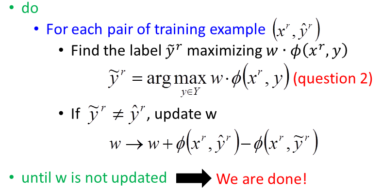

假设我刚才说的那个要让红色的大于蓝色的vector，只要它存在，用上面这个演算法可以找到答案。这个演算法是长什么样子呢？我们来说明一下。这个演算法的input就是我们的training data，output就是要找到一个vector $w$，这个vector $w$要满足我们之前所说的特性。一开始，我们先initialize $w=0$，然后开始跑一个外围圈，这个外围圈里面，每次我们都取出一笔training data  $(x^r,\hat{y}^r)$，然后我们去找一个$\tilde{y}^r$，它可以使得$w \cdot (x^r,y)$的值最大，那么这个事情要怎么做呢？这个问题其实就是Problem 2，我们刚刚假设这个问题已经解决了的，如果找出来的$\tilde{y}^r$不是正确答案，即$\tilde{y}^r \neq \hat{y}^r$，代表这个$w$不是我要的，就要把这个$w$改一下，怎么改呢？把$\phi(x^r,\hat{y}^r)$计算出来，把$\phi(x^r,\tilde{y}^r)$也计算出来，两者相减在加到$w$上，update $w$，有新的$w$后，再去取一个新的example，然后重新算一次max，如果算出来不对再update，步骤一直下去，如果我们要找的$w$是存在得，那么最终就会停止。
这个算法有没有觉得很熟悉呢?这不就是perceptron algorithm，今天要做的是structured learning。perceptron learning 其实也是structured learning 的一个特例，以下证明几乎是一样。举个例子来说明一下，刚才那个演算法是怎么运作的。我们的目标是要找到一个$w$，它可以让红色星星大过蓝色星星，红色圈圈大过蓝色圈圈，假设这个$w$是存在的，首先我们假设$w=0$，然后我们随便pick 一个example $(x^1,\hat{y}^1)$，根据我手上的data 和 w 去看 哪一个$\tilde{y}^1$使得$w \cdot \phi(x^1,y)$的值最大，现在$w=0$，不管是谁，所算出来的值都为0，所以结果值都是一样的，那么没关系，我们随机选一个$y$当做$\tilde{y}^1$就可以。我们假设选了下图红框标出的点作为$\tilde{y}^1$，选出来的$\tilde{y}^1 \neq \hat{y}^1$，对$w$进行调整，把$\phi(x^r,\hat{y}^r)$值减掉$\phi(x^r,\tilde{y}^r)$的值再和$w$加起来，更新$w$
$$
w \rightarrow w + \phi(x^1,\hat{y}^1) -\phi(x^1,\tilde{y}^1)     (2)
$$

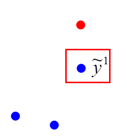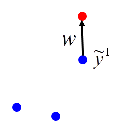

我们就可以获取到第一个$w$，第二步呢，我们就在选一个example  $(x^2,\hat{y}^2）$，穷举所有可能的$y$，计算$w \cdot \phi(x^2,y)$，找出值最大时对应的$y$，假设为下图的$\tilde{y}^2$，发现不等于$\hat{y}^2$，按照公式（2）更新$w$，得到一个新的$w$。然后再取出$(x^1,\hat{y}^1)$，得到$\tilde{y}^1=\hat{y}^2$，对于第一笔就不用更新。再测试第二笔data，发现$\tilde{y}^1 = \hat{y}^2$，$w$也不用更新，等等。看过所有data后，发现$w$不再更新，就停止整个training。所找出的$w$可以让$\tilde{y}^r = \hat{y}^r$。接下来就证明这个演算法的收敛性。

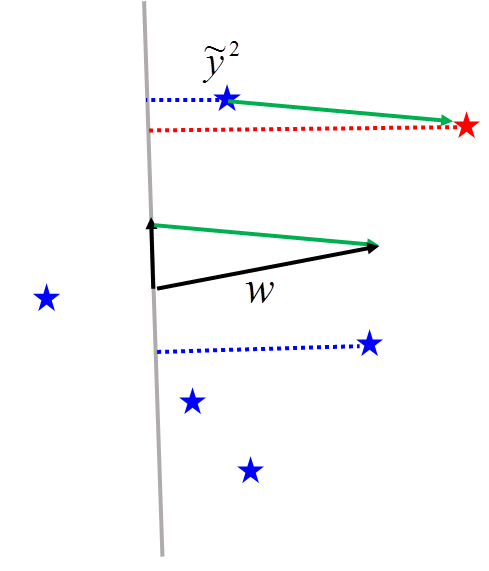
