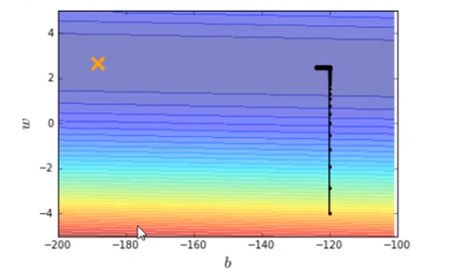
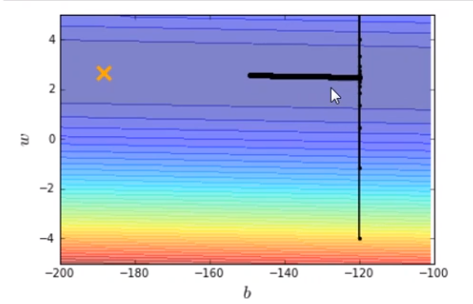
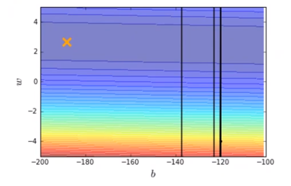
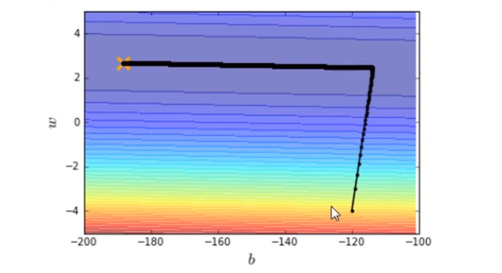

#  回归演示
代码到放在Regression-Demo.md中，自取哦！


现在假设有10个x_data和y_data，x和y之间的关系是y_data=b+w*x_data。b，w都是参数，是需要学习出来的。现在我们来练习用梯度下降找到b和w。
```python
import numpy as np
import matplotlib.pyplot as plt

x_data = [338., 333., 328., 207., 226., 25., 179., 60., 208., 606.]
y_data = [640., 633., 619., 393., 428., 27., 193., 66., 226., 1591.]
```

```
x = np.arange(-200, -100, 1)
y = np.arange(-5, 5, 0.1)
Z = np.zeros((len(x), len(y)))
X, Y = np.meshgrid(x, y)
```

```
# loss
for i in range(len(x)):
    for j in range(len(y)):
        b = x[i]
        w = y[j]
        Z[j][i] = 0  # meshgrid吐出结果：y为行，x为列
        for n in range(len(x_data)):
            Z[j][i] += (y_data[n] - b - w * x_data[n]) ** 2
        Z[j][i] /= len(x_data)
```


先给b和w一个初始值，计算出b和w的偏微分
```python
# linear regression
b = -120
w = -4
lr = 0.0000001
iteration = 100000

b_history = [b]
w_history = [w]

import time
start = time.time()
for i in range(iteration):
    b_grad=0.0
    w_grad=0.0
    for n in range(len(x_data))
        b_grad=b_grad-2.0*(y_data[n]-n-w*x_data[n])*1.0
        w_grad= w_grad-2.0*(y_data[n]-n-w*x_data[n])*x_data[n]
    
    # update param
    b -= lr * b_grad
    w -= lr * w_grad

    b_history.append(b)
    w_history.append(w)
```
```python
# plot the figure
plt.contourf(x, y, Z, 50, alpha=0.5, cmap=plt.get_cmap('jet'))  # 填充等高线
plt.plot([-188.4], [2.67], 'x', ms=12, mew=3, color="orange")
plt.plot(b_history, w_history, 'o-', ms=3, lw=1.5, color='black')
plt.xlim(-200, -100)
plt.ylim(-5, 5)
plt.xlabel(r'$b$')
plt.ylabel(r'$w$')
plt.title("线性回归")
plt.show()

```
输出结果如图



横坐标是b，纵坐标是w，标记×位最优解，显然，在图中我们并没有运行得到最优解，最优解十分的遥远。那么我们就调大learning rate，lr = 0.000001（调大10倍），得到结果如下图。



我们再调大learning rate，lr = 0.00001（调大10倍），得到结果如下图。



结果发现learning rate太大了，结果很不好。

所以我们给b和w特制化两种learning rate
```python
# linear regression
b = -120
w = -4
lr = 1
iteration = 100000

b_history = [b]
w_history = [w]

lr_b=0
lr_w=0
import time
start = time.time()
for i in range(iteration):
    b_grad=0.0
    w_grad=0.0
    for n in range(len(x_data)):
        b_grad=b_grad-2.0*(y_data[n]-n-w*x_data[n])*1.0
        w_grad= w_grad-2.0*(y_data[n]-n-w*x_data[n])*x_data[n]
    
    lr_b=lr_b+b_grad**2
    lr_w=lr_w+w_grad**2
    # update param
    b -= lr/np.sqrt(lr_b) * b_grad
    w -= lr /np.sqrt(lr_w) * w_grad

    b_history.append(b)
    w_history.append(w)
```
```python
# plot the figure
plt.contourf(x, y, Z, 50, alpha=0.5, cmap=plt.get_cmap('jet'))  # 填充等高线
plt.plot([-188.4], [2.67], 'x', ms=12, mew=3, color="orange")
plt.plot(b_history, w_history, 'o-', ms=3, lw=1.5, color='black')
plt.xlim(-200, -100)
plt.ylim(-5, 5)
plt.xlabel(r'$b$')
plt.ylabel(r'$w$')
plt.title("线性回归")
plt.show()

```



有了新的特制化两种learning rate就可以在10w次迭代之内到达最优点了。